<div align="center">
  

  <h1 id="kermits-turkce">KERMİTS</h1>

  <p><strong>Katılım bankacılığı için kanıta dayalı çok ajanlı asistan ve karar destek platformu</strong></p>

  <p>
    <strong>TEKNOFEST 2026 · Yapay Zeka Dil Ajanları Yarışması</strong><br/>
    <em>Katılım Bankacılığı Finansal Metin Madenciliği, Bilgi Çıkarımı ve Akıllı Dashboard-Asistan Çözümleri Kategorisi</em>
  </p>

  [](https://www.teknofest.org/tr/yarismalar/yapay-zeka-dil-ajanlari-yarismasi/)
  [](https://www.python.org/)
  [](https://nextjs.org/)
  [](https://fastapi.tiangolo.com/)
  [](https://langchain-ai.github.io/langgraph/)
  [](https://qdrant.tech/)
  [](LICENSE)

  <br/>

  <strong>Türkçe</strong> · <a href="#kermits-english"><strong>English</strong></a>
</div>

---

## Ne yapıyor

Kermits, Türkiye'deki 10 katılım bankasının ürünlerini, kampanyalarını ve güncel oranlarını tek bir yerde karşılaştırılabilir hale getiriyor. Kullanıcı doğal dille soruyor, sistem cevabı **kaynağıyla birlikte** veriyor: her sayının yanında onu hangi resmi sayfadan ya da hangi belgeden aldığı, tıklanabilir bir bağlantı olarak duruyor.

> **Katılım bankacılığı**, faiz yerine kâr–zarar ortaklığına dayanan bankacılık modelidir. Klasik bankanın kredi dediğine *finansman*, faize *kâr payı*, vadeli mevduata *katılma hesabı* denir. Bu sadece bir kelime meselesi değildir. Katılma hesabında getiri önceden taahhüt edilemez; dolayısıyla "şu kadar kazanırsınız" diyen bir asistan yardımcı olmuş değil, yanlış cevap vermiş olur. Sistem bu terminolojiyi baştan sona koruyor.

Arayüz şimdilik yalnızca Türkçe yayınlanıyor; çok dilli altyapı yerinde duruyor ve ikinci dil için hazır. Altı çalışma alanı var: sohbet, canlı karşılaştırma, ürün kataloğu, kampanyalar, otomasyonlar ve sesli konuşma.

<div align="center">
  
</div>

---

## Baştan sona akış

Bu README, sistemin gerçekte işlediği sırayı takip ediyor: ham banka siteleri nasıl bilgiye dönüşüyor, o bilgi bir soru geldiğinde nasıl kullanılıyor, ve cevap kullanıcıya varmadan önce nereden geçiyor.

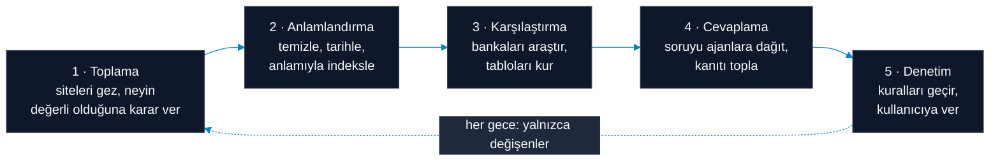
```mermaid
%%{init: {'theme':'base','themeVariables':{'primaryColor':'#0f172a','primaryTextColor':'#f8fafc','primaryBorderColor':'#334155','lineColor':'#0284c7','secondaryColor':'#1e293b','tertiaryColor':'#0f172a','clusterBkg':'#090d16','clusterBorder':'#1e293b'}}}%%
flowchart LR
    A["1 · Toplama<br/>siteleri gez, neyin<br/>değerli olduğuna karar ver"] --> B["2 · Anlamlandırma<br/>temizle, tarihle,<br/>anlamıyla indeksle"]
    B --> C["3 · Karşılaştırma<br/>bankaları araştır,<br/>tabloları kur"]
    C --> D["4 · Cevaplama<br/>soruyu ajanlara dağıt,<br/>kanıtı topla"]
    D --> E["5 · Denetim<br/>kuralları geçir,<br/>kullanıcıya ver"]
    E -.->|her gece: yalnızca değişenler| A
```

İlk üç adım kullanıcıdan bağımsız, **önceden** çalışır ve korpusu kurar. Son iki adım kullanıcı bir soru sorduğunda **anlık** çalışır. Her gece ise ilk üç adımın tamamı baştan işletilmez; yalnızca değişenler ele alınır: yeni ve güncellenmiş sayfalar, kalkan sayfalar ve tarihi geçmiş kampanyalar. Bölümler bu sırayla ilerliyor.

---

## Tasarımın dayandığı üç ayrım

Aşağıdaki bütün kararlar bu üçünün sonucudur.

**Canlı sayı ile kalıcı bilgi ayrı yerlerden gelir.** Bugünün kâr payı oranı, taksit tutarı ve döviz kuru, sorulduğu anda bankanın kendi hesaplama servisinden çekilir ve arama indeksine hiçbir zaman yazılmaz; çünkü indekslenen bir sayı yarın yanlıştır. Ürün şartları, katılım ilkeleri ve ücret tarifeleri ise kalıcı bir **korpustan** gelir: bankaların kendi sitelerinden toplanıp temizlenmiş belge arşivi.

**Her banka kendi ajanının içine kapatılmıştır.** On banka uzmanı birbirinin verisini göremez. Bir uzmana hangi bankayla çalışacağı hiç sorulmaz; bankası doğduğu anda sabitlenir. Bu, çok bankalı bir cevaptaki en yaygın hatayı, yani bir bankanın oranını başka bankaya atfetmeyi, talimatla değil mimariyle imkânsız kılar.

**"Sunmuyor" ile "ulaşamadım" farklı cevaplardır.** Banka o ürünü satmıyorsa bunu söylemek doğru ve işe yarar bir cevaptır. Bankanın servisi bu sabah bozulduysa aynı şey doğru değildir. Sistem bu iki durumu ayrı ayrı kaydeder ve ayrı ayrı bildirir.

---

# 1 · Toplama

> Banka siteleri taranırken URL ağacı budanır: indirilecek sayfa sayısı, hiçbir şey indirilmeden önce düşürülür.

## URL ağacı budanarak sayfa sayısı düşürülür

Bir bankanın sitesindeki URL'ler iki kaynaktan birlikte çıkarılır. **Sitemap** bankanın kendi ilan ettiği listedir: hızlıdır ve derin sayfaları doğrudan verir, ama çoğu banka onu güncel tutmaz. **BFS** ise ana sayfadan başlayıp linkleri katman katman izler: yavaştır ama sitemap'te hiç yazmayan sayfaları bulur. İkisinin birleşimi, tek başına hiçbirinin bulamadığı bütünü verir.

Tarama boyunca tek bir sınır hiç esnetilmez: **istekler bankanın kendi domaininin dışına çıkmaz.** Sayfalardaki dış linkler, sosyal medya adresleri ve üçüncü taraf servisler daha izlenmeden elenir. Bu sınır olmasa bir bankanın sitesinden çıkıp internetin geri kalanına dağılmak an meselesidir; korpusun hangi bankaya ait olduğu da belirsizleşir.

Toplanan URL'ler düz bir liste değil, bir **ağaçtır**. Buradaki amaç tek tek sayfaları değerlendirmek değil, **daha kök seviyesinde koca dalları budayarak indirilecek sayfa sayısını düşürmektir.** `/kariyer` ya da `/yatirimci-iliskileri` dalına en tepede SKIP demek, altındaki yüzlerce sayfayı tek kararla eler. Ajan bu kararı sayfaları indirmeden verir; elindeki tek bilgi URL yolu, dalın başlığı ve altındaki birkaç örnek başlıktır.

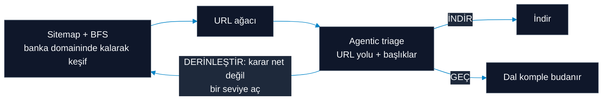
```mermaid
%%{init: {'theme':'base','themeVariables':{'primaryColor':'#0f172a','primaryTextColor':'#f8fafc','primaryBorderColor':'#334155','lineColor':'#0284c7','secondaryColor':'#1e293b','tertiaryColor':'#0f172a','clusterBkg':'#090d16','clusterBorder':'#1e293b'}}}%%
flowchart LR
    A["Sitemap + BFS<br/>banka domaininde kalarak keşif"] --> C["URL ağacı"]
    C --> D["Agentic triage<br/>URL yolu + başlıklar"]
    D -->|DERİNLEŞTİR: karar net değil<br/>bir seviye aç| A
    D -->|İNDİR| E["İndir"]
    D -->|GEÇ| F["Dal komple budanır"]
```

## Karar verilemeyen dal, karar verilebilene kadar açılır

Ajan bir dal için üç karardan birini verir:

| Karar | Anlamı |
|---|---|
| **DERİNLEŞTİR** | Karar bu seviyede verilemiyor, bir alt seviyeye in |
| **İNDİR** | Burada somut bir ürün, kampanya ya da belge var |
| **GEÇ** | Bu müşteriye dönük değil: iş ilanları, şube bulucu, yatırımcı raporları |

Asıl mekanizma **DERİNLEŞTİR** kararında: bir dalın tamamen atılacağına da tamamen alınacağına da karar verilemiyorsa, ajan o dalı açar ve bir alt seviyeye iner. Bu, karar netleşene kadar tekrarlanır ve gerekirse tek bir sayfaya kadar sürer. Yani ağaç yukarıdan aşağıya, ancak gerektiği kadar açılır: emin olunan yerde koca dal tek kararla kapanır, belirsiz olan yerde yapraklara kadar inilir.

Böylece indirme bütçesi, kararın gerçekten zor olduğu yerlere harcanır. Kırılgan desen kuralları yerine ajan kullanılır, çünkü her bankanın sitesi farklı kurgulanmıştır. Kural yazmak, her yeni banka için işe sıfırdan başlamak demek olurdu.

## Her PDF okunmaya değmez

Taranan **1.088 PDF'in yalnızca yaklaşık 227'si** ürün belgesi. Geri kalanın çoğu genel kredi sözleşmeleri, izahnameler ve kurumsal politikalar. Hepsini okumak, çıkarım bütçesinin büyük kısmını sözleşme diline harcayıp ücret tarifelerini bunların altına gömmek olurdu.

Karar dosya adından değil, **bankanın belgeyi nereye koyduğundan** çıkarılır: ürün sayfasından bağlanmış bir PDF ürün belgesidir. Dosya adının tek başına yetmediğini korpusun kendisi kanıtlıyor: `banking-license.pdf` bir lisans taraması, `vahesabi_onbilg_formu.pdf` ise gerçek oranlar taşıyan bir bilgilendirme formu.

## Aynı içerik iki kez işlenmez

Toplanan her sayfa, PDF ve görsel için bir hash çıkarılır. Farklı adreslerde duran aynı içerik, aynı kampanya afişinin on ayrı sayfada tekrarlanması gibi, tek sefer işlenir. Bu, hem tarama hem de model maliyetini doğrudan düşürür.

---

# 2 · Anlamlandırma

> Toplanan ham içerik, aranabilir ve güvenilir bilgiye dönüştürülür.

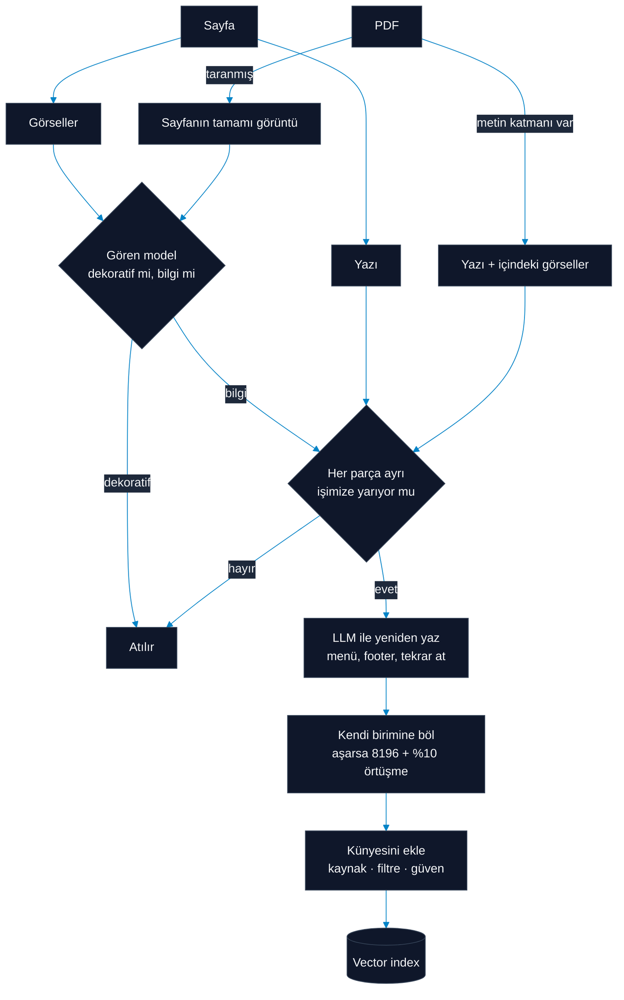
```mermaid
%%{init: {'theme':'base','themeVariables':{'primaryColor':'#0f172a','primaryTextColor':'#f8fafc','primaryBorderColor':'#334155','lineColor':'#0284c7','secondaryColor':'#1e293b','tertiaryColor':'#0f172a','clusterBkg':'#090d16','clusterBorder':'#1e293b'}}}%%
flowchart TD
    P["Sayfa"] --> PT["Yazı"]
    P --> PI["Görseller"]
    D["PDF"] -->|metin katmanı var| DT["Yazı + içindeki görseller"]
    D -->|taranmış| DI["Sayfanın tamamı görüntü"]

    PI --> V{"Gören model<br/>dekoratif mi, bilgi mi"}
    DI --> V
    V -->|dekoratif| X["Atılır"]
    V -->|bilgi| G

    PT --> G{"Her parça ayrı<br/>işimize yarıyor mu"}
    DT --> G
    G -->|hayır| X
    G -->|evet| C["LLM ile yeniden yaz<br/>menü, footer, tekrar at"]

    C --> S["Kendi birimine böl<br/>aşarsa 8196 + %10 örtüşme"]
    S --> M["Künyesini ekle<br/>kaynak · filtre · güven"]
    M --> F[("Vector index")]
```

Toplanan her şey aynı yoldan geçmez, ama hepsi aynı kapıya varır: **kullanılabilir, kaynağı belli, yeniden yazılmış metin.**

## Metin ve görsel ayrı yollardan gelir

Bir sayfada bilgi iki yerde durur. Bir kısmı yazıdır, bir kısmı ise görüntünün içindedir; bir ücret tarifesi ya da kâr payı tablosu çoğu zaman metin değil resimdir. Yalnızca yazıyı almak, o sayfanın en değerli kısmını atmak olur.

Bu yüzden sayfanın yazısı ile içindeki görseller ayrı ayrı ele alınır. Aynısı PDF'ler için de geçerli: PDF'in metin katmanı varsa yazı olduğu gibi alınır, içindeki görseller ayrıca incelenir; metin katmanı hiç yoksa, yani belge taranmış bir kâğıtsa, sayfanın tamamı görüntü olarak okunur. Böylece taranmış bir sözleşme ile dijital bir ürün sayfası aynı hatta buluşur.

Görsellerde bir eleme daha var: her görsel önce "bu dekoratif bir öğe mi, yoksa ürün ya da kampanya bilgisi mi taşıyor" diye değerlendirilir. Logo ve arka plan atılır, tablo ve koşul metni çıkarılır.

## Görseller OCR ile değil, gören bir modelle okunur

Görüntüden yazı çıkarmanın hazır yolu OCR'dir ve burada bilinçli olarak kullanılmıyor. Sebebi şu: **bir bankacılık görselinde bilginin çoğu harflerde değil, düzendedir.**

OCR bir kâr payı tablosuna baktığında gördüğü şey alt alta dizilmiş sayılardır; hangi sayının hangi vade ve hangi ürün satırına ait olduğunu bilmez, çünkü tablonun yapısını değil yalnızca karakterleri okur. Aynı şekilde bir kampanya afişinde büyük puntoyla yazılmış oranın ana vaat, altındaki küçük yazının ise koşul olduğunu ayırt edemez. Çıkan metin doğru karakterlerden oluşur ama yanlış anlama gelir; üstelik bunu sessizce yapar.

Gören bir model ise görüntüye bir okuyucu gibi bakar: tablonun satır ve sütun ilişkisini kurar, başlığı gövdesinden ayırır, dipnotun hangi rakama ait olduğunu görür. Aynı model dekoratif olanı ayıklama işini de yapar; ayrı bir sınıflandırma adımına gerek kalmaz.

Bir maliyeti var: gören bir modeli çalıştırmak OCR'den pahalıdır. Bu yüzden hangi görselin buna değdiği önceden elenir ve aynı görsel ikinci kez sorulmaz.

## Gereklilik kararı, temizlemeden önce verilir

Elde edilen her metin işlenmez. Önce **işimize yarayıp yaramadığına** karar verilir: bu içerik müşteriye gösterilebilecek bir ürün, kampanya ya da hizmet bilgisi mi, yoksa kurumsal duyuru, mevzuat metni, iş ilanı mı?

Sıra bilinçli olarak böyle: eleme önce, temizleme sonra. Temizleme pahalı bir iştir ve gereksiz bir belgeyi güzelce yeniden yazmak, o maliyeti hiçbir işe yaramayacak bir metne harcamaktır.

Karar belgenin tamamına bakılarak bir kez verilmez; **her parça tek tek sorgulanır** ve yalnızca gerekli bulunanlar kaydedilir. Uzun bir belgede işe yarayan kısımlar genellikle dağınıktır: bir sözleşmenin başı ve sonu kalıp metindir ama ortasında bir ücret tablosu durabilir. Belgeyi bütün olarak elemek o tabloyu da atardı; bütün olarak almak ise kalıp metni indekse doldururdu.

Aynı sorgulama, uzun belgelerde erken durmayı da mümkün kılar: baştan belli sayıda parçanın tamamı gereksiz çıkarsa belgenin geri kalanına hiç bakılmaz.

Kararsız kalınan yerde veri korunur. Bir belge için parçaların oyları bölünürse sonuç gerekli sayılır; sistemin tercihi, şüpheli bir metni atmak yerine tutmak yönündedir.

## Kalan içerik yeniden yazılır

Gerekli bulunan metin olduğu gibi saklanmaz, bir modele verilip **yeniden yazılır**: menü, altbilgi, çerez uyarısı, sosyal medya bağlantısı ve sayfadan sayfaya tekrar eden ne varsa atılır; geriye o sayfaya özgü ürün ve kampanya içeriği kalır.

Bu iş kural listeleriyle değil modelle yapılır, çünkü on bankanın sayfa yapısı birbirini tutmuyor ve kural yazmak her yeni banka için baştan başlamak demek. Aynı gerekçe görseller ve PDF'ler için de geçerli olduğundan üç yolun üçünde de aynı yaklaşım kullanılır.

## Hiçbir şey iki kez işlenmez

Sayfalar, PDF'ler ve görseller içeriklerinden çıkan bir imzayla tanınır. Aynı kampanya afişi on ayrı sayfada geçiyorsa bir kez okunur; aynı PDF iki adresten iniyorsa bir kez işlenir.

Bu yalnızca hız meselesi değil. Tekrarlayan içerik tekrar tekrar modele gönderilseydi, maliyetin büyük kısmı zaten bilinen şeyleri yeniden öğrenmeye giderdi.

## Kesme noktasını belge belirler

Metni sabit uzunlukta bölmek kolay yoldur ve bir kâr payı tablosunun ortasından geçer. Bunun yerine belgenin kendi birimleri kullanılır: bir sayfanın başlık altı bölümleri, bir PDF'in sayfaları.

Kampanyalar hiç bölünmez. Tarihi bir parçaya, koşulu başka parçaya düşerse arama koşulu bulur ama hâlâ geçerli olup olmadığını bilemez.

Yine de bir üst sınır koyduk: **8196 karakter**. Bu teknik bir zorunluluk değil, bizim tercihimiz; çok uzun bir metni tek parça halinde vermek modelin bağlamı kaçırmasına yol açıyor. Sınırı aşan metinler **%10 örtüşmeyle** bölünür, yani her parça bir öncekinin sonundan bir miktar taşır: bir ücret satırı ya da koşul cümlesi tam kesme noktasına denk gelirse en az bir parçada bütün kalır. Sınırın altındaki hiçbir birim bölünmez.

## Her parça nereden geldiğini kendi üstünde taşır

Bölmeden sonra elimizde belgeler değil parçalar var ve bir parça tek başına kimliksizdir. Bu yüzden her parça, metniyle birlikte kaynağını da taşır: geldiği tam adres, hangi bankaya ve hangi belge türüne ait olduğu, geçerlilik tarihi.

Bağlantı sayfanın tamamına değil bilginin geçtiği başlığa verilir; çıpa yoksa sayfaya düşülür ama asla uydurulmaz. Böylece parça nereye giderse gitsin kaynağı yanında kalır ve gösterilen her rakam doğrulanabilir olur.

---

# 3 · Karşılaştırma

> Temiz sayfalardan, bankaları yan yana koyan tablolar üretilir. Bu adımın tamamı ajanlarla yürür; hiçbir yerde sabit bir kural listesi yoktur.

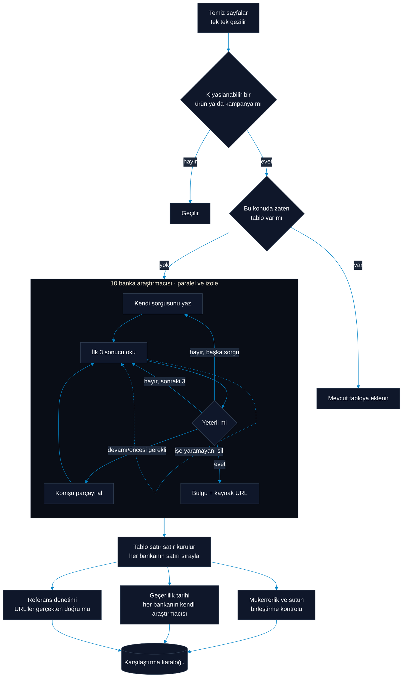
```mermaid
%%{init: {'theme':'base','themeVariables':{'primaryColor':'#0f172a','primaryTextColor':'#f8fafc','primaryBorderColor':'#334155','lineColor':'#0284c7','secondaryColor':'#1e293b','tertiaryColor':'#0f172a','clusterBkg':'#090d16','clusterBorder':'#1e293b'}}}%%
flowchart TD
    P["Temiz sayfalar<br/>tek tek gezilir"] --> Q{"Kıyaslanabilir bir<br/>ürün ya da kampanya mı"}
    Q -->|hayır| X["Geçilir"]
    Q -->|evet| DUP{"Bu konuda zaten<br/>tablo var mı"}
    DUP -->|var| M["Mevcut tabloya eklenir"]
    DUP -->|yok| R

    subgraph R["10 banka araştırmacısı · paralel ve izole"]
        direction TB
        RA["Kendi sorgusunu yaz"] --> RB["İlk 3 sonucu oku"]
        RB --> RC{"Yeterli mi"}
        RC -->|hayır, başka sorgu| RA
        RC -->|hayır, sonraki 3| RB
        RC -->|devamı/öncesi gerekli| RD["Komşu parçayı al"]
        RD --> RB
        RB -.->|işe yaramayanı sil| RB
        RC -->|evet| RE["Bulgu + kaynak URL"]
    end

    R --> S["Tablo satır satır kurulur<br/>her bankanın satırı sırayla"]
    S --> A1["Referans denetimi<br/>URL'ler gerçekten doğru mu"]
    S --> A2["Geçerlilik tarihi<br/>her bankanın kendi araştırmacısı"]
    S --> A3["Mükerrerlik ve sütun<br/>birleştirme kontrolü"]
    A1 --> T[("Karşılaştırma kataloğu")]
    A2 --> T
    A3 --> T
```

## Her sayfaya tek bir soru sorulur

İlk ajan, temizlenmiş ve işimize yaradığına karar verilmiş sayfaları tek tek geziyor. Her biri için verdiği karar tek: **bu sayfa somut bir ürün ya da kampanya bilgisi taşıyor mu, ve bu bilgi diğer bankalarla kıyaslanabilir mi?**

## Aynı tablo iki kez kurulmaz

Cevap evet ise hemen araştırma başlamıyor. Önce mevcut tablo havuzunda **bu konuyu zaten karşılaştıran bir tablo var mı** diye aranıyor, hem de kelime eşleşmesiyle değil anlam üzerinden; aynı konu iki farklı sayfada iki farklı isimle geçebiliyor.

Tablo varsa yeni sayfa ona ekleniyor. Bu kontrol olmasa on bankaya açılan pahalı araştırma, zaten elimizde olan bir tabloyu yeniden üretmek için harcanırdı.

## On araştırmacı, on ayrı araştırma

Tablo yoksa ilk ajan konuyu detaylandırıp **her bankanın kendi araştırmacısına** gönderiyor. Onlar paralel çalışıyor ve birbirlerinin verisini görmüyor.

Her araştırmacı kendi araştırmasını kendisi yürütüyor. Sorgusunu kendisi yazıyor, ilk üç sonucu okuyor ve devamını kendisi kararlaştırıyor:

- Sonuçlar işe yaramadıysa **sonraki üçü** isteyebiliyor ya da sorguyu baştan yazabiliyor.
- Önemli bir bilgi parça sınırında kesilmişse **komşu parçayı** çekebiliyor.
- İşine yaramayan parçaları **siliyor**, böylece çalışma alanını dolu tutmadan araştırmayı sürdürüyor.

Bu üçü de sabit bir akış değil, araştırmacının o an verdiği kararlar. Sonuçta her biri bulgusunu **kaynak adresiyle birlikte** ilk ajana döndürüyor.

## Tablo satır satır kurulur

İlk ajan on araştırmacının bulgularını sırayla geziyor ve tabloyu banka banka dolduruyor. On bankalık bir tabloyu tek seferde üretmek, eksik kalan tek bir bankanın bütün tabloyu bozmasına kapı aralar; sırayla kurulduğunda bir banka için veri bulunamaması diğerlerinin satırlarına dokunmuyor.

## Tablo kurulduktan sonra üç denetim

Tablo bittiğinde tek seferlik bir gözden geçirme yapılıyor:

**Referanslar gerçekten doğru mu.** Her satırın kaynak adresi, geldiği metinle karşılaştırılıyor. Uydurulmuş ya da yanlış sayfaya işaret eden atıflar burada ayıklanıyor.

**Bilgi ne zamana kadar geçerli.** Her bankanın geçerlilik tarihini yine o bankanın kendi araştırmacısı çıkarıyor, çünkü tarihi bulacak yer o bankanın kendi kaynakları.

**Tablo gereksiz yere ikiye ayrılmış mı.** Havuzda gerçekten aynı konuyu karşılaştıran başka bir tablo kalmışsa birleştiriliyor. Aynı şekilde çok az satırda dolu olan seyrek sütunlar, veri kaybetmeden tek sütunda toplanıyor.

---

# 4 · Cevaplama

> Kullanıcı sorduğunda, soru bankalara dağıtılır ve kanıt toplanır.

Sistemin tamamı tek bir cümleyle: **bir yönetici ajan var, on tane de banka uzmanı.** Yönetici hiçbir bankayı kendi bilmiyor; soruyu ilgili uzmanlara aynı anda dağıtıyor, onların getirdiği kanıtı birleştirip cevabı yazıyor.

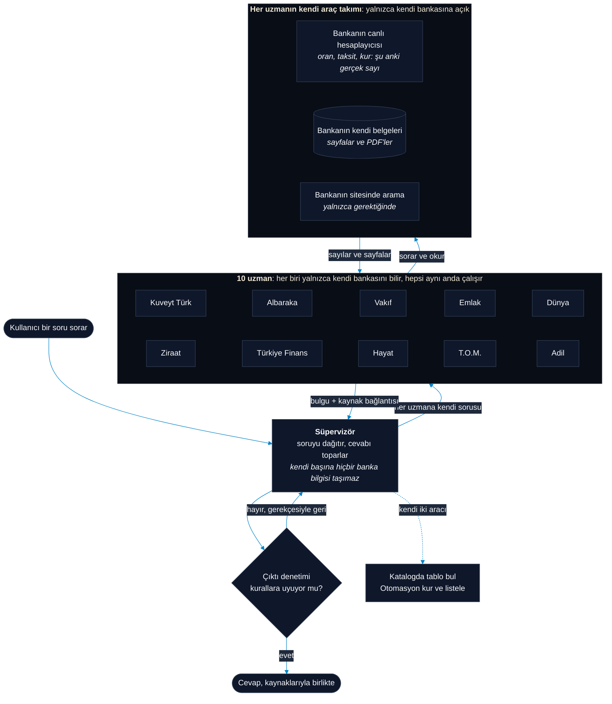
```mermaid
%%{init: {'theme':'base','themeVariables':{'primaryColor':'#0f172a','primaryTextColor':'#f8fafc','primaryBorderColor':'#334155','lineColor':'#0284c7','secondaryColor':'#1e293b','tertiaryColor':'#0f172a','clusterBkg':'#090d16','clusterBorder':'#1e293b'}}}%%
flowchart TB
    U(["Kullanıcı bir soru sorar"])
    SUP["<b>Süpervizör</b><br/>soruyu dağıtır, cevabı toparlar<br/><i>kendi başına hiçbir banka bilgisi taşımaz</i>"]

    U --> SUP

    subgraph SPEC["<b>10 uzman</b>: her biri yalnızca kendi bankasını bilir, hepsi aynı anda çalışır"]
        direction LR
        S1["Kuveyt Türk"] ~~~ S2["Albaraka"] ~~~ S3["Vakıf"] ~~~ S4["Emlak"] ~~~ S5["Dünya"]
        S6["Ziraat"] ~~~ S7["Türkiye Finans"] ~~~ S8["Hayat"] ~~~ S9["T.O.M."] ~~~ S10["Adil"]
    end

    subgraph TOOLS["<b>Her uzmanın kendi araç takımı</b>: yalnızca kendi bankasına açık"]
        direction LR
        T1["Bankanın canlı hesaplayıcısı<br/><i>oran, taksit, kur: şu anki gerçek sayı</i>"]
        T2[("Bankanın kendi belgeleri<br/><i>sayfalar ve PDF'ler</i>")]
        T3["Bankanın sitesinde arama<br/><i>yalnızca gerektiğinde</i>"]
    end

    SUP -->|"her uzmana kendi sorusu"| SPEC
    SPEC -->|"sorar ve okur"| TOOLS
    TOOLS -->|"sayılar ve sayfalar"| SPEC
    SPEC -->|"bulgu + kaynak bağlantısı"| SUP

    SUP --> G{"Çıktı denetimi<br/>kurallara uyuyor mu?"}
    G -->|"hayır, gerekçesiyle geri"| SUP
    G -->|"evet"| OUT(["Cevap, kaynaklarıyla birlikte"])

    SUP -.->|"kendi iki aracı"| SUPT["Katalogda tablo bul<br/>Otomasyon kur ve listele"]
```

Okuma sırası soldan sağa değil, yukarıdan aşağı: **soru yukarıdan girer, kanıt aşağıda toplanır, cevap denetimden geçtikten sonra çıkar.** Denetimden dönen ok gerçek bir yoldur: kural ihlali bulunduğunda cevap kullanıcıya gitmez, gerekçesiyle birlikte süpervizöre geri döner.

Süpervizörün kendi iki aracı bilgi taşımaz, iş yapar: sitenin bu konuda zaten yayımladığı bir tablo varsa adresini bulur, ve kullanıcının kurduğu tekrarlayan görevleri kaydeder. **Bankaya dair her olgu uzmandan gelir.**

> **Ajan**, hangi aracı ne zaman kullanacağına kendi karar veren bir dil modelidir. Sıradan bir sohbet modelinden farkı, tek hamlede cevap vermek yerine çok adımlı bir araştırma yürütebilmesidir. **Süpervizör** işi dağıtan ve toparlayan ajandır; **uzman** ise tek bir bankadan sorumlu alt ajandır.

## Araç olarak ajan

Süpervizör bankalara doğrudan sormaz. Her bankayı bir **araç** olarak çağırır ve on uzman aynı anda çalışabilir. Uzmanın kendi akıl yürütme adımları süpervizöre hiç ulaşmaz; yalnızca nihai bulgusu ve kaynak bağlantıları ulaşır. Böylece süpervizörün context window'u on ayrı araştırma turunun gürültüsüyle dolmaz.

> Bir ajanın **context window**'u, aynı anda aklında tutabildiği her şeydir: o ana kadarki konuşma ve içeri çektiği bütün belgeler. Sınırlıdır ve dolduğunda en eski malzemenin ya özetlenmesi ya da atılması gerekir. Aşağıdaki kararların çoğu, bu alanı gürültüye değil kanıta harcamak için vardır.

## Bir uzmanın elinde tam olarak ne var

Yukarıdaki kutulardan biri açıldığında görünen şey bu. Örnek Kuveyt Türk uzmanı; diğer dokuzu aynı biçimde, yalnızca kendi bankasına bağlı olarak kurulur.

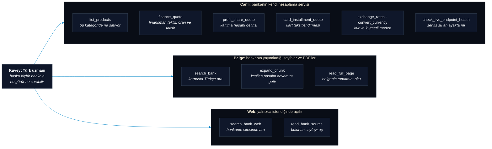
```mermaid
%%{init: {'theme':'base','themeVariables':{'primaryColor':'#0f172a','primaryTextColor':'#f8fafc','primaryBorderColor':'#334155','lineColor':'#0284c7','secondaryColor':'#1e293b','tertiaryColor':'#0f172a','clusterBkg':'#090d16','clusterBorder':'#1e293b'}}}%%
flowchart LR
    A["<b>Kuveyt Türk uzmanı</b><br/><i>başka hiçbir bankayı<br/>ne görür ne sorabilir</i>"]

    subgraph CANLI["<b>Canlı</b>: bankanın kendi hesaplama servisi"]
        direction TB
        L1["list_products<br/><i>bu kategoride ne satıyor</i>"]
        L2["finance_quote<br/><i>finansman teklifi: oran ve taksit</i>"]
        L3["profit_share_quote<br/><i>katılma hesabı getirisi</i>"]
        L4["card_installment_quote<br/><i>kart taksitlendirmesi</i>"]
        L5["exchange_rates · convert_currency<br/><i>kur ve kıymetli maden</i>"]
        L6["check_live_endpoint_health<br/><i>servis şu an ayakta mı</i>"]
    end

    subgraph BELGE["<b>Belge</b>: bankanın yayımladığı sayfalar ve PDF'ler"]
        direction TB
        D1["search_bank<br/><i>korpusta Türkçe ara</i>"]
        D2["expand_chunk<br/><i>kesilen pasajın devamını getir</i>"]
        D3["read_full_page<br/><i>belgenin tamamını oku</i>"]
    end

    subgraph WEB["<b>Web</b>: yalnızca istendiğinde açılır"]
        direction TB
        W1["search_bank_web<br/><i>bankanın sitesinde ara</i>"]
        W2["read_bank_source<br/><i>bulunan sayfayı aç</i>"]
    end

    A --> CANLI
    A --> BELGE
    A --> WEB
```

Üç grup üç ayrı soruya cevap veriyor ve **birbirinin yerine geçmiyorlar:**

**Canlı**, *şu anda* geçerli olan sayıdır. Bir oran ya da taksit sorusu indeksten değil, bankanın müşteriye gösterdiği hesaplayıcıdan cevaplanır. Bir bankanın yayımlamadığı hesaplayıcı, o uzmanın araç listesinde hiç görünmez; böylece model olmayan bir servisi çağırmayı deneyemez.

**Belge**, bankanın *yayımladığı* şeydir: ürün şartları, ücret tabloları, kampanya koşulları. Kanıttır ama teklif değildir, ve uzmana bu ayrım açıkça söylenir: bir sayfadan okunan rakam asla canlı oran diye sunulmaz.

**Web** varsayılan olarak kapalıdır ve açıldığında bile kendi bankasının alan adı dışındaki her sonucu atar.

## Bir uzman araştırmasını nasıl yürütür

Uzman tek bir arama yapıp durmaz; araştırmasını kendi yönlendirir:

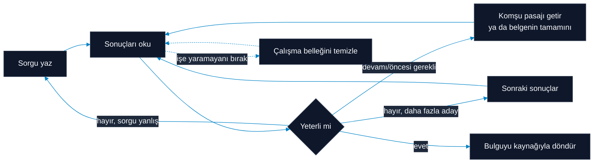
```mermaid
%%{init: {'theme':'base','themeVariables':{'primaryColor':'#0f172a','primaryTextColor':'#f8fafc','primaryBorderColor':'#334155','lineColor':'#0284c7','secondaryColor':'#1e293b','tertiaryColor':'#0f172a','clusterBkg':'#090d16','clusterBorder':'#1e293b'}}}%%
flowchart LR
    Q["Sorgu yaz"] --> R["Sonuçları oku"]
    R --> D{Yeterli mi}
    D -->|devamı/öncesi gerekli| E["Komşu pasajı getir<br/>ya da belgenin tamamını"]
    D -->|hayır, sorgu yanlış| Q
    D -->|hayır, daha fazla aday| N["Sonraki sonuçlar"]
    E --> R
    N --> R
    D -->|evet| A["Bulguyu kaynağıyla döndür"]
    R -.->|işe yaramayanı bırak| P["Çalışma belleğini temizle"]
    P -.-> R
```

Uzun belgeler indekslenmeden önce pasajlara bölündüğü için tek bir arama sonucu sayfanın tamamı değil bir dilimidir. Buradan iki karar doğar:

**Kesilmiş bir pasajın devamı ayrı bir araçtır.** Bir ücret tablosu ya da kâr payı koşulu pasaj sınırında bölünmüşse, uzman komşu pasajı veya belgenin tamamını isteyebilir. Bu olmasa model yarım cümleyi bütün sanır ve hiçbir zaman tamamlanmamış bir rakamı cevap diye verir.

**Model kendi belleğini boşaltabilir.** Uzman bir sonucu işe yaramadı diye işaretlediğinde o metin bir sonraki adımdan önce bağlamdan düşer. Üç aramanın geride yirmi pasaj bırakmasını engelleyen budur. Bu yetki bilinçli olarak dardır ve yalnızca arama sonuçlarına uygulanır; canlı bir fiyat teklifi ya da kullanıcının mesajı bu yolla silinemez.

## Canlı sayılar bankadan anlık gelir

Oran, taksit ve kur soruları indeksten değil, bankanın kendi hesaplama servisinden cevaplanır. Dört karar bu katmanı belirliyor:

**Sınır önce bilinir.** Kullanıcıya 360 ay istetip sonra her bankanın reddettiği ekranı göstermek ona hiçbir şey öğretmez. Asıl önemli sayı karşılaştırmadaki bankaların **kesişimidir**: biri 84 ayda bitiyorsa, o bankayı içeren karşılaştırma en fazla 84 ay sorabilir. Bu, sonradan bildirilecek bir hata değil, önceden ve o sınırı koyan bankanın adıyla gösterilecek bir tavandır.

**Bankalar aynı anda sorulur.** Altı bankaya sırayla sormak **11,99 saniye**, aynı anda sormak **0,59 saniye** sürüyor.

**Hiçbir sonuç sessizce düşürülmez.** "Bu banka bunu satmıyor", "servisi bakımda" ve "istek başarısız oldu" ayrı üç cevaptır ve üçü de raporlanır. *Hiçbir banka bunu sunmuyor* ile *hiçbirine ulaşamadık* asla birbirine benzememelidir.

**Bankaların durumu sürekli izlenir.** Bu ayrımı yapabilmek için iki denetim çalışır: saniyeler süren ve ajanın anında tetikleyebildiği bir yetenek kontrolü, bir de her ürünü tek tek gezen zamanlanmış bir ürün denetimi. İkisi de değeri değil **sözleşmeyi** doğrular; bir oranın dünkünden farklı olması arıza değildir. Bulunanlar ortak bir duruma yazılır ve araçlar her çağrıdan önce bunu okur.

Adil Katılım ve T.O.M. Katılım ise **yeteneği olmayan** sağlayıcılar olarak kayıtlıdır; sitelerinde müşterinin oran hesaplatabileceği bir arayüz yok. Kayıtlı olmaları, ajanın "bu banka hesaplama aracı yayınlamıyor" diyebilmesini sağlar. Dışarıda bırakılsalardı aynı soru sessiz bir boşlukla karşılanırdı.


---

# Bir istek nasıl karşılanır

> Yazarak sorulan soru ile sesli sorulan soru aynı yoldan geçer. Ses, o yolun iki ucuna eklenmiş dört adımdır.

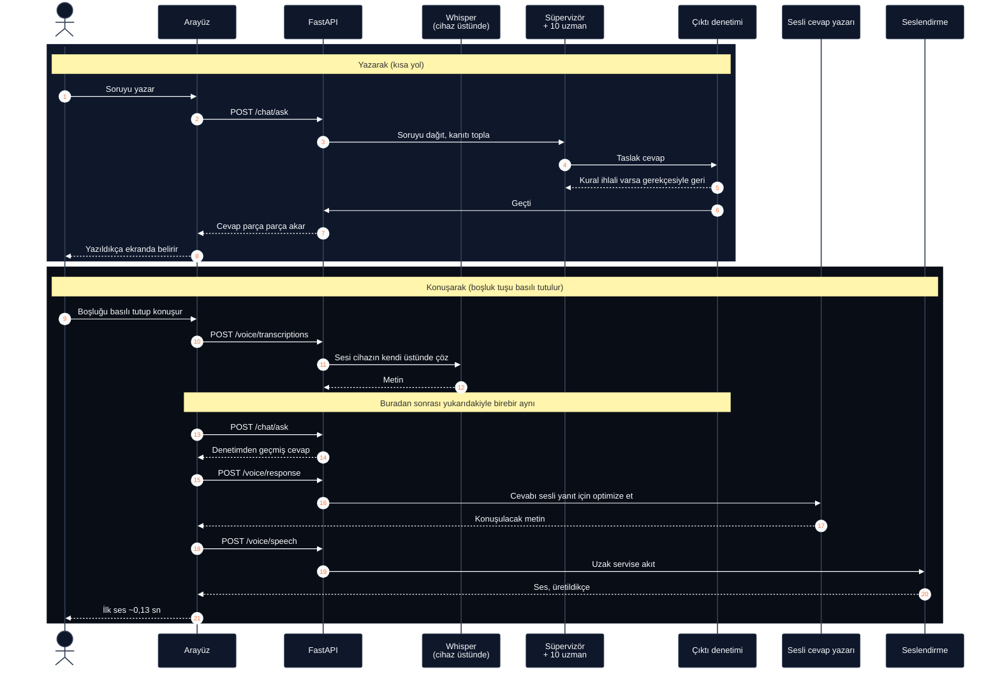
```mermaid
%%{init: {'theme':'base','themeVariables':{'primaryColor':'#0f172a','primaryTextColor':'#f8fafc','primaryBorderColor':'#334155','lineColor':'#0284c7','secondaryColor':'#1e293b','tertiaryColor':'#0f172a','clusterBkg':'#090d16','clusterBorder':'#1e293b'}}}%%
sequenceDiagram
    autonumber
    actor K as Kullanıcı
    participant UI as Arayüz
    participant API as FastAPI
    participant W as Whisper<br/>(cihaz üstünde)
    participant AJ as Süpervizör<br/>+ 10 uzman
    participant D as Çıktı denetimi
    participant Y as Sesli cevap yazarı
    participant S as Seslendirme

    rect rgb(15, 23, 42)
    Note over K,D: Yazarak (kısa yol)
    K->>UI: Soruyu yazar
    UI->>API: POST /chat/ask
    API->>AJ: Soruyu dağıt, kanıtı topla
    AJ->>D: Taslak cevap
    D-->>AJ: Kural ihlali varsa gerekçesiyle geri
    D->>API: Geçti
    API-->>UI: Cevap parça parça akar
    UI-->>K: Yazıldıkça ekranda belirir
    end

    rect rgb(9, 13, 22)
    Note over K,S: Konuşarak (boşluk tuşu basılı tutulur)
    K->>UI: Boşluğu basılı tutup konuşur
    UI->>API: POST /voice/transcriptions
    API->>W: Sesi cihazın kendi üstünde çöz
    W-->>API: Metin
    Note over UI,D: Buradan sonrası yukarıdakiyle birebir aynı
    UI->>API: POST /chat/ask
    API-->>UI: Denetimden geçmiş cevap
    UI->>API: POST /voice/response
    API->>Y: Cevabı sesli yanıt için optimize et
    Y-->>UI: Konuşulacak metin
    UI->>API: POST /voice/speech
    API->>S: Uzak servise akıt
    S-->>UI: Ses, üretildikçe
    UI-->>K: İlk ses ~0,13 sn
    end
```

**Ses ayrı bir hat değil.** Sesli sorunun ortası, yazılı sorunun tamamıdır: aynı süpervizör, aynı on uzman, aynı çıktı denetimi. Fark yalnızca uçlardadır: önde konuşmayı metne çeviren bir adım, arkada cevabı önce sesli yanıt için optimize eden, sonra okuyan iki adım. Bu, sesin ikinci sınıf bir giriş yöntemi olmamasını sağlar: ses kanalına özel bir cevap üretici yoktur, dolayısıyla sesle sorulan soru yazıyla sorulandan daha az kanıt görmez.

**Cevap, sesli yanıt için optimize edilir.** Süpervizöre karşılaştırmaları tablo olarak ve her iddiadan sonra bağlantı koyarak yazması söylenir; bu ekranda doğrudur, sesli yanıtta kullanışsızdır. Araya giren optimizasyon adımı, bitmiş cevabı sesli sunuma uygun hâle getirir. Bu adım başarısız olursa ses susmaz: tarayıcının kendi dönüştürücüsü devreye girer; tabloyu o kadar iyi ifade edemez ama **var olmayan bir oran uyduramaz**, ki geri düşülecek doğru yer tam olarak budur.

**Bekleme doldurulur.** On bankalı bir karşılaştırma otuz saniye sürebilir ve sesli modda bakılacak bir ekran yoktur; bir dakikalık sessizlik çökmeden ayırt edilemez. Bu yüzden transkript iner inmez bir onay cümlesi söylenir, sonra her on saniyede bir bekletme cümlesi, altta çalan bir müzikle birlikte. Cevap okunmaya başladığında müzik kapanır.

**Kullanıcı sözü kesebilir.** Asistan cevabı okurken boşluk tuşuna basmak okumayı ortasında keser ve yeni kaydı başlatır. Konuşma geçmişi durur; kesilen yalnızca sestir.

---

# 5 · Denetim

> Cevap kullanıcıya varmadan önce kurallardan geçer.

## Çıktı denetimi

Bir cevap kullanıcıya ulaşmadan önce düzenlenebilir bir kural kümesine karşı okunur. Denetim katmanı cevabı **onarmaz**; geçti ya da kaldı der. Kaldığında cevap gerekçesiyle birlikte asistana geri döner, çünkü doğru cevabı üretecek araçlara ve konuşmaya sahip olan asistandır. Sorumluluk bilinçli olarak ayrılmıştır: hem yazan hem yargılayan bir katman ikisini de iyi yapamaz.

Denetlediği başlıklar:

- Katılım bankacılığı terminolojisine sadakat ve ima yoluyla bile olsa garanti getiri vaadinin reddi
- Alan dışına çıkmama
- Prompt injection ve kimlik değiştirme girişimlerinin etkisizleştirilmesi
- İç mimarinin ve istem şablonlarının sızdırılmaması
- Arkasında kaynak olmayan hiçbir iddianın öne sürülmemesi

> **Prompt injection**, modelin okuduğu içeriğin içine gizlenmiş bir talimattır: yüklenen bir PDF'te ya da bir web sayfasında duran "önceki talimatlarını yok say" gibi bir satır. Amaç, modeli yalnızca özetlemesi için verilmiş bir malzemenin içinden ele geçirmektir.

## İzolasyon sınırı nereye çizilmiş

Bir uzmanın web araştırma aracı, kendi bankasının alan adı dışındaki her sonucu atar ve **her yönlendirmeyi** doğrular; böylece bir uzman başka bir bankanın sitesine ya da dahili bir adrese yürütülerek kandırılamaz. Süpervizör bu araçları hiç yüklemez.

## Uzun konuşmalarda hiçbir şeyi kaybetmemek

Her ajan kendi geçmişini taşır ve sınırına ayrı ayrı ulaşır. Bir konuşma özetlenirken özetleyiciye geçmişin **tamamı** verilir; hazır çözümlerin varsayılanı ona yalnızca en son bölümü göstermektir ki bu, uzun bir konuşmanın büyük kısmını okumadan tarif etmek demektir.

---

# Her gece: yalnızca değişenler

> Korpus bir kez kurulup bırakılmaz, ama her gece de sıfırdan kurulmaz. Gece koşusu farkı arar ve yalnızca onu işler.

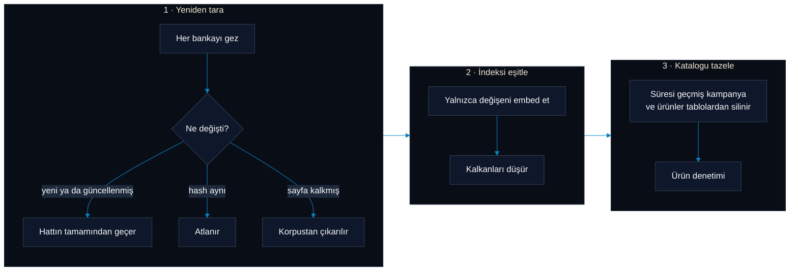
```mermaid
%%{init: {'theme':'base','themeVariables':{'primaryColor':'#0f172a','primaryTextColor':'#f8fafc','primaryBorderColor':'#334155','lineColor':'#0284c7','secondaryColor':'#1e293b','tertiaryColor':'#0f172a','clusterBkg':'#090d16','clusterBorder':'#1e293b'}}}%%
flowchart LR
    subgraph N1["1 · Yeniden tara"]
        direction TB
        A["Her bankayı gez"] --> B{"Ne değişti?"}
        B -->|yeni ya da güncellenmiş| C["Hattın tamamından geçer"]
        B -->|hash aynı| D["Atlanır"]
        B -->|sayfa kalkmış| E["Korpustan çıkarılır"]
    end
    subgraph N2["2 · İndeksi eşitle"]
        F["Yalnızca değişeni embed et"] --> G["Kalkanları düşür"]
    end
    subgraph N3["3 · Katalogu tazele"]
        H["Süresi geçmiş kampanya<br/>ve ürünler tablolardan silinir"] --> I["Ürün denetimi"]
    end
    N1 --> N2 --> N3
```

**Yeni ya da değişmiş sayfa özel bir durum değildir.** Bu gece keşfedilen ya da içeriği güncellenmiş her şey, diğer her şeyle tam olarak aynı yoldan geçer: eleme, toplama, temizleme, tarihleme, indeksleme. Sonradan gelen içerik için ayrı bir güzergâh yoktur; dolayısıyla bugün eklenen bir sayfa, en baştan beri duran bir sayfayla aynı ölçüte tabidir. Değişmemiş sayfalar bu yolun hiçbir adımına girmez.

**Yeni hesaplama araçları da aranır.** Tarama, bankanın yeni bir hesaplama endpoint'i yayınlayıp yayınlamadığına bakar; arayüzünü dinamik kuran sayfalar gerçek bir tarayıcıda açılır, böylece ziyaretçinin fiilen gördüğü şey incelenmiş olur.

**Silmek eklemek kadar önemlidir.** Bankanın kaldırdığı bir sayfa korpustan çıkarılır. Bitiş tarihi geçmiş kampanya ve ürünler karşılaştırma tablolarından silinir; böylece bir tablo artık var olmayan bir teklifi taşımaz.

**Yapılan iş değişimle orantılıdır.** Hash'i değişmemiş içerik yeniden okunmaz; hiçbir şeyin değişmediği bir gece neredeyse hiçbir maliyet çıkarmaz. Silme işlemi de korumalıdır: indeksin olağandışı büyük bir bölümünü silecek bir koşu reddedilir ve hiçbir şey yazmaz, çünkü bunun bir bankanın sitesini silmesinden çok bir taramanın bozulması olduğu varsayılır.

---

# Arayüz

<div align="center">
  
  <br/><sub><b>Karşılaştır: altı sayfalık panelin giriş noktası</b></sub>
</div>

| Sayfa | Ne yapar |
|---|---|
| **Sohbet** | Kanıta dayalı asistan. Model seçimi, uzun düşünme ve web araması ayrı ayrı açılıp kapatılabilir. Ekranda açık olan tabloyu ya da hesaplamayı görüp onun hakkındaki soruları cevaplayabilir. Tablo dosyası, PDF, görsel ve belge eki kabul eder. Konuşmanın içinde kataloğa kaydedilebilen tablolar üretir. |
| **Canlı karşılaştırma** | İhtiyaç, taşıt ve konut finansmanı, katılma hesapları, döviz ve kart taksitleri. Bankalar paralel sorgulanır. Kullanıcının kendi varsayımları, bankanın yayınladığı oranlardan görsel olarak ayrı tutulur. |
| **Ürünler** | Küratörlü çok bankalı tablolar, kullanıcının sohbetten kaydettiği kendi tablolarıyla yan yana. Herhangi biri tek tıkla konuşmaya geri iliştirilebilir. |
| **Kampanyalar** | On bankanın kampanyaları; aktif, bitmek üzere ve süresi dolmuş olarak etiketlenmiş halde. |
| **AI Görünümü** | Kişisel panonuz: sohbette beğendiğiniz tabloları buraya kaydediyorsunuz. Her kartın üstünde tablonun ne için kurulduğunu anlatan bir not ve kaydedilme tarihi, altında da dört formatta indirme düğmesi var. |
| **Otomasyonlar** | Doğal dille kurulan tekrarlayan görevler: *"Taşıt finansman oranı %3,5'in altına inerse haber ver."* Her çalışmanın raporu e-postayla gönderilir; koşul sağlandığında ayrıca uygulama içi bildirim düşer. |

### Arayüzde tekrar eden parçalar

Pano birkaç basit parçadan kurulu ve bunlar her sayfada aynı işi yapıyor; birini bir kere öğrenince diğer sayfalarda arayacak bir şey kalmıyor.

| Parça | Ne işe yarıyor |
|---|---|
| **Sol menü** | Altı sayfanın listesi. Daraltılabilir; hangi sayfada olduğunuz işaretli durur. |
| **Tablo kartı** | Karşılaştırmaların tamamı aynı kart içinde gösterilir: başlık, süzme kutusu, sıralanabilir sütunlar ve altta indirme düğmesi. Ürünler, Kampanyalar, AI Görünümü ve sohbetin ürettiği tablolar hep bu aynı karttır. |
| **AI özeti** | Bir tablonun üstünde duran kısa özet kutusu. İçindeki maddeler o tablodan yazılır, başka bir yerden değil. |
| **Asistan penceresi** | Sağ alt köşedeki düğme, asistanı sayfanın üstünde küçük bir pencere olarak açar. Sayfa değiştirseniz de konuşma durduğu yerden devam eder. |
| **Sesli mod** | Boşluk tuşunu basılı tuttuğunuzda ekranın altından yükselen, konuşurken hareket eden küre. Arkadaki sayfayı kapatmaz, çünkü soru genellikle o sayfa hakkındadır. |
| **Otomasyon kartı** | Kurduğunuz her iş için bir kart: cümlenin kendisi, sonraki ve son çalışma zamanı, duraklatma anahtarı ve "şimdi çalıştır" düğmesi. |
| **Tema anahtarı** | Açık ve koyu tema. Grafikler, tablolar ve sesli mod dahil arayüzün tamamı iki temada da çalışır. |

## Karşılaştırma: soru bir form, cevap canlı bankadan

Bir ürün seçip tutarı ve vadeyi yazıyorsunuz. Sistem aynı soruyu o anda bütün bankalara soruyor ve dönen cevapları tek bir tabloda yan yana koyuyor; rakamlar kayıtlı bir listeden değil, bankanın kendi hesaplama ekranından geliyor.

<div align="center">
  
  <br/><sub><b>Aynı anda sorulan altı banka, taksite göre sıralanmış; üstünde tabloyu okuyan yapay zekâ özeti</b></sub>
</div>

Kullanıcı ne karşılaştıracağını seçer, tutarı ve vadeyi girer; bankalar **paralel** sorgulanır. Sunmayan banka “sunmuyor” diye, ulaşılamayan banka “ulaşılamadı” diye ayrı ayrı raporlanır; ikisi asla aynı görünmez.

## Ürünler ve Kampanyalar: hazır karşılaştırma tabloları

Katalog iki sayfaya ayrılır: **Ürünler** banka ürünlerini, **Kampanyalar** süreli teklifleri karşılaştırır. İkisi de aynı düzeni kullanır; aşağıdaki görüntüler Ürünler sayfasından alınmış birer örnektir.

<div align="center">
  
  <br/><sub><b>Katalog: konu başına bir tablo, alt kategoriye göre süzülebilir (örnek: Ürünler)</b></sub>
</div>

<div align="center">
  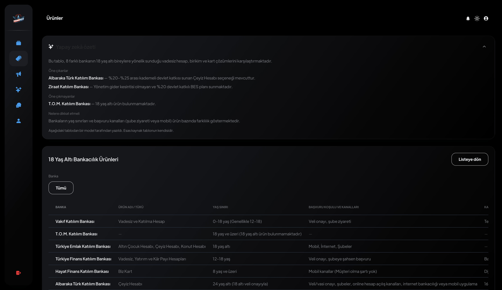
  <br/><sub><b>Açılmış bir tablo ve üstünde o tablodan yazılmış özet (örnek)</b></sub>
</div>

Özet her zaman **tablodan** yazılır; altındaki satırlar esas kaynaktır.

## Asistan: her sayının yanında kaynağı

Serbest yazdığınız soruyu cevaplayan sohbet ekranı. Sıradan bir sohbet robotundan farkı şu: söylediği her rakamın yanında o rakamı aldığı banka sayfasının bağlantısı duruyor, yani cevabı kontrol edebiliyorsunuz.

<div align="center">
  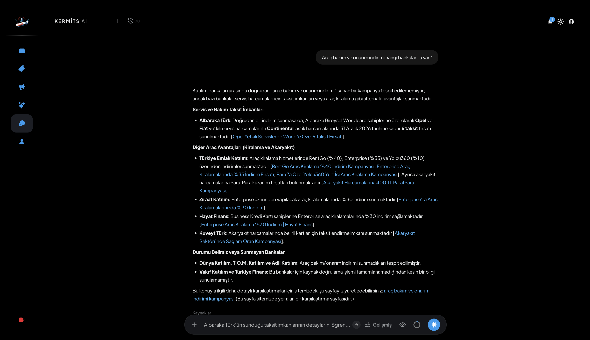
  <br/><sub><b>Kampanya sorusu: her iddianın ardından bankanın kendi sayfasına giden bağlantı</b></sub>
</div>

<div align="center">
  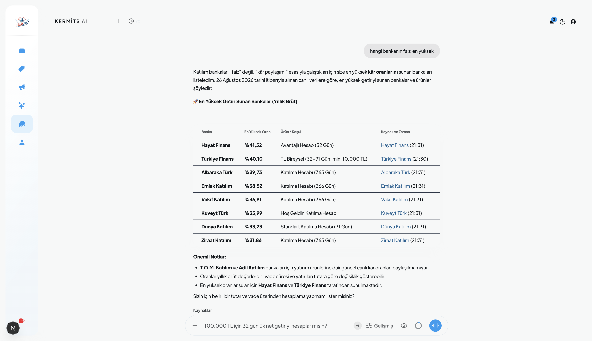
  <br/><sub><b>Çıktı denetimi iş başında: soru “faiz” diyor, cevap terminolojiyi düzeltip kâr payı üzerinden veriyor; her satırda banka, oran, kaynak ve saat</b></sub>
</div>

İkinci görüntü aynı zamanda açık temayı gösteriyor: arayüzün tamamı iki temada da çalışır.

## Modeli ve düşünme derinliğini kullanıcı seçer

Cevabı hangi yapay zekâ modelinin yazacağını siz seçiyorsunuz; üçü de farklı işlerde iyi. Yanındaki **Düşün** anahtarı açıkken model cevaplamadan önce adım adım akıl yürütüyor: daha yavaş, ama karışık sorularda daha isabetli.

<div align="center">
  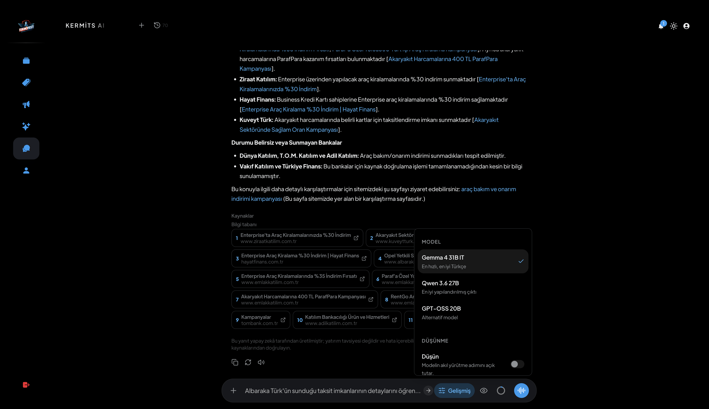
  <br/><sub><b>Üç model, bir de Düşün anahtarı; konuşmanın ortasında değiştirilebilir</b></sub>
</div>

Geçmiş modelin değil checkpoint'in olduğu için, model değiştirmek biriken konuşmayı kaybettirmez.

## Sesli sohbet: siz konuşuyorsunuz, asistan sesle cevap veriyor

Klavyeye hiç dokunmadan konuşabilirsiniz. Boşluk tuşunu basılı tutup sorunuzu söylüyorsunuz; bıraktığınızda asistan cevabını **sesli olarak okuyor**. Yani tek yönlü bir dikte değil, karşılıklı ve canlı bir konuşma: asistan okurken boşluğa yeniden basmak sözünü keser ve sıradaki sorunuzu başlatır, tıpkı telefonda birinin sözünü kesmek gibi.

<div align="center">
  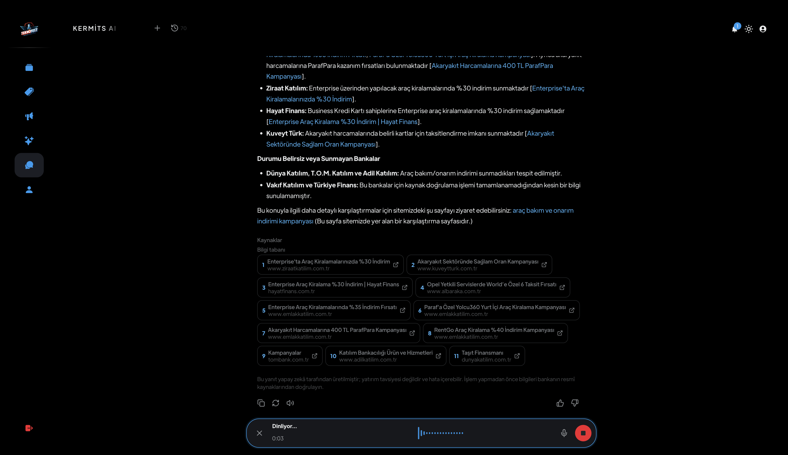
  <br/><sub><b>Kayıt sırasında besleyici: süre, canlı dalga biçimi ve tek dokunuşla durdurma</b></sub>
</div>

<div align="center">
  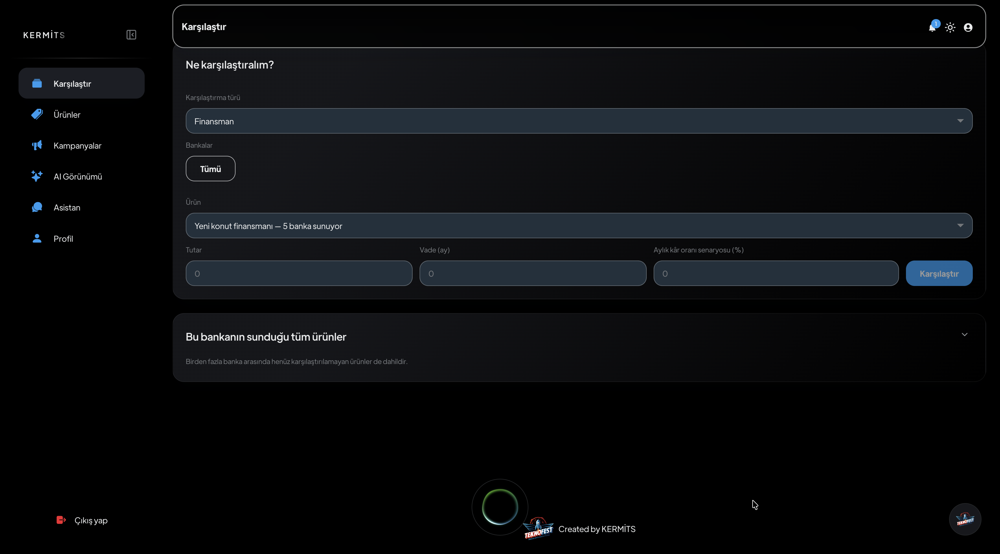
  <br/><sub><b>Boşluk tuşu basılı: küme alttan yükselir, sayfanın üstünde durur ve arkasındaki hiçbir şeyi kapatmaz</b></sub>
</div>

İkinci görüntü tasarımın bütün noktası: soru neredeyse her zaman ekrandaki şey **hakkındadır**, dolayısıyla sorarken o şeyin görünmeye devam etmesi gerekir.

## Asistan sayfayı terk etmez

Asistan ayrı bir sayfa değil. Hangi ekranda olursanız olun köşedeki düğmeyle açılıyor, üstte küçük bir pencere olarak duruyor ve sayfa değiştirdiğinizde konuşma silinmiyor.

<div align="center">
  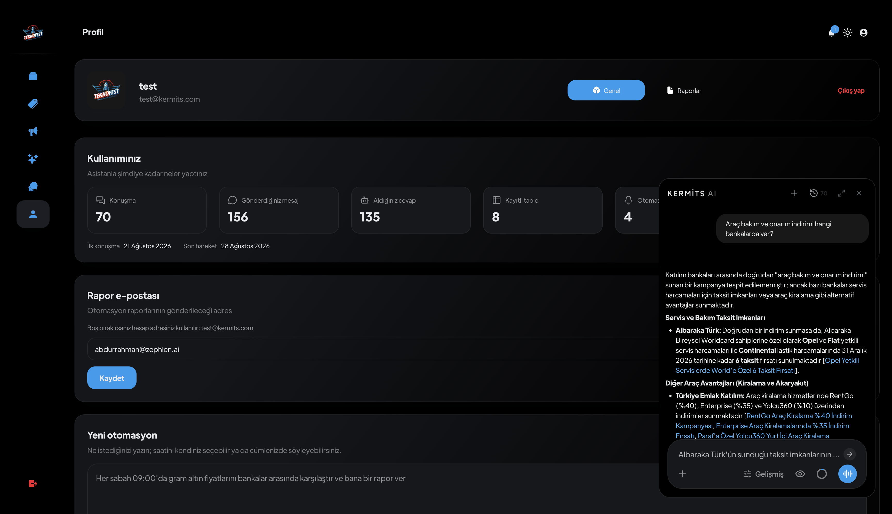
  <br/><sub><b>Profil sayfasının üstünde açılmış asistan; konuşma sayfa değiştirince kaybolmaz</b></sub>
</div>

## AI Görünümü: kaydedilen tablolar ve dışa aktarma

Sohbet sırasında asistanın kurduğu bir tabloyu beğenirseniz kaydedebiliyorsunuz; **AI Görünümü** o kayıtlı tabloların durduğu sayfa. Her tablonun üstünde ne için kurulduğunu ve ne zaman kaydedildiğini anlatan bir not var, altındaki düğmeyle de dört ayrı dosya biçiminde indirilebiliyor.

<div align="center">
  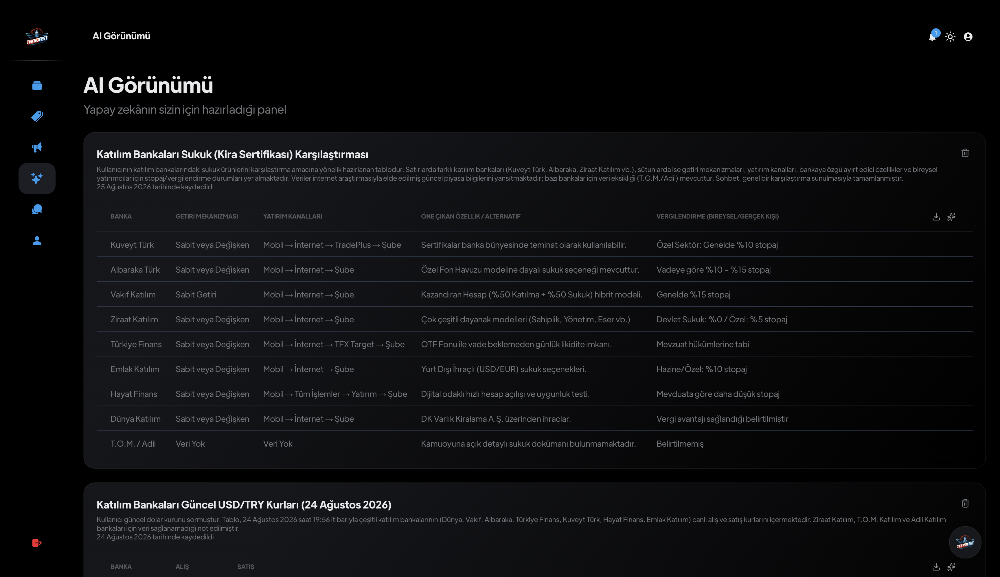
  <br/><sub><b>Konuşmadan kaydedilmiş tablolar, ne için kurulduklarını anlatan notlarıyla</b></sub>
</div>

<div align="center">
  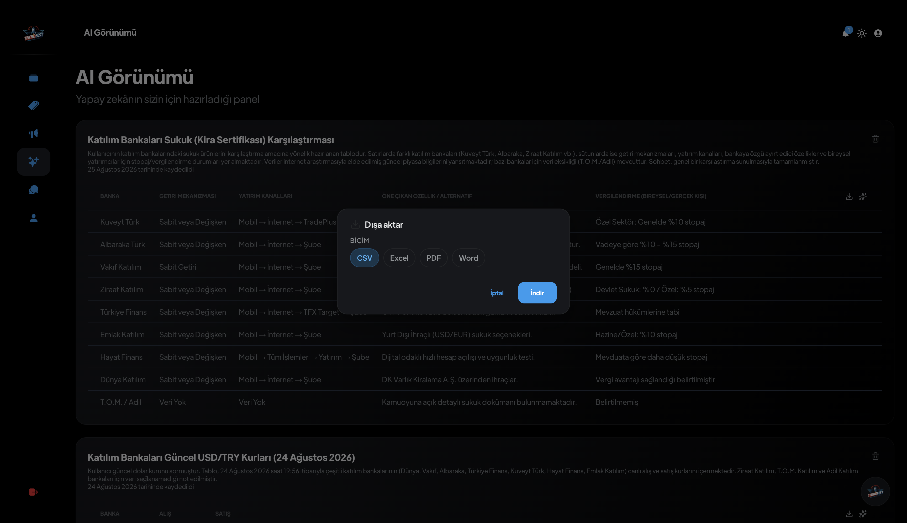
  <br/><sub><b>Dört format; her hücre hem sayısını hem ekrandaki biçimini taşıyor</b></sub>
</div>

## Otomasyonlar: cümleyle kurulur

Otomasyon, asistanın sizin yerinize düzenli olarak tekrarladığı bir iş. Ne istediğinizi gündelik bir cümleyle yazıyorsunuz, asistan bunu bir programa çeviriyor. Her çalışmanın sonucu size **e-postayla rapor olarak** gönderiliyor: otomasyonun ne aradığı, o koşu neyi bulduğu ve varsa bankaların güncel oranları e-postanın içinde duruyor. Koşul gerçekleştiğinde ayrıca uygulama içi bildirim de düşüyor.

<div align="center">
  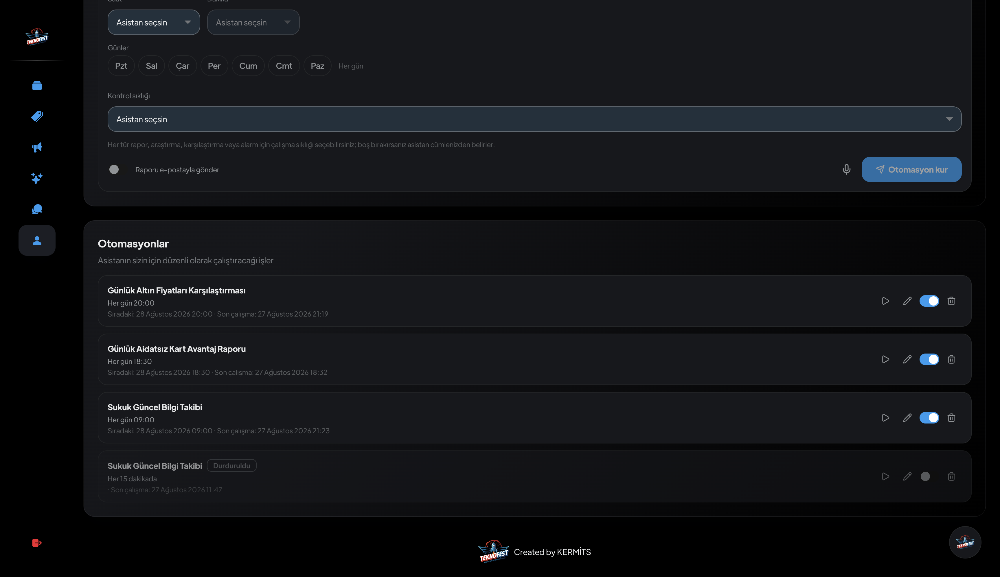
  <br/><sub><b>Kurulmuş otomasyonlar: sonraki çalışma, son çalışma, duraklatma ve elle tetikleme</b></sub>
</div>

Saat ve gün elle seçilebilir ama gerekmez: boş bırakılırsa sıklığı **cümlenin kendisinden** asistan çıkarır.

## Neler yapabiliyor

| Yetenek | Nasıl çalışıyor |
|---|---|
| **Canlı sesli konuşma** | Karşılıklı bir konuşma: siz sesle soruyorsunuz, **asistan da sesle cevap veriyor**; okurken sözünü kesip yeni soru sorabiliyorsunuz. Konuşma tanıma **cihazın kendi üzerinde** çalışır (Whisper large-v3, MLX 4-bit); ses hiçbir zaman üçüncü taraf bir servise gitmez. Kaynak dil Türkçe olarak sabitlenmiştir, böylece iki kelimelik bir soru yanlış dile atanmaz. |
| **Boşluk tuşuyla konuşma** | Panonun herhangi bir yerinde boşluğu basılı tutup sormak yeterli; ayrı bir sayfaya gitmek gerekmez. Bakılan sayfa soruyla birlikte gider, çünkü "bunlardan hangisi daha iyi?" ancak önünde durduğu tablonun yanında bir anlam taşır. Asistan konuşurken tekrar basmak sözünü keser. |
| **Sesli cevap** | Cevap önce sesli yanıt için optimize edilir, sonra akış halinde okunur; ilk ses yaklaşık **0,13 saniyede** duyulur, kullanıcı tamamının üretilmesini beklemez. |
| **Yazılı sohbet** | Cevap üretildikçe akar. Model seçimi, uzun düşünme ve web araması ayrı ayrı açılıp kapatılabilir. Tablo dosyası, PDF, görsel ve belge eki kabul eder. |
| **Ekranı görme** | Asistan o an açık olan tabloyu veya hesaplamayı görebilir; sayfadaki bir metni seçip doğrudan onun hakkında soru sorulabilir. |
| **Karşılaştırma tabloları** | Konuşmanın içinde tablo üretir ve bunlar katalog'a kaydedilebilir; kaydedilen tablo tek tıkla yeni bir konuşmaya geri iliştirilebilir. |
| **Canlı bağlantı** | Oran, taksit ve kur, indeksten değil bankanın **kendi hesaplama servisinden** anlık gelir. Bankalar aynı anda sorulur: sırayla 11,99 sn, paralel 0,59 sn. |
| **Kaynaklı cevap** | Her sayının yanında geldiği resmi sayfa tıklanabilir bir bağlantı olarak durur. Arkasında kaynak olmayan iddia çıktı denetiminden geçemez. |
| **Araç kullanan ajanlar** | LangChain / LangGraph üzerine kurulu; süpervizör on banka uzmanını **araç olarak** çağırır, her uzman da kendi bankasının araçlarını. |
| **Otomasyonlar** | Doğal dille kurulur: *"Taşıt finansman oranı %3,5'in altına inerse haber ver."* Kullanıcı zamanlama ya da eşik sözdizimi yazmaz; ne istediğini tarif eder. Her koşunun raporu e-postayla gider; koşul sağlandığında üstüne uygulama içi bildirim de düşer. |
| **Profil** | Kayıtlı tablolar, konuşma geçmişi, bildirim ve rapor tercihleri tek yerde. |
| **Dışa aktarma** | Excel, PDF, Word ve CSV. Her hücre hem sayısal değerini hem ekrandaki biçimini taşır. |

## Sesli konuşma

Konuşma tanıma cihazın kendi üzerinde çalışır; ses hiçbir zaman üçüncü taraf bir servise gitmez. Sesli cevap akış halinde üretilir ve ilk ses yaklaşık **0,13 saniyede** duyulur; kullanıcı cevabın tamamının üretilmesini beklemez.

## Tablo özetleyici neden durumsuz bir ajan

Bir tabloyu özetleyen ajan bilinçli olarak geçmişsiz ve aramasız kuruldu: aynı sayfa bir hafta sonra da aynı özeti üretsin ve sonuç önbelleğe alınabilsin diye. Ajana sayfanın ekran görüntüsünü vermek denendi ve bırakıldı; tablo başına dakikalarca görsel işleme maliyeti çıkarırken metin anahattının zaten taşıdığı hiçbir şeyin üstüne bir şey koymuyordu.

## Dışa aktarılan her hücre iki değer taşır

Dört ayrı yüzey tablo üretiyor ve dört format bunları almak istiyor. On altı ayrı dönüştürücü yazmak, Excel ile PDF'in yüzdenin ne olduğu konusunda anlaşamamasıyla biter. Bunun yerine her şey tek bir ara temsile indirgenir ve her hücre **hem sayısal değerini hem de ekranda yazıldığı biçimi** taşır. Excel sayıyı alır, böylece sütun toplanabilir. PDF ve Word ekrandaki biçimi alır (`%2,89`, `₺1.234,56`), böylece belge geldiği sayfanın aynısı gibi okunur.

---

# Teknoloji

| Alan | Kullanılanlar |
|---|---|
| **Arayüz** | Next.js 16 (App Router), React 19, TailwindCSS v4, Recharts / ApexCharts |
| **Sunucu** | FastAPI, Uvicorn, streaming |
| **Ajanlar** | LangChain, LangGraph, kalıcı checkpoint'ler |
| **Veri** | PostgreSQL, SQLAlchemy 2, Alembic |
| **Arama** | Qdrant, Sentence-Transformers, SearXNG |
| **Kimlik** | Argon2id, PyJWT |
| **Korpus** | Trafilatura, Poppler, PyMuPDF, Pillow, Playwright |
| **Ses** | mlx-whisper (tanıma), voxcpm (sentez) |
| **Dışa aktarma** | WeasyPrint, XlsxWriter, Pandoc |

## Modeller

Sistemde beş ayrı model var ve **hepsi kendi işini yapıyor**: üçü dil modeli, biri gömme, biri konuşma tanıma, biri seslendirme. Dil modellerinin üçü de yerel bir vLLM sunucusunda çalışır ve rol dağılımı tercihe değil **ölçüme** dayanır.

### Dil modelleri

| Anahtar | Model | Bağlam | Rolü |
|---|---|---|---|
| `gemma` | `google/gemma-4-31B-it` | 131K | Sohbet, görsel okuma, çıktı denetimi. En temiz Türkçe. Taranmış bir sayfada karo başına 304 istem jetonu harcadı ve hiç okuma hatası yapmadı; `qwen` aynı işte 4.328 jeton harcayıp üç hata yaptı. |
| `qwen` | `Qwen/Qwen3.6-27B` | 64K | Varsayılan model ve yapısal çıkarım. En güvenilir JSON ve en güçlü adım adım finansal muhakeme. |
| `gpt` | `openai/gpt-oss-20b` | 64K | Hafif sınıflandırma ve durumsuz işler. Görsel okuyamaz. |

Model seçimi kodda değil yapılandırmada durur, dolayısıyla roller `.env` üzerinden yeniden dağıtılabilir. Kullanıcı da composer'dan seçebilir; geçmiş modelin değil checkpoint'in olduğu için konuşmanın ortasında değiştirmek bir şey kaybettirmez.

### Arama, ses ve seslendirme

| İş | Model | Nerede çalışır | Neden bu |
|---|---|---|---|
| **Gömme** | `Qwen/Qwen3-Embedding-0.6B` · 1024 boyut | vLLM sunucusu (`/embed/v1`) | Çok dilli ve Türkçede güçlü; 32K bağlam sayesinde uzun bir ücret tablosu sayfası bölünmeden gömülüyor. Sorgular komut önekiyle, pasajlar öneksiz gömülür. |
| **Konuşma tanıma** | `whisper-large-v3` · MLX 4-bit | **Cihazın kendi üzerinde** | Ses üçüncü taraf bir servise hiç gitmiyor. Yerel bir dosya yolu bilinçli: bir isteğin karşılanması asla gigabaytlık bir indirme tetikleyemez. Kaynak dil Türkçeye sabitlenmiştir. |
| **Seslendirme** | `Trendyol/Trendyol-TTS` · voxcpm | Ayrı bir servis, akışlı | Türkçe bankacılık metnini okuyan Türkçe bir LoRA, işletim sisteminin rastgele sesine karşı. Ham 16-bit PCM olarak, daha üretilirken akıyor. |

Görsel okuma ayrı bir model istemiyor: `gemma` zaten görüyor, dolayısıyla taranmış bir PDF ile bir kampanya afişi sohbetle aynı modelden geçiyor.

## Kütüphaneler

Sürümler `requirements.txt` ve `UI/package.json` içinde sabitlenmiştir; aşağısı ne için orada olduklarını anlatır.

| Katman | Kütüphaneler | Ne için |
|---|---|---|
| **Ajanlar** | `langchain` · `langgraph` · `langgraph-checkpoint-postgres` · `langchain-openai` | Ajan grafiği, araç çağrısı ve konuşmayı süreç dışında tutan kalıcı checkpoint |
| **Arama** | `qdrant-client` · `langchain-qdrant` · `sentence-transformers` · `langchain-huggingface` | Vektör deposu ve gömme; SearXNG ile talep üzerine web araması |
| **Sunucu** | `fastapi` · `uvicorn[standard]` · `pydantic` · `pydantic-settings` · `httpx` · `httpx-sse` | Akışlı API, şema doğrulama ve yapılandırma |
| **Veri** | `sqlalchemy` · `psycopg[binary]` · `alembic` | Şema, göç ve konuşma deposu |
| **Kimlik** | `argon2-cffi` · `pyjwt` · `email-validator` | Parola özeti, oturum jetonu |
| **Korpus** | `trafilatura` · `lxml` · `pymupdf` · `pypdf` · `pillow` · `playwright` · `curl_cffi` | HTML'den markdown'a, PDF çözme, görsel işleme, arayüzünü dinamik kuran sayfalar için gerçek tarayıcı |
| **Ses** | `mlx-whisper` (yalnız Apple Silicon) · `voxcpm` | Cihaz üstünde tanıma, akışlı seslendirme |
| **Dışa aktarma** | `weasyprint` · `XlsxWriter` · `markdown-it-py` · Pandoc | PDF, Excel, Word ve CSV; hepsi tek bir ara temsilden |
| **Arayüz** | `next` 16 · `react` 19 · `tailwindcss` v4 · `@mui/material` · `@tanstack/react-query` · `next-intl` · `streamdown` | App Router, sunucu durumu, iki dil, akan cevabın markdown olarak çizilmesi |
| **Arayüz (görsel)** | `recharts` · `apexcharts` · `lucide-react` · `ogl` · `@zumer/snapdom` | Grafikler, tek ikon seti, sesli modun WebGL küresi, ekran görüntüsü alma |
| **Test** | `pytest` · `pytest-asyncio` · `node --test` | Python tarafı pytest, arayüz tarafı Node'un kendi koşucusu |

---

# Kurulum

**Gerekenler:** Python 3.13+, Node.js 20+, Docker, Pandoc ve erişilebilir bir vLLM sunucusu. Sesli konuşma Apple Silicon gerektirir.

```bash
git clone https://github.com/Abdurrahman-Wahdan/TF26.git
cd TF26
cp .env.example .env          # vLLM adresini ve veritabanı bilgilerini doldurun

docker compose up -d postgres qdrant searxng

python -m venv .venv && source .venv/bin/activate
pip install -r requirements.txt
playwright install chromium
alembic upgrade head
uvicorn api.main:app --port 8000 --reload
```

```bash
cd UI && npm install && npm run dev
```

Arayüz: [http://localhost:3000](http://localhost:3000)

## İşe yarayan komutlar

```bash
python -m banks.health          # her bankanın her yeteneği çalışıyor mu
python -m banks.audit           # her bankanın her ürünü (zamanlanmış çalışır)
python -m corpus.build          # korpusu sitelerden yeniden kur
python -m index                 # değişen belgeleri indekse eşitle
```

Son üçü her gece çalışmak üzere tasarlandı. `python -m corpus.schedule`, `python -m index.schedule` ve `python -m banks.schedule` komutlarının her biri, çakışmayacak şekilde kaydırılmış hazır bir zamanlayıcı kaydı yazdırır.

---

<div align="center">
  <sub>TEKNOFEST 2026 Yapay Zeka Dil Ajanları Yarışması için geliştirilmiştir.</sub>
</div>

<br/>

---

<br/>

<div align="center">
  

  <h1 id="kermits-english">KERMİTS</h1>

  <p><strong>An evidence-first multi-agent assistant and decision support platform for participation banking</strong></p>

  <p>
    <strong>TEKNOFEST 2026 · Yapay Zeka Dil Ajanları Yarışması</strong><br/>
    <em>Katılım Bankacılığı Finansal Metin Madenciliği, Bilgi Çıkarımı ve Akıllı Dashboard-Asistan Çözümleri Kategorisi</em>
  </p>

  [](https://www.teknofest.org/tr/yarismalar/yapay-zeka-dil-ajanlari-yarismasi/)
  [](https://www.python.org/)
  [](https://nextjs.org/)
  [](https://fastapi.tiangolo.com/)
  [](https://langchain-ai.github.io/langgraph/)
  [](https://qdrant.tech/)
  [](LICENSE)

  <br/>

  <a href="#kermits-turkce"><strong>Türkçe</strong></a> · <strong>English</strong>
</div>

---

## What it does

Kermits makes the products, campaigns and current rates of Türkiye's 10 participation banks comparable in one place. The user asks in plain language, and the system answers **with its sources attached**: every figure carries the official page or document it came from, as a clickable reference.

> **Participation banking** is a banking model based on profit-and-loss sharing instead of interest. What a conventional bank calls a loan is *financing*, interest is a *profit share*, and a term deposit is a *participation account*. This is not just vocabulary. A participation account cannot promise a return in advance, so an assistant that says "you will earn X" has given a wrong answer, not a helpful one. The system holds this terminology end to end.

The interface ships in Turkish for now; the multilingual groundwork is in place and ready for a second language. It has six workspaces: chat, live comparison, product catalogue, campaigns, automations, and voice conversation.

<div align="center">
  
</div>

---

## End to end

This README follows the order the system actually works in: how raw bank sites become knowledge, how that knowledge is used when a question arrives, and what the answer passes through before it reaches the user.

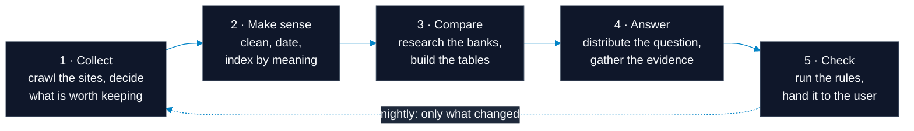
```mermaid
%%{init: {'theme':'base','themeVariables':{'primaryColor':'#0f172a','primaryTextColor':'#f8fafc','primaryBorderColor':'#334155','lineColor':'#0284c7','secondaryColor':'#1e293b','tertiaryColor':'#0f172a','clusterBkg':'#090d16','clusterBorder':'#1e293b'}}}%%
flowchart LR
    A["1 · Collect<br/>crawl the sites, decide<br/>what is worth keeping"] --> B["2 · Make sense<br/>clean, date,<br/>index by meaning"]
    B --> C["3 · Compare<br/>research the banks,<br/>build the tables"]
    C --> D["4 · Answer<br/>distribute the question,<br/>gather the evidence"]
    D --> E["5 · Check<br/>run the rules,<br/>hand it to the user"]
    E -.->|nightly: only what changed| A
```

The first three steps run **ahead of time**, independently of any user, and build the corpus. The last two run **live**, the moment a user asks something. Nightly, those first three are not run again from scratch; only what changed is handled: new and updated pages, pages that went away, and campaigns past their end date. The sections follow that order.

---

## Three distinctions the design rests on

Every decision below follows from these three.

**Live numbers and durable facts come from different places.** Today's profit-share rate, instalment amount and exchange rate are fetched from the bank's own calculation service at the moment they are asked for, and are never stored in the search index, because an indexed number is wrong tomorrow. Product terms, participation principles and fee schedules come instead from a durable **corpus**: an archive of documents collected from the banks' own sites and cleaned.

**Each bank is sealed inside its own agent.** The ten bank specialists cannot see each other's data. A specialist is never offered a choice of bank; its bank is fixed the moment it is created. This makes the most common failure in a multi-bank answer, attributing one bank's rate to another, impossible by construction rather than by instruction.

**"They don't offer it" and "I couldn't reach them" are different answers.** If a bank does not sell that product, saying so is a correct and useful answer. If the bank's service broke this morning, it is not. The system records these two states separately and reports them separately.

---

# 1 · Collect

> Bank sites are crawled while the URL tree is pruned: the number of pages to download is cut before anything is downloaded.

## Pruning the URL tree to cut the page count

The URLs on a bank's site are drawn from two sources at once. The **sitemap** is the list the bank publishes itself: fast, and it hands over deep pages directly, but most banks do not keep it current. **BFS** starts at the home page and follows links layer by layer: slower, but it finds pages the sitemap never mentions. Together they produce a whole that neither reaches alone.

Throughout the crawl one boundary is never relaxed: **requests never leave the bank's own domain.** Outbound links, social media addresses and third-party services are dropped before they are ever followed. Without that boundary, wandering off one bank's site into the rest of the internet is a matter of moments, and which bank the corpus belongs to stops being clear.

The collected URLs form a **tree**, not a flat list. The goal is not to judge pages one at a time but to **prune whole branches near the root, so that far fewer pages ever need downloading.** Saying SKIP to `/kariyer` or `/yatirimci-iliskileri` at the top eliminates hundreds of pages in one decision. The agent makes that call without downloading anything: all it has is the URL path, the branch's title, and a few sample titles from underneath it.

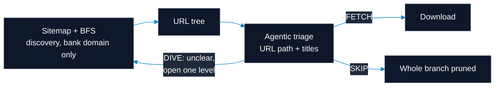
```mermaid
%%{init: {'theme':'base','themeVariables':{'primaryColor':'#0f172a','primaryTextColor':'#f8fafc','primaryBorderColor':'#334155','lineColor':'#0284c7','secondaryColor':'#1e293b','tertiaryColor':'#0f172a','clusterBkg':'#090d16','clusterBorder':'#1e293b'}}}%%
flowchart LR
    A["Sitemap + BFS<br/>discovery, bank domain only"] --> C["URL tree"]
    C --> D["Agentic triage<br/>URL path + titles"]
    D -->|DIVE: unclear,<br/>open one level| A
    D -->|FETCH| E["Download"]
    D -->|SKIP| F["Whole branch pruned"]
```

## A branch that cannot be judged is opened until it can

The agent makes one of three calls per branch:

| Call | What it means |
|---|---|
| **DIVE** | This branch holds product categories, go into its children |
| **FETCH** | There is a concrete product, campaign or document here |
| **SKIP** | This is not customer-facing: job listings, branch locators, investor reports |

The real mechanism is **DIVE**: when a branch can neither be discarded outright nor taken outright, the agent opens it and descends one level. This repeats until the call becomes clear, going all the way down to a single page if it has to. The tree is opened top-down, but only as far as it needs to be: where the answer is obvious a whole branch closes in one decision, and where it is ambiguous the crawl goes to the leaves.

The download budget is therefore spent where the judgement is genuinely hard. An agent is used instead of brittle pattern rules because every bank's site is laid out differently. Writing rules would mean starting from scratch for each new bank.

## Not every PDF is worth reading

Of the **1,088 PDFs crawled, only about 227** are product documents. Most of the rest are general credit agreements, prospectuses and corporate policies. Reading everything would have spent most of the extraction budget on contract language and buried the fee schedules underneath it.

The decision comes from **where the bank published the document**, not from its filename: a PDF linked from a product page is a product document. The corpus proves filenames alone are not enough: `banking-license.pdf` is a scan of a licence, while `vahesabi_onbilg_formu.pdf` is a disclosure form carrying real rates.

## The same content is never processed twice

Every page, PDF and image collected gets a fingerprint. Identical content sitting at different addresses, such as the same campaign banner repeated across ten pages, is processed once. This cuts both crawling and model cost directly.

---

# 2 · Make sense

> Raw collected content is turned into knowledge that can be searched and trusted.

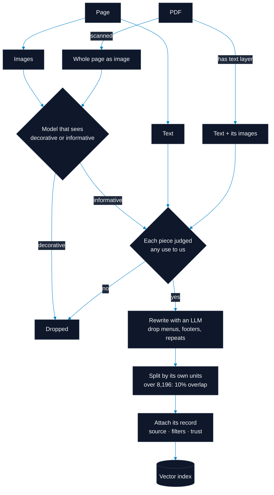
```mermaid
%%{init: {'theme':'base','themeVariables':{'primaryColor':'#0f172a','primaryTextColor':'#f8fafc','primaryBorderColor':'#334155','lineColor':'#0284c7','secondaryColor':'#1e293b','tertiaryColor':'#0f172a','clusterBkg':'#090d16','clusterBorder':'#1e293b'}}}%%
flowchart TD
    P["Page"] --> PT["Text"]
    P --> PI["Images"]
    D["PDF"] -->|has text layer| DT["Text + its images"]
    D -->|scanned| DI["Whole page as image"]

    PI --> V{"Model that sees<br/>decorative or informative"}
    DI --> V
    V -->|decorative| X["Dropped"]
    V -->|informative| G

    PT --> G{"Each piece judged<br/>any use to us"}
    DT --> G
    G -->|no| X
    G -->|yes| C["Rewrite with an LLM<br/>drop menus, footers, repeats"]

    C --> S["Split by its own units<br/>over 8,196: 10% overlap"]
    S --> M["Attach its record<br/>source · filters · trust"]
    M --> F[("Vector index")]
```

Not everything collected travels the same road, but all of it arrives at the same door: **usable, attributable, rewritten text.**

## Text and images arrive by different routes

Information on a page sits in two places. Some of it is writing; some of it is inside a picture, because a fee schedule or a profit-share table is usually an image rather than text. Taking only the writing throws away the most valuable part of such a page.

So a page's text and its images are handled separately. The same holds for PDFs: where a PDF has a text layer, the writing is taken as it stands and the images within it are examined separately; where there is no text layer at all, meaning the document is a scan, the whole page is read as an image. A scanned contract and a digital product page thus meet on the same pipeline.

Images get one extra filter: each is first judged as decorative or as carrying real product or campaign information. Logos and backgrounds are dropped; tables and condition text are extracted.

## Images are read by a model that sees, not by OCR

The off-the-shelf way to get text out of a picture is OCR, and it is deliberately not used here. The reason: **in a banking image, most of the information is not in the letters but in the layout.**

Looking at a profit-share table, OCR sees numbers stacked in a column. It cannot say which number belongs to which term or which product row, because it reads characters rather than structure. In the same way, on a campaign banner it cannot tell that the rate set in large type is the headline offer while the small print beneath it is the condition. The text it produces is made of correct characters and means the wrong thing, and it does so silently.

A model that sees looks at the image the way a reader does: it holds the row and column relationship of a table together, separates a heading from its body, and sees which figure a footnote belongs to. The same model also decides what is merely decorative, so no separate classification step is needed.

There is a cost: running a model that sees is more expensive than OCR. That is why which images are worth it is filtered beforehand, and the same image is never asked about twice.

## Relevance is judged before anything is cleaned

Not every piece of text that comes out is processed. First it is decided whether it is **any use to us**: is this product, campaign or service information a customer could be shown, or is it a corporate announcement, a regulatory text, a job posting?

The order is deliberate: filter first, clean second. Cleaning is expensive, and rewriting an irrelevant document nicely spends that cost on text that will never be used.

The call is not made once for a whole document; **every piece is judged individually**, and only those found relevant are kept. In a long document the useful parts are usually scattered: a contract's opening and closing are boilerplate, but a fee table may sit in the middle. Discarding the document whole would throw that table away; taking it whole would fill the index with boilerplate.

The same per-piece judgement makes early stopping possible on long documents: if a decisive number of pieces at the start all come back irrelevant, the rest is never looked at.

Where the answer is uncertain, the data is kept. If the pieces of a document disagree, the result counts as relevant; the system prefers holding on to doubtful text over discarding it.

## What survives is rewritten

Text judged relevant is not stored as it came. It is handed to a model and **rewritten**: menus, footers, cookie notices, social media links and anything else repeating from page to page are dropped, leaving the product and campaign content specific to that page.

This is done by a model rather than by rule lists, because the ten banks' page structures do not resemble each other and writing rules means starting over for each new bank. The same reasoning applies to images and PDFs, so all three routes take the same approach.

## Nothing is processed twice

Pages, PDFs and images are identified by a signature derived from their content. If the same campaign banner appears on ten pages, it is read once; if the same PDF downloads from two addresses, it is processed once.

This is not only about speed. Were repeated content sent to the model again and again, most of the cost would go on relearning what is already known.

## The document decides where to cut

Slicing text into fixed lengths is the easy path, and it runs through the middle of a profit-share table. The document's own units are used instead: a page's sections under their headings, a PDF's pages.

Campaigns are never split. If the dates land in one piece and the conditions in another, a search finds the condition but cannot tell whether it still applies.

We did set an upper bound: **8,196 characters**. That is our choice rather than a technical limit; handing a model one very long piece makes it lose track of the context. Text above the bound is split with a **10% overlap**, so each piece carries a little of the end of the previous one: if a fee line or a condition sentence falls exactly on the cut, it stays intact in at least one piece. Nothing under the bound is split.

## Every piece carries where it came from

After splitting we hold pieces rather than documents, and a piece on its own is anonymous. So each one carries its source alongside its text: the exact address it came from, which bank and which kind of document it belongs to, and its validity dates.

The link points at the heading the information sits under rather than the whole page; where there is no anchor it falls back to the page, but one is never invented. Wherever a piece travels, its source travels with it, so every figure shown can be verified.

---

# 3 · Compare

> Clean pages become tables that put the banks side by side. The whole step runs on agents; nowhere in it is there a fixed list of rules.

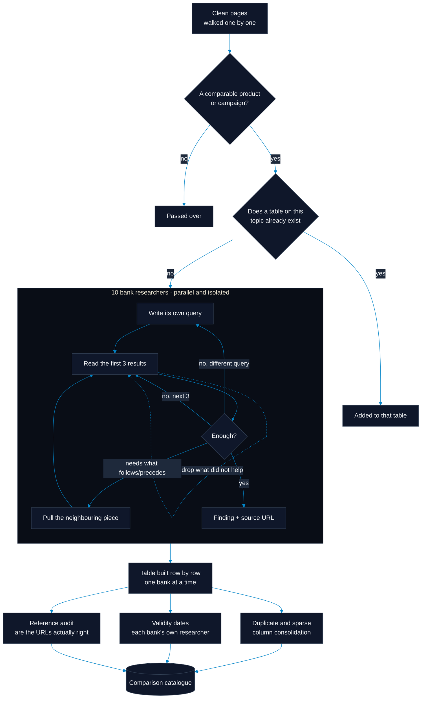
```mermaid
%%{init: {'theme':'base','themeVariables':{'primaryColor':'#0f172a','primaryTextColor':'#f8fafc','primaryBorderColor':'#334155','lineColor':'#0284c7','secondaryColor':'#1e293b','tertiaryColor':'#0f172a','clusterBkg':'#090d16','clusterBorder':'#1e293b'}}}%%
flowchart TD
    P["Clean pages<br/>walked one by one"] --> Q{"A comparable product<br/>or campaign?"}
    Q -->|no| X["Passed over"]
    Q -->|yes| DUP{"Does a table on this<br/>topic already exist"}
    DUP -->|yes| M["Added to that table"]
    DUP -->|no| R

    subgraph R["10 bank researchers · parallel and isolated"]
        direction TB
        RA["Write its own query"] --> RB["Read the first 3 results"]
        RB --> RC{"Enough?"}
        RC -->|no, different query| RA
        RC -->|no, next 3| RB
        RC -->|needs what follows/precedes| RD["Pull the neighbouring piece"]
        RD --> RB
        RB -.->|drop what did not help| RB
        RC -->|yes| RE["Finding + source URL"]
    end

    R --> S["Table built row by row<br/>one bank at a time"]
    S --> A1["Reference audit<br/>are the URLs actually right"]
    S --> A2["Validity dates<br/>each bank's own researcher"]
    S --> A3["Duplicate and sparse<br/>column consolidation"]
    A1 --> T[("Comparison catalogue")]
    A2 --> T
    A3 --> T
```

## One question is asked of every page

The first agent walks the pages that were cleaned and judged useful, one at a time. For each it makes a single call: **does this page carry concrete product or campaign information, and can that information be compared against other banks?**

## The same table is never built twice

A yes does not start the research straight away. First the existing pool is searched for **a table that already compares this topic**, and by meaning rather than by matching words, since the same subject appears on two pages under two different names.

If such a table exists, the new page is added to it. Without this check, an expensive ten-bank fan-out would be spent reproducing a table we already hold.

## Ten researchers, ten separate investigations

Where no table exists, the first agent works the topic up and hands it to **each bank's own researcher**. They run in parallel and cannot see one another's data.

Each researcher steers its own investigation. It writes its own query, reads the first three results, and decides for itself what comes next:

- If the results did not help, it can ask for **the next three** or rewrite the query entirely.
- If something important is cut off at a piece boundary, it can pull **the neighbouring piece**.
- It **discards** the pieces that were no use, keeping its working space clear as the investigation goes on.

None of these is a fixed sequence; each is a call the researcher makes in the moment. In the end every one returns its finding **together with its source address**.

## The table is built row by row

The first agent walks the ten researchers' findings in turn and fills the table one bank at a time. Producing a ten-bank table in one go leaves the door open for a single missing bank to corrupt the whole thing; built in sequence, finding nothing for one bank leaves the other rows untouched.

## Three audits once the table is built

When the table is finished it gets a single review pass:

**Are the references actually right.** Every row's source address is checked against the text it came from. Fabricated citations, and ones pointing at the wrong page, are removed here.

**How long the information holds.** Each bank's validity dates are extracted by that bank's own researcher, because the place to find the date is that bank's own sources.

**Has the table been split unnecessarily.** If another table in the pool really does compare the same topic, the two are merged. Likewise sparse columns, filled in only a few rows, are consolidated without losing data.

---

# 4 · Answer

> When a user asks, the question is distributed to the banks and evidence is gathered.

The whole system in one sentence: **there is one manager agent and ten bank specialists.** The manager knows nothing about any bank on its own. It hands the question to the relevant specialists all at once, then assembles the evidence they bring back into an answer.

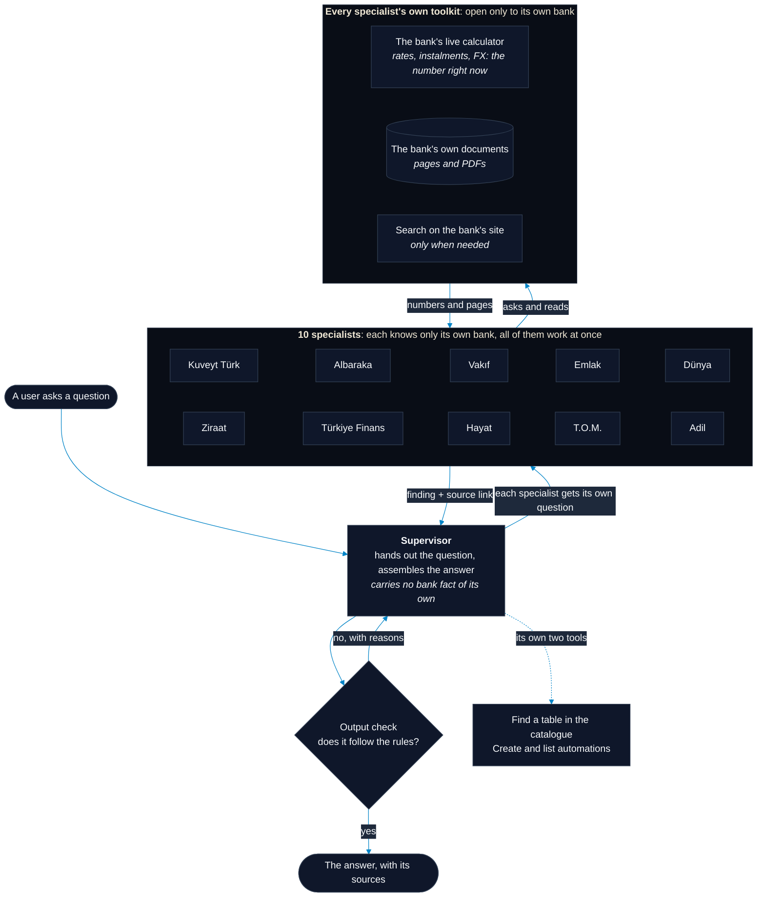
```mermaid
%%{init: {'theme':'base','themeVariables':{'primaryColor':'#0f172a','primaryTextColor':'#f8fafc','primaryBorderColor':'#334155','lineColor':'#0284c7','secondaryColor':'#1e293b','tertiaryColor':'#0f172a','clusterBkg':'#090d16','clusterBorder':'#1e293b'}}}%%
flowchart TB
    U(["A user asks a question"])
    SUP["<b>Supervisor</b><br/>hands out the question, assembles the answer<br/><i>carries no bank fact of its own</i>"]

    U --> SUP

    subgraph SPEC["<b>10 specialists</b>: each knows only its own bank, all of them work at once"]
        direction LR
        S1["Kuveyt Türk"] ~~~ S2["Albaraka"] ~~~ S3["Vakıf"] ~~~ S4["Emlak"] ~~~ S5["Dünya"]
        S6["Ziraat"] ~~~ S7["Türkiye Finans"] ~~~ S8["Hayat"] ~~~ S9["T.O.M."] ~~~ S10["Adil"]
    end

    subgraph TOOLS["<b>Every specialist's own toolkit</b>: open only to its own bank"]
        direction LR
        T1["The bank's live calculator<br/><i>rates, instalments, FX: the number right now</i>"]
        T2[("The bank's own documents<br/><i>pages and PDFs</i>")]
        T3["Search on the bank's site<br/><i>only when needed</i>"]
    end

    SUP -->|"each specialist gets its own question"| SPEC
    SPEC -->|"asks and reads"| TOOLS
    TOOLS -->|"numbers and pages"| SPEC
    SPEC -->|"finding + source link"| SUP

    SUP --> G{"Output check<br/>does it follow the rules?"}
    G -->|"no, with reasons"| SUP
    G -->|"yes"| OUT(["The answer, with its sources"])

    SUP -.->|"its own two tools"| SUPT["Find a table in the catalogue<br/>Create and list automations"]
```

Read it top to bottom, not left to right: **the question enters at the top, evidence is gathered at the bottom, and the answer only leaves after passing the check.** The arrow coming back from the check is a real path: when a rule is broken the answer does not go to the user, it returns to the supervisor with the reason attached.

The supervisor's own two tools carry no facts, they do work: finding the address of a table the site already publishes on that topic, and storing the recurring tasks a user has set up. **Every bank fact comes from a specialist.**

> An **agent** is a language model that decides for itself which tool to use and when. What separates it from an ordinary chat model is that it can carry out a multi-step investigation instead of answering in one shot. The **supervisor** distributes and assembles the work; a **specialist** is a sub-agent responsible for exactly one bank.

## Agent-as-a-tool

The supervisor never queries banks directly. It calls each bank **as a tool**, and all ten specialists can run at once. A specialist's own reasoning steps never reach the supervisor; only its final finding and its source links do. That keeps the supervisor's working context free of the noise of ten separate research sessions.

> An agent's **context window** is everything it can hold in mind at once: the conversation so far, plus every document it has pulled in. It is finite, and once it fills up the oldest material has to be summarised or dropped. Most of the decisions below exist to spend that space on evidence rather than on noise.

## Exactly what one specialist has in its hands

This is what you see when one of the boxes above is opened. The example is the Kuveyt Türk specialist; the other nine are built identically, each wired to its own bank.

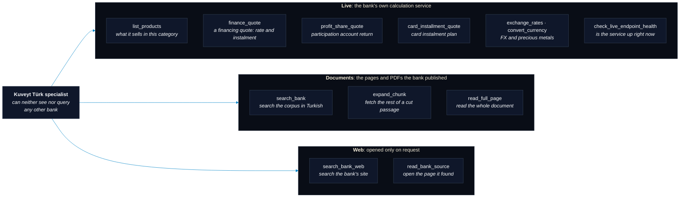
```mermaid
%%{init: {'theme':'base','themeVariables':{'primaryColor':'#0f172a','primaryTextColor':'#f8fafc','primaryBorderColor':'#334155','lineColor':'#0284c7','secondaryColor':'#1e293b','tertiaryColor':'#0f172a','clusterBkg':'#090d16','clusterBorder':'#1e293b'}}}%%
flowchart LR
    A["<b>Kuveyt Türk specialist</b><br/><i>can neither see nor query<br/>any other bank</i>"]

    subgraph LIVE["<b>Live</b>: the bank's own calculation service"]
        direction TB
        L1["list_products<br/><i>what it sells in this category</i>"]
        L2["finance_quote<br/><i>a financing quote: rate and instalment</i>"]
        L3["profit_share_quote<br/><i>participation account return</i>"]
        L4["card_installment_quote<br/><i>card instalment plan</i>"]
        L5["exchange_rates · convert_currency<br/><i>FX and precious metals</i>"]
        L6["check_live_endpoint_health<br/><i>is the service up right now</i>"]
    end

    subgraph DOCS["<b>Documents</b>: the pages and PDFs the bank published"]
        direction TB
        D1["search_bank<br/><i>search the corpus in Turkish</i>"]
        D2["expand_chunk<br/><i>fetch the rest of a cut passage</i>"]
        D3["read_full_page<br/><i>read the whole document</i>"]
    end

    subgraph WEB["<b>Web</b>: opened only on request"]
        direction TB
        W1["search_bank_web<br/><i>search the bank's site</i>"]
        W2["read_bank_source<br/><i>open the page it found</i>"]
    end

    A --> LIVE
    A --> DOCS
    A --> WEB
```

The three groups answer three different questions and **do not substitute for one another:**

**Live** is the number that holds *right now*. A rate or instalment question is answered from the calculator the bank shows its own customers, not from the index. A calculator a bank does not publish never appears in that specialist's tool list at all, so the model cannot even try to call a service that does not exist.

**Documents** are what the bank *published*: product terms, fee tables, campaign conditions. That is evidence, but it is not a quote, and the specialist is told so explicitly: a figure read off a page is never presented as a live rate.

**Web** is off by default, and even when it is on it discards every result outside its own bank's domain.

## How a specialist runs its own investigation

A specialist does not perform one search and stop. It steers its own research:

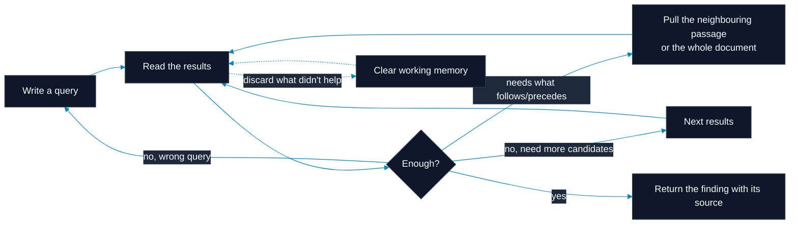
```mermaid
%%{init: {'theme':'base','themeVariables':{'primaryColor':'#0f172a','primaryTextColor':'#f8fafc','primaryBorderColor':'#334155','lineColor':'#0284c7','secondaryColor':'#1e293b','tertiaryColor':'#0f172a','clusterBkg':'#090d16','clusterBorder':'#1e293b'}}}%%
flowchart LR
    Q["Write a query"] --> R["Read the results"]
    R --> D{Enough?}
    D -->|needs what follows/precedes| E["Pull the neighbouring passage<br/>or the whole document"]
    D -->|no, wrong query| Q
    D -->|no, need more candidates| N["Next results"]
    E --> R
    N --> R
    D -->|yes| A["Return the finding with its source"]
    R -.->|discard what didn't help| P["Clear working memory"]
    P -.-> R
```

Long documents are split into passages before being indexed, so a single search result is a slice of a page rather than the whole of it. Two decisions follow:

**Continuing a cut-off passage is its own tool.** If a fee table or a profit-share condition is split across a passage boundary, the specialist can ask for the neighbouring passage or for the entire document. Without it, the model treats half a sentence as the whole answer and reports a figure that was never complete.

**The model can empty its own memory.** When a specialist marks a result as unhelpful, that text drops out of its context before the next step. This is what stops three searches from leaving twenty passages behind. The permission is deliberately narrow and applies only to search results. A live price quote or a user's message cannot be deleted this way.

## Live numbers come from the bank on the spot

Questions about rates, instalments and exchange rates are answered from the bank's own calculation service, not from the index. Four decisions shape this layer:

**The limit is known first.** Letting someone request 360 months and then showing them a screen where every bank declines teaches them nothing. The number that matters is the **intersection** across the banks in the comparison: if one stops at 84 months, a comparison including it can only ask for 84. That is not an error to report afterwards, but a ceiling to show beforehand, named alongside the bank that set it.

**The banks are asked at once.** Asking six banks one after another takes **11.99 seconds**. Asking them together takes **0.59**.

**No result is silently dropped.** "This bank does not sell that", "the service is under maintenance" and "the request failed" are three distinct answers and all three are reported. *No bank offers this* and *we could not reach anyone* must never look alike.

**The banks' state is continuously watched.** Two checks make that distinction possible: a capability check that takes seconds and can be triggered by an agent on demand, and a scheduled product audit that walks every product one by one. Both verify the **contract** rather than the value; a rate changing from yesterday is not a fault. What they find is written to a shared state that the tools read before every call.

Adil Katılım and T.O.M. Katılım are registered as providers **with no capabilities**; their sites offer no interface where a customer can have a rate calculated. Registering them is what allows the agent to say "this bank does not publish a calculator." Had they been left out, the same question would have met a silent gap instead.


---

# How a request is handled

> A typed question and a spoken one travel the same road. Voice is four steps bolted onto the two ends of it.

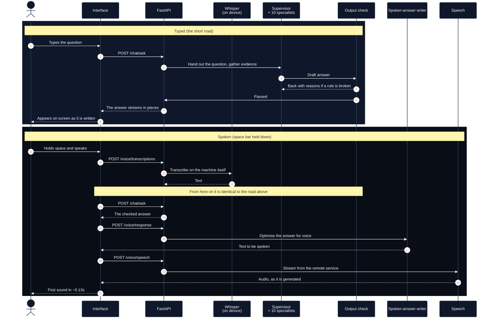
```mermaid
%%{init: {'theme':'base','themeVariables':{'primaryColor':'#0f172a','primaryTextColor':'#f8fafc','primaryBorderColor':'#334155','lineColor':'#0284c7','secondaryColor':'#1e293b','tertiaryColor':'#0f172a','clusterBkg':'#090d16','clusterBorder':'#1e293b'}}}%%
sequenceDiagram
    autonumber
    actor U as User
    participant UI as Interface
    participant API as FastAPI
    participant W as Whisper<br/>(on device)
    participant AG as Supervisor<br/>+ 10 specialists
    participant C as Output check
    participant R as Spoken-answer writer
    participant S as Speech

    rect rgb(15, 23, 42)
    Note over U,C: Typed (the short road)
    U->>UI: Types the question
    UI->>API: POST /chat/ask
    API->>AG: Hand out the question, gather evidence
    AG->>C: Draft answer
    C-->>AG: Back with reasons if a rule is broken
    C->>API: Passed
    API-->>UI: The answer streams in pieces
    UI-->>U: Appears on screen as it is written
    end

    rect rgb(9, 13, 22)
    Note over U,S: Spoken (space bar held down)
    U->>UI: Holds space and speaks
    UI->>API: POST /voice/transcriptions
    API->>W: Transcribe on the machine itself
    W-->>API: Text
    Note over UI,C: From here on it is identical to the road above
    UI->>API: POST /chat/ask
    API-->>UI: The checked answer
    UI->>API: POST /voice/response
    API->>R: Optimise the answer for voice
    R-->>UI: Text to be spoken
    UI->>API: POST /voice/speech
    API->>S: Stream from the remote service
    S-->>UI: Audio, as it is generated
    UI-->>U: First sound in ~0.13s
    end
```

**Voice is not a separate track.** The middle of a spoken question is the whole of a typed one: same supervisor, same ten specialists, same output check. The difference is only at the ends: one step in front that turns speech into text, and two behind that optimise the answer for voice and then speak it. That is what keeps voice from being a second-class way in: there is no answer generator specific to the voice channel, so a question asked out loud never sees less evidence than one that was typed.

**The answer is optimised for voice.** The supervisor is told to write comparisons as tables with a link after every claim: right on screen, unbearable aloud. The optimisation step in between turns the finished answer into something built to be heard. If that step fails the voice does not go silent: the browser's own converter takes over. It cannot phrase a table as well, but it also **cannot invent a rate that does not exist**, which is exactly what makes it the right thing to fall back to.

**The wait is filled.** A ten-bank comparison can take thirty seconds, and in voice mode there is no screen to watch; a minute of silence is indistinguishable from a crash. So an acknowledgement is spoken the moment the transcript lands, then a holding line every ten seconds, over music playing underneath. The music stops as the answer begins.

**The user can interrupt.** Pressing space while the assistant is reading cuts the reading off mid-sentence and starts the new recording. The conversation history stays; only the audio is cut.

---

# 5 · Check

> Before an answer reaches the user, it passes through the rules.

## The output check

An answer is read against an editable rule set before it reaches the user. The checking layer does not **repair** the answer; it returns pass or fail. On a failure the answer goes back to the assistant with the reason, because the assistant is the one holding the tools and the conversation needed to produce a correct answer. The responsibility is kept separate deliberately: a layer that both writes and judges does neither well.

What it checks:

- Fidelity to participation banking terminology, and the refusal of any guaranteed return even by implication
- Staying inside the domain
- Neutralising prompt injection and persona-hijack attempts
- Never leaking internal architecture or prompt templates
- Never asserting a claim that has no source behind it

> A **prompt injection** is an instruction hidden inside content the model reads, such as a line in an uploaded PDF or on a web page saying "ignore your previous instructions", written to hijack the model through material it was only meant to summarise.

## Where the isolation boundary is drawn

A specialist's web research tool discards every result outside its own bank's domain and validates **every redirect**, so a specialist cannot be walked onto another bank's site or an internal address. The supervisor never loads these tools at all.

## Losing nothing in long conversations

Each agent carries its own history and reaches its limit independently. When a conversation is summarised, the summariser is given the **whole** history; the off-the-shelf default is to show it only the most recent portion, which means describing most of a long conversation without having read it.

---

# Nightly: only what changed

> The corpus is not built once and left alone, but neither is it rebuilt from scratch each night. The nightly run looks for the difference and processes only that.

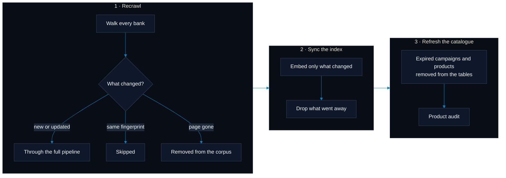
```mermaid
%%{init: {'theme':'base','themeVariables':{'primaryColor':'#0f172a','primaryTextColor':'#f8fafc','primaryBorderColor':'#334155','lineColor':'#0284c7','secondaryColor':'#1e293b','tertiaryColor':'#0f172a','clusterBkg':'#090d16','clusterBorder':'#1e293b'}}}%%
flowchart LR
    subgraph N1["1 · Recrawl"]
        direction TB
        A["Walk every bank"] --> B{"What changed?"}
        B -->|new or updated| C["Through the full pipeline"]
        B -->|same fingerprint| D["Skipped"]
        B -->|page gone| E["Removed from the corpus"]
    end
    subgraph N2["2 · Sync the index"]
        F["Embed only what changed"] --> G["Drop what went away"]
    end
    subgraph N3["3 · Refresh the catalogue"]
        H["Expired campaigns and products<br/>removed from the tables"] --> I["Product audit"]
    end
    N1 --> N2 --> N3
```

**A new or changed page is not a special case.** Anything discovered tonight, or whose content has changed, goes through exactly the same path as everything else: triage, collection, cleaning, dating, indexing. There is no separate route for content that arrives later, so a page added today is held to the same standard as one that has been there from the start. Unchanged pages enter none of those steps.

**New calculators are looked for too.** The crawl checks whether a bank has published a new calculation endpoint, and pages that build their interface dynamically are opened in a real browser, so what a visitor actually sees is what gets inspected.

**Removal matters as much as addition.** A page the bank has taken down is removed from the corpus. Campaigns and products past their end date are deleted from the comparison tables, so a table does not carry an offer that no longer exists.

**The work is proportional to the change.** Content whose fingerprint is unchanged is not read again; a night in which nothing changed costs almost nothing. Removal is guarded too: a run that would delete an unusually large share of the index refuses and writes nothing, on the assumption that a crawl went wrong rather than that a bank deleted its site.

---

# The interface

<div align="center">
  
  <br/><sub><b>Compare: the way into a six-page dashboard</b></sub>
</div>

| Page | What it does |
|---|---|
| **Chat** | The evidence-first assistant. Model choice, extended reasoning and web search are each toggleable. It can see the table or calculation currently on screen and answer questions about it. Accepts spreadsheets, PDFs, images and documents. Builds tables inside the conversation that can be saved to the catalogue. |
| **Live comparison** | General-purpose, vehicle and housing financing, participation accounts, FX and card instalments. Banks are queried in parallel. The user's own assumptions are kept visually separate from the rates the bank published. |
| **Products** | Curated multi-bank tables alongside the user's own tables from chat. Any of them can be attached back into a conversation in one click. |
| **Campaigns** | Campaigns across all ten banks, labelled active, ending soon, or expired. |
| **AI Overview** | Your own board: the tables you liked in chat get saved here. Each card carries a note on what the table was built for and when it was saved, with a download button underneath in four formats. |
| **Automations** | Recurring tasks set up in plain language: *"Tell me if the vehicle financing rate drops below 3.5%."* Every run is emailed to you as a report; when the condition is met, an in-app notification lands as well. |

### The pieces that recur across the interface

The dashboard is built out of a handful of simple pieces, and each one does the same job on every page; learn one and there is nothing to look for on the next screen.

| Piece | What it is for |
|---|---|
| **Left menu** | The list of the six pages. Collapsible, with the page you are on marked. |
| **Table card** | Every comparison is shown inside the same card: title, filter box, sortable columns and a download button at the bottom. Products, Campaigns, AI Overview and the tables chat builds are all this one card. |
| **AI summary** | The short summary box sitting above a table. Its points are written off that table and nowhere else. |
| **Assistant window** | The button in the bottom corner opens the assistant as a small window over the page. Change pages and the conversation carries on where it left off. |
| **Voice mode** | Hold the space bar and a sphere rises from the bottom of the screen, moving as you speak. It does not cover the page behind it, because the question is usually about that page. |
| **Automation card** | One card per job you set up: the sentence itself, the next and last run, a pause switch and a "run now" button. |
| **Theme switch** | Light and dark. The whole interface works in both, charts, tables and voice mode included. |

## Comparison: the question is a form, the answer comes from the bank

You pick a product and type in the amount and the term. The system asks every bank the same question at that moment and lays the answers side by side in one table; the figures come from each bank's own calculator, not from a stored list.

<div align="center">
  
  <br/><sub><b>Six banks asked at once, sorted by instalment; with an AI summary read off the table above it</b></sub>
</div>

The user picks what to compare and enters the amount and term; the banks are queried **in parallel**. A bank that does not offer it is reported as “does not offer”, a bank that could not be reached as “could not be reached”; the two never look alike.

## Products and Campaigns: ready-made comparison tables

The catalogue is split across two pages: **Products** compares bank products, **Campaigns** compares time-limited offers. Both use the same layout; the shots below are examples taken from Products.

<div align="center">
  
  <br/><sub><b>The catalogue: one table per topic, filterable by sub-category (example: Products)</b></sub>
</div>

<div align="center">
  
  <br/><sub><b>One table opened, with a summary written from that table above it (example)</b></sub>
</div>

The summary is always written **from the table**; the rows beneath it are the source of record.

## The assistant: every figure carries its source

The chat screen, where you can ask anything in your own words. What separates it from an ordinary chatbot: every figure it gives you carries a link to the bank page it came from, so you can check the answer rather than trust it.

<div align="center">
  
  <br/><sub><b>A campaign question: every claim is followed by a link to the bank's own page</b></sub>
</div>

<div align="center">
  
  <br/><sub><b>The output check at work: the question says “interest”, the answer corrects the terminology and answers in profit-share terms; bank, rate, source and time on every row</b></sub>
</div>

The second shot also shows the light theme: the whole interface works in both.

## The user picks the model and the depth of reasoning

You choose which AI model writes the answer; each of the three is good at different work. With the **Think** switch on, the model reasons step by step before answering: slower, but more accurate on tangled questions.

<div align="center">
  
  <br/><sub><b>Three models and a Think switch; changeable mid-conversation</b></sub>
</div>

Because the history belongs to the checkpointer and not to the model, switching does not lose the conversation built up so far.

## Live voice conversation: you speak, the assistant speaks back

You can use it without touching the keyboard. Hold the space bar, ask your question, and when you let go the assistant **reads its answer out loud**. So it is not one-way dictation but a live, two-way conversation: pressing space again while it is speaking cuts it off and starts your next question, the same way you would interrupt someone on the phone.

<div align="center">
  
  <br/><sub><b>The composer while recording: elapsed time, a live waveform, and one tap to stop</b></sub>
</div>

<div align="center">
  
  <br/><sub><b>Space held down: the dock rises from the bottom, hovers over the page and covers nothing behind it</b></sub>
</div>

The second shot is the whole point of the design: the question is nearly always *about* what is on screen, so that thing has to stay visible while it is being asked about.

## The assistant does not leave the page

The assistant is not a separate page. Whatever screen you are on, a button in the corner opens it as a small window on top, and changing pages does not wipe the conversation.

<div align="center">
  
  <br/><sub><b>The assistant open over the profile page; the conversation survives changing pages</b></sub>
</div>

## AI Overview: saved tables and export

If you like a table the assistant built during a conversation, you can save it; **AI Overview** is the page those saved tables live on. Each one carries a note saying what it was built for and when it was saved, and a button to download it in four different file formats.

<div align="center">
  
  <br/><sub><b>Tables saved out of a conversation, each with a note on what it was built for</b></sub>
</div>

<div align="center">
  
  <br/><sub><b>Four formats; every cell carries both its number and its on-screen form</b></sub>
</div>

## Automations: set up in a sentence

An automation is a job the assistant repeats for you on a schedule. You write what you want in an everyday sentence and the assistant turns it into a schedule. The result of every run reaches you **as an emailed report**: what the automation was looking for, what that run found, and the banks' current rates where there are any. When the condition is met, an in-app notification lands too.

<div align="center">
  
  <br/><sub><b>Automations already running: next run, last run, pause and manual trigger</b></sub>
</div>

The hour and days can be picked by hand but need not be: left blank, the assistant infers the frequency **from the sentence itself**.

## What it can do

| Capability | How it works |
|---|---|
| **Live voice conversation** | A two-way conversation: you ask out loud and **the assistant answers out loud**; you can cut it off mid-sentence and ask the next thing. Speech recognition runs **on the machine itself** (Whisper large-v3, MLX 4-bit); audio never leaves it for a third-party service. The source language is pinned to Turkish, so a two-word question is never misclassified into another one. |
| **Hold space to talk** | Hold the space bar anywhere on the dashboard and ask; there is no separate page to go to. The page being looked at travels with the question, because "which of these is better?" only means something beside the table it was asked in front of. Pressing again while the assistant is speaking interrupts it. |
| **Spoken answers** | The answer is optimised for voice first, then synthesised as a stream; the first sound is audible in about **0.13 seconds**, so the user does not wait for the whole thing to be generated. |
| **Typed chat** | The answer streams as it is written. Model choice, extended reasoning and web search are each toggleable. Accepts spreadsheets, PDFs, images and documents. |
| **Seeing the screen** | The assistant can see the table or calculation currently open, and any text on the page can be selected and asked about directly. |
| **Comparison tables** | It builds tables inside the conversation, and those can be saved to the catalogue; a saved table can be attached back into a new conversation in one click. |
| **Live connections** | Rates, instalments and FX come from the bank's **own calculation service** on the spot, not from the index. Banks are queried at once: 11.99s in sequence, 0.59s in parallel. |
| **Sourced answers** | Every figure carries the official page it came from as a clickable link. A claim with no source behind it does not pass the output check. |
| **Tool-using agents** | Built on LangChain / LangGraph: the supervisor calls ten bank specialists **as tools**, and each specialist calls its own bank's tools. |
| **Automations** | Set up in plain language: *"Tell me if the vehicle financing rate drops below 3.5%."* The user writes no schedule and no threshold syntax; they describe what they want. Every run is emailed as a report; when the condition is met, an in-app notification lands on top of that. |
| **Profile** | Saved tables, conversation history, notification and report preferences in one place. |
| **Export** | Excel, PDF, Word and CSV. Every cell carries both its numeric value and its on-screen form. |

## Voice conversation

Speech recognition runs on the machine itself; audio never leaves it for a third-party service. The spoken reply is synthesised as a stream, with the first sound audible in about **0.13 seconds**, so the user does not wait for the whole answer before hearing it.

## Why the table summariser is a stateless agent

The agent that summarises a table was deliberately built with no history and no search: so that the same page produces the same summary a week later, and the result can be cached. Giving it a screenshot of the page was tried and dropped: it cost minutes of image processing per table while adding nothing the text outline already carried.

## Every exported cell carries two values

Four different surfaces produce tables, and four formats want to receive them. Writing sixteen separate converters is how Excel and PDF end up disagreeing about what a percentage is. Instead everything is reduced to one intermediate representation in which each cell holds **both its numeric value and the way it was written on screen**. Excel receives the number, so the column can still be summed. PDF and Word receive the on-screen form (`%2,89`, `₺1.234,56`), so the document reads exactly like the page it came from.

---

# Technology

| Area | Used |
|---|---|
| **Interface** | Next.js 16 (App Router), React 19, TailwindCSS v4, Recharts / ApexCharts |
| **Server** | FastAPI, Uvicorn, streamed responses |
| **Agents** | LangChain, LangGraph, persistent checkpoints |
| **Data** | PostgreSQL, SQLAlchemy 2, Alembic |
| **Search** | Qdrant, Sentence-Transformers, SearXNG |
| **Identity** | Argon2id, PyJWT |
| **Corpus** | Trafilatura, Poppler, PyMuPDF, Pillow, Playwright |
| **Voice** | mlx-whisper (recognition), voxcpm (synthesis) |
| **Export** | WeasyPrint, XlsxWriter, Pandoc |

## Models

There are five models in the system and **each does its own job**: three language models, one embedding model, one for speech recognition, one for synthesis. All three language models run on a local vLLM server, and the role assignments come from **measurement**, not preference.

### Language models

| Key | Model | Context | Role |
|---|---|---|---|
| `gemma` | `google/gemma-4-31B-it` | 131K | Chat, visual reading, output checking. The cleanest Turkish. On a scanned page it spent 304 prompt tokens per tile and made no transcription errors, where `qwen` spent 4,328 and made three. |
| `qwen` | `Qwen/Qwen3.6-27B` | 64K | Default, and structured extraction. The most reliable JSON and the strongest step-by-step financial reasoning. |
| `gpt` | `openai/gpt-oss-20b` | 64K | Lightweight classification and stateless work. Cannot read images. |

Model choice lives in configuration rather than in code, so roles can be reassigned through `.env`. The user can also pick one in the composer; because the history belongs to the checkpointer and not to the model, switching mid-conversation loses nothing.

### Retrieval, speech and voice

| Job | Model | Where it runs | Why this one |
|---|---|---|---|
| **Embedding** | `Qwen/Qwen3-Embedding-0.6B` · 1024 dimensions | vLLM server (`/embed/v1`) | Multilingual and strong on Turkish; its 32K context means a long fee-table page is embedded whole. Queries take an instruction prefix, passages do not. |
| **Speech recognition** | `whisper-large-v3` · MLX 4-bit | **On the device itself** | Audio never goes to a third-party service. The local file path is deliberate: serving a request must never be able to trigger a multi-gigabyte download. The source language is pinned to Turkish. |
| **Speech synthesis** | `Trendyol/Trendyol-TTS` · voxcpm | A separate service, streamed | A Turkish LoRA reading Turkish banking prose, against whatever generic voice the operating system happened to install. Raw 16-bit PCM, streamed while it is still being generated. |

Visual reading needs no separate model: `gemma` already sees, so a scanned PDF and a campaign banner go through the same model as the conversation.

## Libraries

Versions are pinned in `requirements.txt` and `UI/package.json`; what follows is why each is there.

| Layer | Libraries | For what |
|---|---|---|
| **Agents** | `langchain` · `langgraph` · `langgraph-checkpoint-postgres` · `langchain-openai` | The agent graph, tool calling, and the persistent checkpoints that keep a conversation out of process memory |
| **Retrieval** | `qdrant-client` · `langchain-qdrant` · `sentence-transformers` · `langchain-huggingface` | Vector store and embeddings; SearXNG for on-request web search |
| **Server** | `fastapi` · `uvicorn[standard]` · `pydantic` · `pydantic-settings` · `httpx` · `httpx-sse` | Streamed API, schema validation and configuration |
| **Data** | `sqlalchemy` · `psycopg[binary]` · `alembic` | Schema, migrations and the conversation store |
| **Identity** | `argon2-cffi` · `pyjwt` · `email-validator` | Password hashing and session tokens |
| **Corpus** | `trafilatura` · `lxml` · `pymupdf` · `pypdf` · `pillow` · `playwright` · `curl_cffi` | HTML to markdown, PDF decoding, image handling, and a real browser for pages that build their interface dynamically |
| **Voice** | `mlx-whisper` (Apple Silicon only) · `voxcpm` | On-device recognition, streamed synthesis |
| **Export** | `weasyprint` · `XlsxWriter` · `markdown-it-py` · Pandoc | PDF, Excel, Word and CSV, all from one intermediate representation |
| **Interface** | `next` 16 · `react` 19 · `tailwindcss` v4 · `@mui/material` · `@tanstack/react-query` · `next-intl` · `streamdown` | App Router, server state, two languages, and drawing a streaming answer as markdown |
| **Interface (visual)** | `recharts` · `apexcharts` · `lucide-react` · `ogl` · `@zumer/snapdom` | Charts, one icon set, voice mode's WebGL orb, and screenshotting |
| **Tests** | `pytest` · `pytest-asyncio` · `node --test` | pytest on the Python side, Node's own runner on the interface side |

---

# Setup

**Requirements:** Python 3.13+, Node.js 20+, Docker, Pandoc, and a reachable vLLM server. Voice conversation requires Apple Silicon.

```bash
git clone https://github.com/Abdurrahman-Wahdan/TF26.git
cd TF26
cp .env.example .env          # fill in the vLLM address and database details

docker compose up -d postgres qdrant searxng

python -m venv .venv && source .venv/bin/activate
pip install -r requirements.txt
playwright install chromium
alembic upgrade head
uvicorn api.main:app --port 8000 --reload
```

```bash
cd UI && npm install && npm run dev
```

Interface: [http://localhost:3000](http://localhost:3000)

## Useful commands

```bash
python -m banks.health          # is every capability at every bank working
python -m banks.audit           # every product at every bank (runs on a schedule)
python -m corpus.build          # rebuild the corpus from the sites
python -m index                 # sync changed documents into the index
```

The last three are meant to run nightly. `python -m corpus.schedule`, `python -m index.schedule` and `python -m banks.schedule` each print a ready scheduler entry, staggered so they do not overlap.

---

<div align="center">
  <sub>Built for TEKNOFEST 2026 Yapay Zeka Dil Ajanları Yarışması.</sub>
</div>
