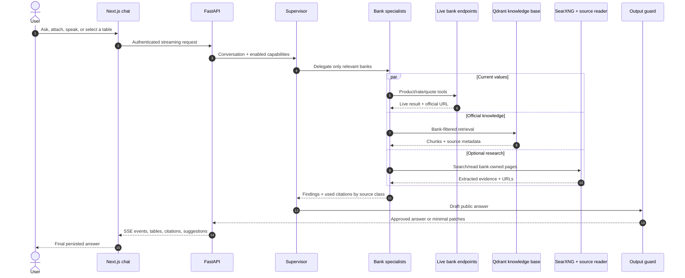
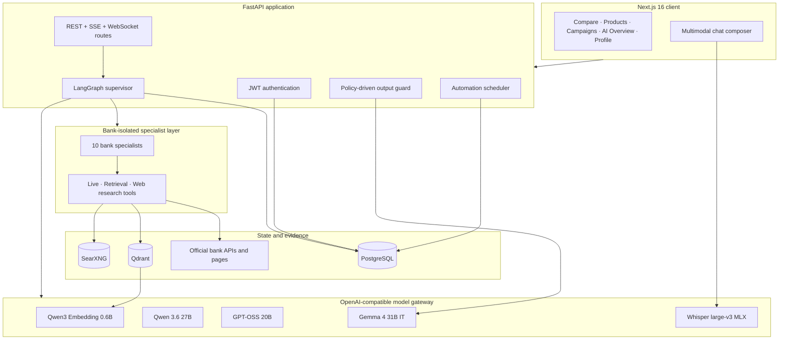
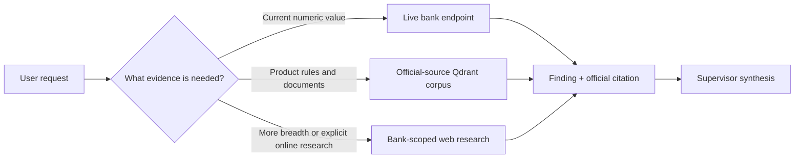

<div align="center">
  

  <h1>KERMİTS</h1>

  <p><strong>Evidence-first participation banking intelligence for Türkiye.</strong></p>
  <p>Compare products, investigate official bank sources, converse with bank-bound AI specialists, and turn decisions into reusable tables and scheduled reports.</p>

  [](#teknofest-2026)
  [](https://www.python.org/)
  [](https://nextjs.org/)
  [](https://fastapi.tiangolo.com/)
  [](https://langchain-ai.github.io/langgraph/)
  [](LICENSE)

  [Features](#features) · [Screenshots](#screenshots) · [Quick start](#quick-start) · [Architecture](#architecture) · [Configuration](#configuration) · [Testing](#testing)
</div>

---

Kermits AI is a Turkish participation-banking research and comparison platform. It combines live bank calculators, an indexed official-document corpus, optional public-web research, and a bank-isolated multi-agent system. Every bank specialist works only within its assigned bank, records the provenance of useful evidence, and hands supported findings to a supervisor that produces the user-facing answer.

The product is designed around one principle: **live values come from live endpoints, durable product knowledge comes from the official-source corpus, and web research is a supporting tool—not a replacement for either.**

> [!IMPORTANT]
> This repository is a research and competition project, not financial advice. Bank rates, fees, campaigns, and eligibility conditions can change. Always verify a decision against the cited official source.

## Table of contents

- [Features](#features)
- [Screenshots](#screenshots)
- [How the agent works](#how-the-agent-works)
- [Architecture](#architecture)
- [Technology](#technology)
- [Quick start](#quick-start)
- [Model gateway](#model-gateway)
- [Knowledge base setup](#knowledge-base-setup)
- [Turkish voice input](#turkish-voice-input)
- [Configuration](#configuration)
- [API and useful commands](#api-and-useful-commands)
- [Testing](#testing)
- [Troubleshooting](#troubleshooting)
- [Repository layout](#repository-layout)
- [Security and public-repository hygiene](#security-and-public-repository-hygiene)
- [Contributors](#contributors)
- [License](#license)

## Features

### Evidence-first banking assistant

- A supervisor delegates bank-specific work to **10 isolated specialists**.
- Specialists prefer indexed official documents and live bank endpoints.
- Optional SearXNG research discovers and reads additional public bank pages.
- Useful evidence is returned with provenance and rendered as clickable citations.
- Sources are grouped by origin, including the knowledge base, online research, and internal product tables.
- A final output guard checks editable participation-banking and disclosure policies before an answer is stored or shown.

### Live comparison

- Compare financing, profit-share, foreign-exchange, precious-metal, card, and reward data.
- Discover product families dynamically instead of relying on a frozen UI catalogue.
- Fan out requests across supported banks concurrently.
- Keep customer-entered scenarios visibly separate from bank-reported facts.

### Research workspace

- Browse 260+ prepared product-comparison tables.
- Attach a table directly to a conversation.
- Save useful Markdown tables generated in chat.
- Search campaigns and official product pages.
- Let the assistant inspect the current application page when explicitly enabled.

### Multimodal chat

- Upload images, Markdown, and plain-text files directly.
- Convert PDF and DOCX pages to images privately before model inference.
- Mention attached files with `@`.
- Record Turkish speech and transcribe it locally with Whisper large-v3 on Apple Silicon.
- Receive context-aware next-message recommendations that can be inserted into the composer.

### Personal workflow

- Persistent chat history backed by PostgreSQL and LangGraph checkpoints.
- Scheduled automations and report notifications.
- Saved views and comparison tables.
- Turkish light and dark interfaces with responsive navigation.

### Covered banks

Kuveyt Türk, Albaraka Türk, Vakıf Katılım, Türkiye Emlak Katılım, Dünya Katılım, Ziraat Katılım, Türkiye Finans, Hayat Finans, T.O.M. Katılım, and Adil Katılım.

## Screenshots

### Cited research, reusable tables, and automations

The assistant can combine official-source evidence, produce a comparison table, expose the supporting links, and create a scheduled follow-up in the same conversation.


### Model, thinking, and web controls

Advanced controls expose clean model names and let the user enable reasoning or online research per request. Voice, attachments, page context, and recommendation insertion remain in the main composer.


<table>
  <tr>
    <td width="50%"></td>
    <td width="50%"></td>
  </tr>
  <tr><td align="center"><strong>Live comparison</strong></td><td align="center"><strong>Product-table catalogue</strong></td></tr>
  <tr>
    <td width="50%"></td>
    <td width="50%"></td>
  </tr>
  <tr><td align="center"><strong>Campaign discovery</strong></td><td align="center"><strong>Profiles, reports, and automations</strong></td></tr>
</table>

## How the agent works

1. The supervisor reads the conversation, attachments, selected table, and enabled capabilities.
2. It delegates only the relevant banks to bank-bound specialists.
3. Each specialist decides which available tools are appropriate:
   - live endpoints for current quotes and rates;
   - Qdrant retrieval for indexed official documents;
   - SearXNG and page reading as extra research when enabled and useful.
4. Specialists return supported findings plus only the sources that materially helped form those findings.
5. The supervisor synthesizes one answer without exposing internal tool or agent implementation details.
6. The output guard applies narrow segment-level fixes when a policy is violated.
7. The guarded answer is streamed to the UI, persisted in PostgreSQL, and retained in the LangGraph checkpoint context.



## Architecture



### Source priority



## Technology

| Layer | Main components |
|---|---|
| Frontend | Next.js 16, React 19, TypeScript 5, Material UI, Tailwind CSS 4, next-intl |
| API | FastAPI, Pydantic, SQLAlchemy 2, Alembic, Server-Sent Events, WebSockets |
| Agents | LangGraph, LangChain, persistent PostgreSQL checkpoints, bank-bound specialists |
| Models | `google/gemma-4-31B-it`, `Qwen/Qwen3.6-27B`, `openai/gpt-oss-20b` via vLLM |
| Retrieval | Qdrant, `Qwen/Qwen3-Embedding-0.6B`, bank-filtered metadata |
| Search | Self-hosted SearXNG and bounded page/PDF extraction |
| Voice | `openai/whisper-large-v3` converted to a local 4-bit MLX checkpoint |
| Documents | PyMuPDF, Poppler, Pillow; PDF/DOCX pages become model-ready images |
| State | PostgreSQL 17 for users, chat, saved tables, automations, reports, and checkpoints |
| Runtime | Docker Compose for PostgreSQL, Qdrant, and SearXNG |

## Quick start

### Prerequisites

- macOS or Linux
- Python **3.13.2**
- Node.js **20.9+** and npm
- Docker Desktop or Docker Engine with Compose v2
- `openssl`
- An OpenAI-compatible model gateway described in [Model gateway](#model-gateway)
- Recommended for document ingestion: Poppler (`brew install poppler` or `sudo apt install poppler-utils`)

### Automated setup

```bash
git clone https://github.com/Abdurrahman-Wahdan/TF26.git
cd TF26
bash scripts/setup_local.sh
```

The setup script creates `.venv`, installs Python and frontend dependencies, creates `.env` once with a generated JWT secret, starts PostgreSQL/Qdrant/SearXNG, waits for PostgreSQL, and runs Alembic migrations. It never overwrites an existing `.env`.

Set the model gateway in `.env`:

```dotenv
VLLM_BASE_URL=http://YOUR_MODEL_HOST:PORT
VLLM_API_KEY=EMPTY
```

Then start the API and UI together:

```bash
bash scripts/dev.sh
```

Open:

- Application: <http://127.0.0.1:3000/tr>
- API documentation: <http://127.0.0.1:8000/docs>
- API readiness: <http://127.0.0.1:8000/api/ready>
- SearXNG: <http://127.0.0.1:8888>
- Qdrant dashboard: <http://127.0.0.1:6333/dashboard>

Create an account from the sign-up screen; no seed account is required.

### Manual setup

```bash
python3 -m venv .venv
source .venv/bin/activate
pip install --upgrade pip
pip install -r requirements.txt

cp .env.example .env
# Edit .env and set API_JWT_SECRET plus VLLM_BASE_URL.

npm --prefix UI ci
docker compose up -d postgres qdrant searxng
alembic upgrade head
```

Run the services in two terminals:

```bash
source .venv/bin/activate
uvicorn api.main:app --reload --host 127.0.0.1 --port 8000
```

```bash
npm --prefix UI run dev -- --hostname 127.0.0.1
```

## Model gateway

The API expects one OpenAI-compatible base URL with model-specific routes:

| Display name | Model ID | Route | Purpose |
|---|---|---|---|
| Gemma 4 31B IT | `google/gemma-4-31B-it` | `/gemma/v1` | Default Turkish chat, vision, output guard |
| Qwen 3.6 27B | `Qwen/Qwen3.6-27B` | `/qwen/v1` | Structured extraction |
| GPT-OSS 20B | `openai/gpt-oss-20b` | `/gpt/v1` | Alternative reasoning model |
| Qwen3 Embedding 0.6B | `Qwen/Qwen3-Embedding-0.6B` | `/embed/v1` | Remote embedding mode |

The measured vLLM tool-calling flags are important:

```bash
vllm serve google/gemma-4-31B-it --enable-auto-tool-choice \
  --tool-call-parser gemma4 --reasoning-parser gemma4 \
  --chat-template examples/tool_chat_template_gemma4.jinja

vllm serve Qwen/Qwen3.6-27B --enable-auto-tool-choice \
  --tool-call-parser hermes --reasoning-parser qwen3

vllm serve openai/gpt-oss-20b --enable-auto-tool-choice \
  --tool-call-parser openai --reasoning-parser openai_gptoss
```

These models require substantial accelerator memory. They may run on a separate GPU workstation; only the gateway URL must be reachable from the API host. For frontend/API development without generated answers, PostgreSQL, Qdrant, and SearXNG can still run locally.

For local embeddings instead of `/embed/v1`:

```dotenv
EMBEDDING_PROVIDER=local
EMBEDDING_DEVICE=mps  # use cuda or cpu on other machines
```

## Knowledge base setup

The multi-gigabyte corpus and Qdrant storage are intentionally excluded from Git. A new clone starts with an empty knowledge base until the corpus is built or a prepared snapshot is restored.

### Build official-source documents

```bash
source .venv/bin/activate

# Faster website pass; queues PDFs for the slower vision pass.
python -m corpus --pages-only

# Process queued PDFs when the vision model is available.
python -m corpus --pdfs
```

For a single bank during development:

```bash
python -m corpus --site kuveytturk --limit 50
```

### Index into Qdrant

```bash
python -m index --no-write  # inspect the planned diff
python -m index             # embed and apply it
```

Both pipelines are incremental. Corpus publishing refuses unsafe shrinkage, and index deletion is gated to protect a healthy collection from a truncated crawl.

### Verify retrieval and live providers

```bash
python -m banks.health --no-write --no-notify
python scripts/verify_source_priority_routing.py
python scripts/verify_specialist_citations.py
```

## Turkish voice input

Voice transcription is optional and currently optimized for Apple Silicon. The browser records audio; FastAPI transcribes it locally with a verified 4-bit MLX checkpoint and forces Turkish to avoid short-utterance language-detection latency.

Expected path:

```text
TF26_data/models/whisper-large-v3-mlx-4bit/
├── config.json
└── weights.npz
```

The checkpoint is deliberately not downloaded during a request. Place the converted `openai/whisper-large-v3` MLX checkpoint at that path, or set `VOICE_MODEL_PATH` to an equivalent local directory. The API validates the expected size and SHA-256 before loading weights.

To run text-only or on Linux/Windows:

```dotenv
VOICE_WARM_ON_STARTUP=false
```

Text chat, comparisons, and retrieval continue to work when the optional voice runtime is unavailable.

## Configuration

Copy `.env.example` to `.env`. Important groups:

| Group | Key examples | Notes |
|---|---|---|
| Model gateway | `VLLM_BASE_URL`, `CHAT_MODEL`, `REASONER_MODEL` | `.env.example` documents every role |
| Output guard | `OUTPUT_GUARD_MODEL`, `OUTPUT_GUARD_POLICY_FILE` | Policies live in `agents/output_guard/policies.json` |
| Retrieval | `QDRANT_URL`, `QDRANT_COLLECTION_CHUNKS` | One collection with bank/source metadata |
| Web research | `WEB_SEARCH_URL`, `WEB_READ_SOURCE_ENABLED` | Specialist-only, bounded, and optional |
| PostgreSQL | `API_DATABASE_URL`, `API_JWT_SECRET` | Never commit the populated `.env` |
| Voice | `VOICE_MODEL_PATH`, `VOICE_LANGUAGE` | Optional Apple-Silicon path |
| Corpus/index | `CORPUS_*`, `INDEX_*`, `EMBEDDING_*` | Includes concurrency and safety gates |

The frontend proxies `/api/*` to `API_ORIGIN`, defaulting to `http://127.0.0.1:8000`. If the API runs elsewhere:

```bash
API_ORIGIN=http://127.0.0.1:8001 npm --prefix UI run dev -- --hostname 127.0.0.1
```

## API and useful commands

| Command | Purpose |
|---|---|
| `bash scripts/dev.sh` | Start infrastructure, migrations, API, and UI |
| `docker compose ps` | Inspect PostgreSQL, Qdrant, and SearXNG |
| `curl http://127.0.0.1:8000/api/health` | API liveness |
| `curl http://127.0.0.1:8000/api/ready` | PostgreSQL + Qdrant readiness |
| `python -m banks.health` | Exercise declared live-bank capabilities |
| `python -m corpus --pages-only` | Crawl official web pages and queue PDFs |
| `python -m corpus --pdfs` | Process selected PDFs with vision |
| `python -m index` | Incrementally synchronize Qdrant |
| `npm --prefix UI run api:schema` | Download the OpenAPI schema |
| `npm --prefix UI run api:types` | Regenerate TypeScript API types |

Main API groups include `/api/auth`, `/api/chat`, `/api/banks`, `/api/compare`, `/api/search`, `/api/profile`, `/api/automations`, `/api/models`, `/api/health`, and `/api/ready`. The interactive contract is always available at `/docs` while FastAPI is running.

## Testing

### Backend

```bash
source .venv/bin/activate
pytest tests/unit -q
```

Live/integration tests require their named services and may contact real bank or model endpoints:

```bash
pytest tests/integration -q
```

### Frontend

```bash
npm --prefix UI run lint
npm --prefix UI run typecheck
npm --prefix UI test
npm --prefix UI run i18n:check
npm --prefix UI run build
```

### Public-repository checks

```bash
git status --short
git ls-files | grep -E '(^|/)(\.env|TF26_data|corpus_data|qdrant_storage|node_modules|\.next)(/|$)'
git diff --check
```

The second command should print nothing.

## Troubleshooting

### Login says “Incorrect email or password” for every account

Confirm that port 8000 belongs to this project:

```bash
curl http://127.0.0.1:8000/openapi.json | python3 -c 'import json,sys; print(json.load(sys.stdin)["info"]["title"])'
```

Expected: `TF26 API`. If another project owns the port, run TF26 on another port and set `API_ORIGIN` for Next.js.

### `/api/ready` reports PostgreSQL or Qdrant unavailable

```bash
docker compose ps
docker compose logs postgres qdrant
alembic upgrade head
```

### Chat loads but model calls fail

- Verify `VLLM_BASE_URL` and each model route.
- Query `${VLLM_BASE_URL}/gemma/v1/models` with `curl`.
- Ensure vLLM was launched with the model-specific tool parser.
- Do not point the UI at the model host; the FastAPI service owns model access.

### Retrieval returns no official documents

Qdrant can be healthy and still empty. Build the corpus and run `python -m index`, then inspect <http://127.0.0.1:6333/dashboard>.

### Web search returns no results or rate-limit errors

Check SearXNG directly at <http://127.0.0.1:8888>, inspect `docker compose logs searxng`, and keep specialist tool limits conservative. Web research supplements Qdrant and live endpoints; it is not required for ordinary banking questions.

### Voice transcription is unavailable

Set `VOICE_WARM_ON_STARTUP=false` for text-only development. On Apple Silicon, verify the checkpoint path, `weights.npz` size/checksum, and that the conditional MLX dependencies installed successfully.

## Repository layout

```text
TF26/
├── agents/                  # Supervisor, ten bank specialists, output guard
├── api/                     # FastAPI routes, auth, chat, attachments, jobs
│   └── migrations/          # Alembic database migrations
├── banks/                   # Provider registry, live capabilities, health
├── config/                  # Environment settings and tunnel recovery
├── corpus/                  # Official-site crawl and document extraction
├── embeddings/              # Remote and local embedding providers
├── index/                   # Chunking, payloads, incremental Qdrant sync
├── llm/                     # Model factory and vLLM provider
├── scripts/                 # Setup, startup, and routing/citation checks
├── searxng/                 # Local metasearch configuration
├── tests/                   # Unit and live integration suites
├── UI/                      # Next.js application
├── vector_stores/           # Qdrant abstraction
├── docker-compose.yml       # PostgreSQL, Qdrant, SearXNG
└── .env.example             # Complete safe configuration template
```

## Security and public-repository hygiene

- `.env`, tokens, passwords, tunnel secrets, and machine-local status files are ignored.
- `TF26_data/`, `corpus_data/`, `data/`, model weights, Qdrant storage, logs, caches, `.next/`, and `node_modules/` stay local.
- The Docker services bind to loopback by default.
- The setup script generates a unique local JWT secret and never overwrites an existing environment file.
- Uploaded document processing remains server-side; rendered PDF/DOCX pages are not exposed as separate user artifacts.
- The included password-reset route is explicitly a **local-demo shortcut** and must be replaced with a verified, time-limited email-token flow before an internet-facing deployment.
- Before publishing, review `git status`, run a secret scanner, and inspect every staged binary.

## Contributors

<table>
  <tr>
    <td align="center" width="50%">
      <br/><br/>
      <strong><a href="https://www.linkedin.com/in/ifurkanatasoy/">İsmail Furkan Atasoy</a></strong><br/>
      <sub>Contributor</sub><br/><br/>
      <a href="https://www.linkedin.com/in/ifurkanatasoy/"></a>
      <a href="https://github.com/ifurkanatasoy"></a>
      <a href="https://www.instagram.com/ifurkanatasoy/"></a>
    </td>
    <td align="center" width="50%">
      <br/><br/>
      <strong><a href="https://www.linkedin.com/in/abdelrahman-wahdan">Abdelrahman Wahdan</a></strong><br/>
      <sub>Contributor</sub><br/><br/>
      <a href="https://www.linkedin.com/in/abdelrahman-wahdan"></a>
      <a href="https://github.com/Abdurrahman-Wahdan"></a>
      <a href="https://www.instagram.com/boodywahdan_/"></a>
    </td>
  </tr>
</table>

## License

Licensed under the [Apache License 2.0](LICENSE). See `LICENSE` for the complete terms.

## TEKNOFEST 2026

<div align="center">
  
  <br />
  <strong>Built for TEKNOFEST 2026 Yapay Zeka Dil Ajanları Yarışması</strong>
  <br />
  <sub>Kermits AI · Evidence-first participation banking intelligence</sub>
</div>
