<div align="center">
  

  <h1 id="kermits-ai-turkce">KERMİTS AI</h1>

  <p><strong>Katılım bankacılığı için kanıta dayalı çok ajanlı asistan ve karar destek platformu</strong></p>

  <p>
    <strong>TEKNOFEST 2026 · Yapay Zeka Dil Ajanları Yarışması</strong><br/>
    <em>Katılım Bankacılığı Finansal Metin Madenciliği, Bilgi Çıkarımı ve Akıllı Dashboard-Asistan Çözümleri Kategorisi</em>
  </p>

  [](https://www.teknofest.org/tr/yarismalar/yapay-zeka-dil-ajanlari-yarismasi/)
  [](https://www.python.org/)
  [](https://nextjs.org/)
  [](https://fastapi.tiangolo.com/)
  [](https://langchain-ai.github.io/langgraph/)
  [](https://qdrant.tech/)
  [](LICENSE)

  <br/>

  <strong>Türkçe</strong> · <a href="#kermits-ai-english"><strong>English</strong></a>
</div>

---

## Ne yapıyor

Kermits AI, Türkiye'deki 10 katılım bankasının ürünlerini, kampanyalarını ve güncel oranlarını tek bir yerde karşılaştırılabilir hale getiriyor. Kullanıcı doğal dille soruyor, sistem cevabı **kaynağıyla birlikte** veriyor: her sayının yanında onu hangi resmi sayfadan ya da hangi belgeden aldığı, tıklanabilir bir bağlantı olarak duruyor.

> **Katılım bankacılığı**, faiz yerine kâr–zarar ortaklığına dayanan bankacılık modelidir. Klasik bankanın kredi dediğine *finansman*, faize *kâr payı*, vadeli mevduata *katılma hesabı* denir. Bu sadece bir kelime meselesi değildir. Katılma hesabında getiri önceden taahhüt edilemez; dolayısıyla "şu kadar kazanırsınız" diyen bir asistan yardımcı olmuş değil, yanlış cevap vermiş olur. Sistem bu terminolojiyi baştan sona koruyor.

Arayüz şimdilik yalnızca Türkçe yayınlanıyor; çok dilli altyapı yerinde duruyor, ikinci dil [ileriki çalışmalar](#ileriki-calismalar) arasında. Altı çalışma alanı var: sohbet, canlı karşılaştırma, ürün kataloğu, kampanyalar, otomasyonlar ve sesli konuşma.

<div align="center">
  
</div>

---

## Baştan sona akış

Bu README, sistemin gerçekte işlediği sırayı takip ediyor: ham banka siteleri nasıl bilgiye dönüşüyor, o bilgi bir soru geldiğinde nasıl kullanılıyor, ve cevap kullanıcıya varmadan önce nereden geçiyor.

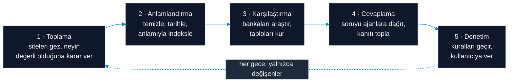

İlk üç adım kullanıcıdan bağımsız, **önceden** çalışır ve korpusu kurar. Son iki adım kullanıcı bir soru sorduğunda **anlık** çalışır. Her gece ise ilk üç adımın tamamı baştan işletilmez; yalnızca değişenler ele alınır: yeni ve güncellenmiş sayfalar, kalkan sayfalar ve tarihi geçmiş kampanyalar. Bölümler bu sırayla ilerliyor.

---

## Tasarımın dayandığı üç ayrım

Aşağıdaki bütün kararlar bu üçünün sonucudur.

**Canlı sayı ile kalıcı bilgi ayrı yerlerden gelir.** Bugünün kâr payı oranı, taksit tutarı ve döviz kuru, sorulduğu anda bankanın kendi hesaplama servisinden çekilir ve arama indeksine hiçbir zaman yazılmaz; çünkü indekslenen bir sayı yarın yanlıştır. Ürün şartları, katılım ilkeleri ve ücret tarifeleri ise kalıcı bir **korpustan** gelir: bankaların kendi sitelerinden toplanıp temizlenmiş belge arşivi.

**Her banka kendi ajanının içine kapatılmıştır.** On banka uzmanı birbirinin verisini göremez. Bir uzmana hangi bankayla çalışacağı hiç sorulmaz; bankası doğduğu anda sabitlenir. Bu, çok bankalı bir cevaptaki en yaygın hatayı, yani bir bankanın oranını başka bankaya atfetmeyi, talimatla değil mimariyle imkânsız kılar.

**"Sunmuyor" ile "ulaşamadım" farklı cevaplardır.** Banka o ürünü satmıyorsa bunu söylemek doğru ve işe yarar bir cevaptır. Bankanın servisi bu sabah bozulduysa aynı şey doğru değildir. Sistem bu iki durumu ayrı ayrı kaydeder ve ayrı ayrı bildirir.

---

# 1 · Toplama

> Banka siteleri taranırken URL ağacı budanır: indirilecek sayfa sayısı, hiçbir şey indirilmeden önce düşürülür.

## URL ağacı budanarak sayfa sayısı düşürülür

Bir bankanın sitesindeki URL'ler iki kaynaktan birlikte çıkarılır. **Sitemap** bankanın kendi ilan ettiği listedir: hızlıdır ve derin sayfaları doğrudan verir, ama çoğu banka onu güncel tutmaz. **BFS** ise ana sayfadan başlayıp linkleri katman katman izler: yavaştır ama sitemap'te hiç yazmayan sayfaları bulur. İkisinin birleşimi, tek başına hiçbirinin bulamadığı bütünü verir.

Tarama boyunca tek bir sınır hiç esnetilmez: **istekler bankanın kendi domaininin dışına çıkmaz.** Sayfalardaki dış linkler, sosyal medya adresleri ve üçüncü taraf servisler daha izlenmeden elenir. Bu sınır olmasa bir bankanın sitesinden çıkıp internetin geri kalanına dağılmak an meselesidir; korpusun hangi bankaya ait olduğu da belirsizleşir.

Toplanan URL'ler düz bir liste değil, bir **ağaçtır**. Buradaki amaç tek tek sayfaları değerlendirmek değil, **daha kök seviyesinde koca dalları budayarak indirilecek sayfa sayısını düşürmektir.** `/kariyer` ya da `/yatirimci-iliskileri` dalına en tepede SKIP demek, altındaki yüzlerce sayfayı tek kararla eler. Ajan bu kararı sayfaları indirmeden verir; elindeki tek bilgi URL yolu, dalın başlığı ve altındaki birkaç örnek başlıktır.

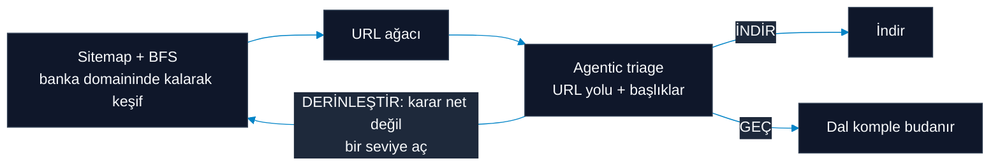

## Karar verilemeyen dal, karar verilebilene kadar açılır

Ajan bir dal için üç karardan birini verir:

| Karar | Anlamı |
|---|---|
| **DERİNLEŞTİR** | Karar bu seviyede verilemiyor, bir alt seviyeye in |
| **İNDİR** | Burada somut bir ürün, kampanya ya da belge var |
| **GEÇ** | Bu müşteriye dönük değil: iş ilanları, şube bulucu, yatırımcı raporları |

Asıl mekanizma **DERİNLEŞTİR** kararında: bir dalın tamamen atılacağına da tamamen alınacağına da karar verilemiyorsa, ajan o dalı açar ve bir alt seviyeye iner. Bu, karar netleşene kadar tekrarlanır ve gerekirse tek bir sayfaya kadar sürer. Yani ağaç yukarıdan aşağıya, ancak gerektiği kadar açılır: emin olunan yerde koca dal tek kararla kapanır, belirsiz olan yerde yapraklara kadar inilir.

Böylece indirme bütçesi, kararın gerçekten zor olduğu yerlere harcanır. Kırılgan desen kuralları yerine ajan kullanılır, çünkü her bankanın sitesi farklı kurgulanmıştır. Kural yazmak, her yeni banka için işe sıfırdan başlamak demek olurdu.

## Her PDF okunmaya değmez

Taranan **1.088 PDF'in yalnızca yaklaşık 227'si** ürün belgesi. Geri kalanın çoğu genel kredi sözleşmeleri, izahnameler ve kurumsal politikalar. Hepsini okumak, çıkarım bütçesinin büyük kısmını sözleşme diline harcayıp ücret tarifelerini bunların altına gömmek olurdu.

Karar dosya adından değil, **bankanın belgeyi nereye koyduğundan** çıkarılır: ürün sayfasından bağlanmış bir PDF ürün belgesidir. Dosya adının tek başına yetmediğini korpusun kendisi kanıtlıyor: `banking-license.pdf` bir lisans taraması, `vahesabi_onbilg_formu.pdf` ise gerçek oranlar taşıyan bir bilgilendirme formu.

## Aynı içerik iki kez işlenmez

Toplanan her sayfa, PDF ve görsel için bir hash çıkarılır. Farklı adreslerde duran aynı içerik, aynı kampanya afişinin on ayrı sayfada tekrarlanması gibi, tek sefer işlenir. Bu, hem tarama hem de model maliyetini doğrudan düşürür.

---

# 2 · Anlamlandırma

> Toplanan ham içerik, aranabilir ve güvenilir bilgiye dönüştürülür.

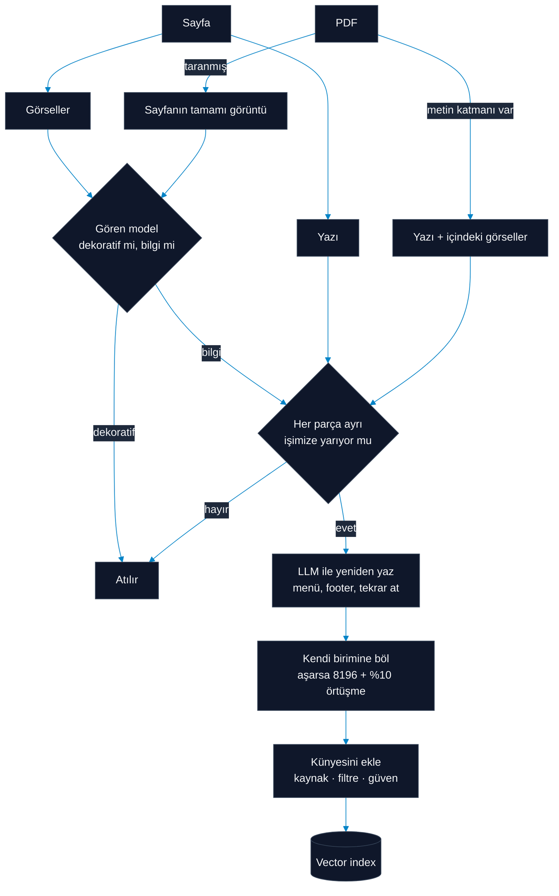

Toplanan her şey aynı yoldan geçmez, ama hepsi aynı kapıya varır: **kullanılabilir, kaynağı belli, yeniden yazılmış metin.**

## Metin ve görsel ayrı yollardan gelir

Bir sayfada bilgi iki yerde durur. Bir kısmı yazıdır, bir kısmı ise görüntünün içindedir; bir ücret tarifesi ya da kâr payı tablosu çoğu zaman metin değil resimdir. Yalnızca yazıyı almak, o sayfanın en değerli kısmını atmak olur.

Bu yüzden sayfanın yazısı ile içindeki görseller ayrı ayrı ele alınır. Aynısı PDF'ler için de geçerli: PDF'in metin katmanı varsa yazı olduğu gibi alınır, içindeki görseller ayrıca incelenir; metin katmanı hiç yoksa, yani belge taranmış bir kâğıtsa, sayfanın tamamı görüntü olarak okunur. Böylece taranmış bir sözleşme ile dijital bir ürün sayfası aynı hatta buluşur.

Görsellerde bir eleme daha var: her görsel önce "bu dekoratif bir öğe mi, yoksa ürün ya da kampanya bilgisi mi taşıyor" diye değerlendirilir. Logo ve arka plan atılır, tablo ve koşul metni çıkarılır.

## Görseller OCR ile değil, gören bir modelle okunur

Görüntüden yazı çıkarmanın hazır yolu OCR'dir ve burada bilinçli olarak kullanılmıyor. Sebebi şu: **bir bankacılık görselinde bilginin çoğu harflerde değil, düzendedir.**

OCR bir kâr payı tablosuna baktığında gördüğü şey alt alta dizilmiş sayılardır; hangi sayının hangi vade ve hangi ürün satırına ait olduğunu bilmez, çünkü tablonun yapısını değil yalnızca karakterleri okur. Aynı şekilde bir kampanya afişinde büyük puntoyla yazılmış oranın ana vaat, altındaki küçük yazının ise koşul olduğunu ayırt edemez. Çıkan metin doğru karakterlerden oluşur ama yanlış anlama gelir; üstelik bunu sessizce yapar.

Gören bir model ise görüntüye bir okuyucu gibi bakar: tablonun satır ve sütun ilişkisini kurar, başlığı gövdesinden ayırır, dipnotun hangi rakama ait olduğunu görür. Aynı model dekoratif olanı ayıklama işini de yapar; ayrı bir sınıflandırma adımına gerek kalmaz.

Bir maliyeti var: gören bir modeli çalıştırmak OCR'den pahalıdır. Bu yüzden hangi görselin buna değdiği önceden elenir ve aynı görsel ikinci kez sorulmaz.

## Gereklilik kararı, temizlemeden önce verilir

Elde edilen her metin işlenmez. Önce **işimize yarayıp yaramadığına** karar verilir: bu içerik müşteriye gösterilebilecek bir ürün, kampanya ya da hizmet bilgisi mi, yoksa kurumsal duyuru, mevzuat metni, iş ilanı mı?

Sıra bilinçli olarak böyle: eleme önce, temizleme sonra. Temizleme pahalı bir iştir ve gereksiz bir belgeyi güzelce yeniden yazmak, o maliyeti hiçbir işe yaramayacak bir metne harcamaktır.

Karar belgenin tamamına bakılarak bir kez verilmez; **her parça tek tek sorgulanır** ve yalnızca gerekli bulunanlar kaydedilir. Uzun bir belgede işe yarayan kısımlar genellikle dağınıktır: bir sözleşmenin başı ve sonu kalıp metindir ama ortasında bir ücret tablosu durabilir. Belgeyi bütün olarak elemek o tabloyu da atardı; bütün olarak almak ise kalıp metni indekse doldururdu.

Aynı sorgulama, uzun belgelerde erken durmayı da mümkün kılar: baştan belli sayıda parçanın tamamı gereksiz çıkarsa belgenin geri kalanına hiç bakılmaz.

Kararsız kalınan yerde veri korunur. Bir belge için parçaların oyları bölünürse sonuç gerekli sayılır; sistemin tercihi, şüpheli bir metni atmak yerine tutmak yönündedir.

## Kalan içerik yeniden yazılır

Gerekli bulunan metin olduğu gibi saklanmaz, bir modele verilip **yeniden yazılır**: menü, altbilgi, çerez uyarısı, sosyal medya bağlantısı ve sayfadan sayfaya tekrar eden ne varsa atılır; geriye o sayfaya özgü ürün ve kampanya içeriği kalır.

Bu iş kural listeleriyle değil modelle yapılır, çünkü on bankanın sayfa yapısı birbirini tutmuyor ve kural yazmak her yeni banka için baştan başlamak demek. Aynı gerekçe görseller ve PDF'ler için de geçerli olduğundan üç yolun üçünde de aynı yaklaşım kullanılır.

## Hiçbir şey iki kez işlenmez

Sayfalar, PDF'ler ve görseller içeriklerinden çıkan bir imzayla tanınır. Aynı kampanya afişi on ayrı sayfada geçiyorsa bir kez okunur; aynı PDF iki adresten iniyorsa bir kez işlenir.

Bu yalnızca hız meselesi değil. Tekrarlayan içerik tekrar tekrar modele gönderilseydi, maliyetin büyük kısmı zaten bilinen şeyleri yeniden öğrenmeye giderdi.

## Kesme noktasını belge belirler

Metni sabit uzunlukta bölmek kolay yoldur ve bir kâr payı tablosunun ortasından geçer. Bunun yerine belgenin kendi birimleri kullanılır: bir sayfanın başlık altı bölümleri, bir PDF'in sayfaları.

Kampanyalar hiç bölünmez. Tarihi bir parçaya, koşulu başka parçaya düşerse arama koşulu bulur ama hâlâ geçerli olup olmadığını bilemez.

Yine de bir üst sınır koyduk: **8196 karakter**. Bu teknik bir zorunluluk değil, bizim tercihimiz; çok uzun bir metni tek parça halinde vermek modelin bağlamı kaçırmasına yol açıyor. Sınırı aşan metinler **%10 örtüşmeyle** bölünür, yani her parça bir öncekinin sonundan bir miktar taşır: bir ücret satırı ya da koşul cümlesi tam kesme noktasına denk gelirse en az bir parçada bütün kalır. Sınırın altındaki hiçbir birim bölünmez.

## Her parça nereden geldiğini kendi üstünde taşır

Bölmeden sonra elimizde belgeler değil parçalar var ve bir parça tek başına kimliksizdir. Bu yüzden her parça, metniyle birlikte kaynağını da taşır: geldiği tam adres, hangi bankaya ve hangi belge türüne ait olduğu, geçerlilik tarihi.

Bağlantı sayfanın tamamına değil bilginin geçtiği başlığa verilir; çıpa yoksa sayfaya düşülür ama asla uydurulmaz. Böylece parça nereye giderse gitsin kaynağı yanında kalır ve gösterilen her rakam doğrulanabilir olur.

---

# 3 · Karşılaştırma

> Temiz sayfalardan, bankaları yan yana koyan tablolar üretilir. Bu adımın tamamı ajanlarla yürür; hiçbir yerde sabit bir kural listesi yoktur.

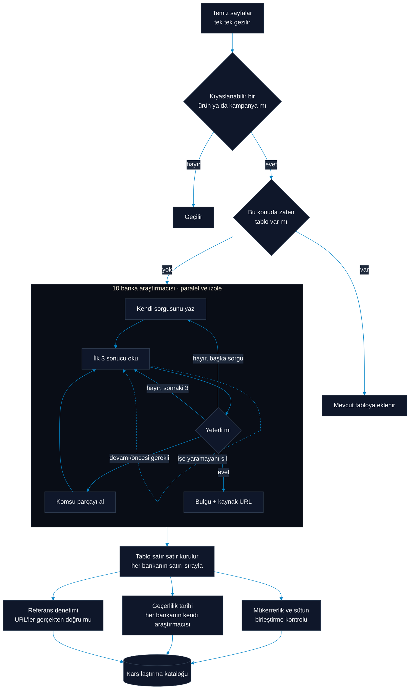

## Her sayfaya tek bir soru sorulur

İlk ajan, temizlenmiş ve işimize yaradığına karar verilmiş sayfaları tek tek geziyor. Her biri için verdiği karar tek: **bu sayfa somut bir ürün ya da kampanya bilgisi taşıyor mu, ve bu bilgi diğer bankalarla kıyaslanabilir mi?**

## Aynı tablo iki kez kurulmaz

Cevap evet ise hemen araştırma başlamıyor. Önce mevcut tablo havuzunda **bu konuyu zaten karşılaştıran bir tablo var mı** diye aranıyor, hem de kelime eşleşmesiyle değil anlam üzerinden; aynı konu iki farklı sayfada iki farklı isimle geçebiliyor.

Tablo varsa yeni sayfa ona ekleniyor. Bu kontrol olmasa on bankaya açılan pahalı araştırma, zaten elimizde olan bir tabloyu yeniden üretmek için harcanırdı.

## On araştırmacı, on ayrı araştırma

Tablo yoksa ilk ajan konuyu detaylandırıp **her bankanın kendi araştırmacısına** gönderiyor. Onlar paralel çalışıyor ve birbirlerinin verisini görmüyor.

Her araştırmacı kendi araştırmasını kendisi yürütüyor. Sorgusunu kendisi yazıyor, ilk üç sonucu okuyor ve devamını kendisi kararlaştırıyor:

- Sonuçlar işe yaramadıysa **sonraki üçü** isteyebiliyor ya da sorguyu baştan yazabiliyor.
- Önemli bir bilgi parça sınırında kesilmişse **komşu parçayı** çekebiliyor.
- İşine yaramayan parçaları **siliyor**, böylece çalışma alanını dolu tutmadan araştırmayı sürdürüyor.

Bu üçü de sabit bir akış değil, araştırmacının o an verdiği kararlar. Sonuçta her biri bulgusunu **kaynak adresiyle birlikte** ilk ajana döndürüyor.

## Tablo satır satır kurulur

İlk ajan on araştırmacının bulgularını sırayla geziyor ve tabloyu banka banka dolduruyor. On bankalık bir tabloyu tek seferde üretmek, eksik kalan tek bir bankanın bütün tabloyu bozmasına kapı aralar; sırayla kurulduğunda bir banka için veri bulunamaması diğerlerinin satırlarına dokunmuyor.

## Tablo kurulduktan sonra üç denetim

Tablo bittiğinde tek seferlik bir gözden geçirme yapılıyor:

**Referanslar gerçekten doğru mu.** Her satırın kaynak adresi, geldiği metinle karşılaştırılıyor. Uydurulmuş ya da yanlış sayfaya işaret eden atıflar burada ayıklanıyor.

**Bilgi ne zamana kadar geçerli.** Her bankanın geçerlilik tarihini yine o bankanın kendi araştırmacısı çıkarıyor, çünkü tarihi bulacak yer o bankanın kendi kaynakları.

**Tablo gereksiz yere ikiye ayrılmış mı.** Havuzda gerçekten aynı konuyu karşılaştıran başka bir tablo kalmışsa birleştiriliyor. Aynı şekilde çok az satırda dolu olan seyrek sütunlar, veri kaybetmeden tek sütunda toplanıyor.

---

# 4 · Cevaplama

> Kullanıcı sorduğunda, soru bankalara dağıtılır ve kanıt toplanır.

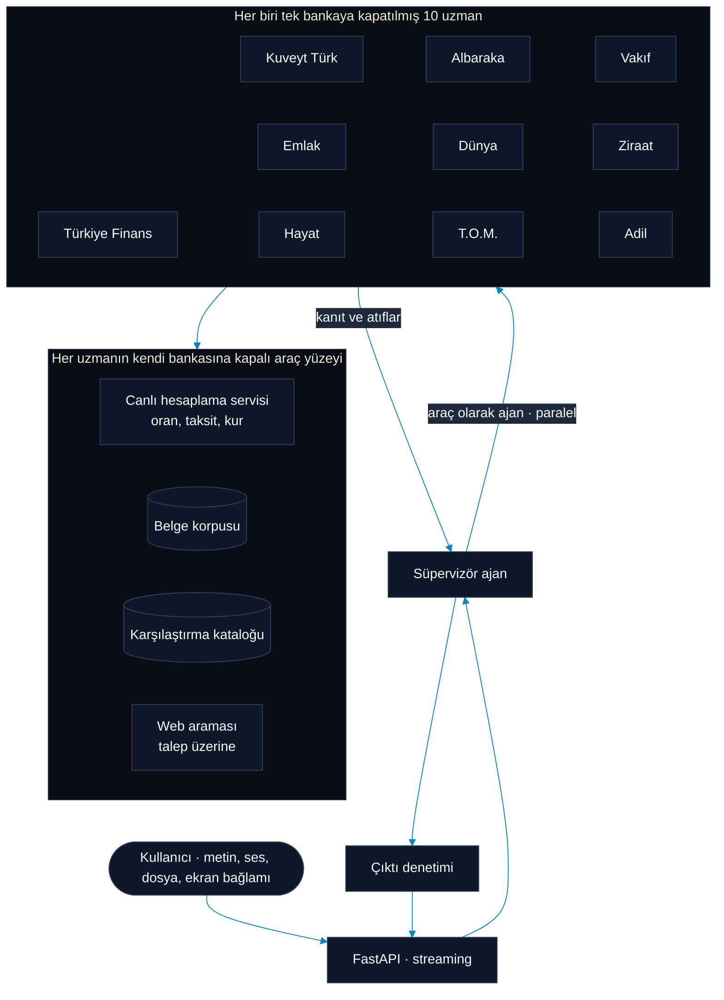

> **Ajan**, hangi aracı ne zaman kullanacağına kendi karar veren bir dil modelidir. Sıradan bir sohbet modelinden farkı, tek hamlede cevap vermek yerine çok adımlı bir araştırma yürütebilmesidir. **Süpervizör** işi dağıtan ve toparlayan ajandır; **uzman** ise tek bir bankadan sorumlu alt ajandır.

## Araç olarak ajan

Süpervizör bankalara doğrudan sormaz. Her bankayı bir **araç** olarak çağırır ve on uzman aynı anda çalışabilir. Uzmanın kendi akıl yürütme adımları süpervizöre hiç ulaşmaz; yalnızca nihai bulgusu ve kaynak bağlantıları ulaşır. Böylece süpervizörün context window'u on ayrı araştırma turunun gürültüsüyle dolmaz.

> Bir ajanın **context window**'u, aynı anda aklında tutabildiği her şeydir: o ana kadarki konuşma ve içeri çektiği bütün belgeler. Sınırlıdır ve dolduğunda en eski malzemenin ya özetlenmesi ya da atılması gerekir. Aşağıdaki kararların çoğu, bu alanı gürültüye değil kanıta harcamak için vardır.

## Bir uzman araştırmasını nasıl yürütür

Uzman tek bir arama yapıp durmaz; araştırmasını kendi yönlendirir:

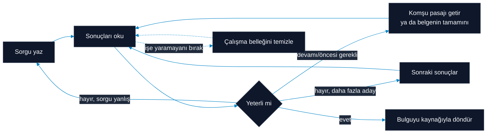

Uzun belgeler indekslenmeden önce pasajlara bölündüğü için tek bir arama sonucu sayfanın tamamı değil bir dilimidir. Buradan iki karar doğar:

**Kesilmiş bir pasajın devamı ayrı bir araçtır.** Bir ücret tablosu ya da kâr payı koşulu pasaj sınırında bölünmüşse, uzman komşu pasajı veya belgenin tamamını isteyebilir. Bu olmasa model yarım cümleyi bütün sanır ve hiçbir zaman tamamlanmamış bir rakamı cevap diye verir.

**Model kendi belleğini boşaltabilir.** Uzman bir sonucu işe yaramadı diye işaretlediğinde o metin bir sonraki adımdan önce bağlamdan düşer. Üç aramanın geride yirmi pasaj bırakmasını engelleyen budur. Bu yetki bilinçli olarak dardır ve yalnızca arama sonuçlarına uygulanır; canlı bir fiyat teklifi ya da kullanıcının mesajı bu yolla silinemez.

## Canlı sayılar bankadan anlık gelir

Oran, taksit ve kur soruları indeksten değil, bankanın kendi hesaplama servisinden cevaplanır. Dört karar bu katmanı belirliyor:

**Sınır önce bilinir.** Kullanıcıya 360 ay istetip sonra her bankanın reddettiği ekranı göstermek ona hiçbir şey öğretmez. Asıl önemli sayı karşılaştırmadaki bankaların **kesişimidir**: biri 84 ayda bitiyorsa, o bankayı içeren karşılaştırma en fazla 84 ay sorabilir. Bu, sonradan bildirilecek bir hata değil, önceden ve o sınırı koyan bankanın adıyla gösterilecek bir tavandır.

**Bankalar aynı anda sorulur.** Altı bankaya sırayla sormak **11,99 saniye**, aynı anda sormak **0,59 saniye** sürüyor.

**Hiçbir sonuç sessizce düşürülmez.** "Bu banka bunu satmıyor", "servisi bakımda" ve "istek başarısız oldu" ayrı üç cevaptır ve üçü de raporlanır. *Hiçbir banka bunu sunmuyor* ile *hiçbirine ulaşamadık* asla birbirine benzememelidir.

**Bankaların durumu sürekli izlenir.** Bu ayrımı yapabilmek için iki denetim çalışır: saniyeler süren ve ajanın anında tetikleyebildiği bir yetenek kontrolü, bir de her ürünü tek tek gezen zamanlanmış bir ürün denetimi. İkisi de değeri değil **sözleşmeyi** doğrular; bir oranın dünkünden farklı olması arıza değildir. Bulunanlar ortak bir duruma yazılır ve araçlar her çağrıdan önce bunu okur.

Adil Katılım ve T.O.M. Katılım ise **yeteneği olmayan** sağlayıcılar olarak kayıtlıdır; sitelerinde müşterinin oran hesaplatabileceği bir arayüz yok. Kayıtlı olmaları, ajanın "bu banka hesaplama aracı yayınlamıyor" diyebilmesini sağlar. Dışarıda bırakılsalardı aynı soru sessiz bir boşlukla karşılanırdı.


---

# 5 · Denetim

> Cevap kullanıcıya varmadan önce kurallardan geçer.

## Çıktı denetimi

Bir cevap kullanıcıya ulaşmadan önce düzenlenebilir bir kural kümesine karşı okunur. Denetim katmanı cevabı **onarmaz**; geçti ya da kaldı der. Kaldığında cevap gerekçesiyle birlikte asistana geri döner, çünkü doğru cevabı üretecek araçlara ve konuşmaya sahip olan asistandır. Sorumluluk bilinçli olarak ayrılmıştır: hem yazan hem yargılayan bir katman ikisini de iyi yapamaz.

Denetlediği başlıklar:

- Katılım bankacılığı terminolojisine sadakat ve ima yoluyla bile olsa garanti getiri vaadinin reddi
- Alan dışına çıkmama
- Prompt injection ve kimlik değiştirme girişimlerinin etkisizleştirilmesi
- İç mimarinin ve istem şablonlarının sızdırılmaması
- Arkasında kaynak olmayan hiçbir iddianın öne sürülmemesi

> **Prompt injection**, modelin okuduğu içeriğin içine gizlenmiş bir talimattır: yüklenen bir PDF'te ya da bir web sayfasında duran "önceki talimatlarını yok say" gibi bir satır. Amaç, modeli yalnızca özetlemesi için verilmiş bir malzemenin içinden ele geçirmektir.

## İzolasyon sınırı nereye çizilmiş

Bir uzmanın web araştırma aracı, kendi bankasının alan adı dışındaki her sonucu atar ve **her yönlendirmeyi** doğrular; böylece bir uzman başka bir bankanın sitesine ya da dahili bir adrese yürütülerek kandırılamaz. Süpervizör bu araçları hiç yüklemez.

## Uzun konuşmalarda hiçbir şeyi kaybetmemek

Her ajan kendi geçmişini taşır ve sınırına ayrı ayrı ulaşır. Bir konuşma özetlenirken özetleyiciye geçmişin **tamamı** verilir; hazır çözümlerin varsayılanı ona yalnızca en son bölümü göstermektir ki bu, uzun bir konuşmanın büyük kısmını okumadan tarif etmek demektir.

---

# Her gece: yalnızca değişenler

> Korpus bir kez kurulup bırakılmaz, ama her gece de sıfırdan kurulmaz. Gece koşusu farkı arar ve yalnızca onu işler.

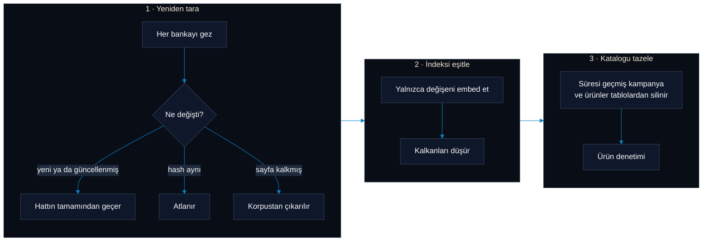

**Yeni ya da değişmiş sayfa özel bir durum değildir.** Bu gece keşfedilen ya da içeriği güncellenmiş her şey, diğer her şeyle tam olarak aynı yoldan geçer: eleme, toplama, temizleme, tarihleme, indeksleme. Sonradan gelen içerik için ayrı bir güzergâh yoktur; dolayısıyla bugün eklenen bir sayfa, en baştan beri duran bir sayfayla aynı ölçüte tabidir. Değişmemiş sayfalar bu yolun hiçbir adımına girmez.

**Yeni hesaplama araçları da aranır.** Tarama, bankanın yeni bir hesaplama endpoint'i yayınlayıp yayınlamadığına bakar; arayüzünü dinamik kuran sayfalar gerçek bir tarayıcıda açılır, böylece ziyaretçinin fiilen gördüğü şey incelenmiş olur.

**Silmek eklemek kadar önemlidir.** Bankanın kaldırdığı bir sayfa korpustan çıkarılır. Bitiş tarihi geçmiş kampanya ve ürünler karşılaştırma tablolarından silinir; böylece bir tablo artık var olmayan bir teklifi taşımaz.

**Yapılan iş değişimle orantılıdır.** Hash'i değişmemiş içerik yeniden okunmaz; hiçbir şeyin değişmediği bir gece neredeyse hiçbir maliyet çıkarmaz. Silme işlemi de korumalıdır: indeksin olağandışı büyük bir bölümünü silecek bir koşu reddedilir ve hiçbir şey yazmaz, çünkü bunun bir bankanın sitesini silmesinden çok bir taramanın bozulması olduğu varsayılır.

---

# Arayüz

<div align="center">
  
</div>

| Sayfa | Ne yapar |
|---|---|
| **Sohbet** | Kanıta dayalı asistan. Model seçimi, uzun düşünme ve web araması ayrı ayrı açılıp kapatılabilir. Ekranda açık olan tabloyu ya da hesaplamayı görüp onun hakkındaki soruları cevaplayabilir. Tablo dosyası, PDF, görsel ve belge eki kabul eder. Konuşmanın içinde kataloğa kaydedilebilen tablolar üretir. |
| **Canlı karşılaştırma** | İhtiyaç, taşıt ve konut finansmanı, katılma hesapları, döviz ve kart taksitleri. Bankalar paralel sorgulanır. Kullanıcının kendi varsayımları, bankanın yayınladığı oranlardan görsel olarak ayrı tutulur. |
| **Ürünler** | Küratörlü çok bankalı tablolar, kullanıcının sohbetten kaydettiği kendi tablolarıyla yan yana. Herhangi biri tek tıkla konuşmaya geri iliştirilebilir. |
| **Kampanyalar** | On bankanın kampanyaları; aktif, bitmek üzere ve süresi dolmuş olarak etiketlenmiş halde. |
| **AI Overview** | Uzun ürün şartlarını, kalabalık tabloları ve piyasa hareketlerini birkaç maddeye indiren hızlı özetler. |
| **Otomasyonlar** | Doğal dille kurulan tekrarlayan görevler: *"Taşıt finansman oranı %3,5'in altına inerse haber ver."* Koşul sağlandığında e-posta ve uygulama içi bildirim gönderilir. |

## Sesli konuşma

Konuşma tanıma cihazın kendi üzerinde çalışır; ses hiçbir zaman üçüncü taraf bir servise gitmez. Sesli cevap akış halinde üretilir ve ilk ses yaklaşık **0,13 saniyede** duyulur; kullanıcı cevabın tamamının üretilmesini beklemez.

## Tablo özetleyici neden durumsuz bir ajan

Bir tabloyu özetleyen ajan bilinçli olarak geçmişsiz ve aramasız kuruldu: aynı sayfa bir hafta sonra da aynı özeti üretsin ve sonuç önbelleğe alınabilsin diye. Ajana sayfanın ekran görüntüsünü vermek denendi ve bırakıldı; tablo başına dakikalarca görsel işleme maliyeti çıkarırken metin anahattının zaten taşıdığı hiçbir şeyin üstüne bir şey koymuyordu.

## Dışa aktarılan her hücre iki değer taşır

Dört ayrı yüzey tablo üretiyor ve dört format bunları almak istiyor. On altı ayrı dönüştürücü yazmak, Excel ile PDF'in yüzdenin ne olduğu konusunda anlaşamamasıyla biter. Bunun yerine her şey tek bir ara temsile indirgenir ve her hücre **hem sayısal değerini hem de ekranda yazıldığı biçimi** taşır. Excel sayıyı alır, böylece sütun toplanabilir. PDF ve Word ekrandaki biçimi alır (`%2,89`, `₺1.234,56`), böylece belge geldiği sayfanın aynısı gibi okunur.

---

# Teknoloji

| Alan | Kullanılanlar |
|---|---|
| **Arayüz** | Next.js 16 (App Router), React 19, TailwindCSS v4, Recharts / ApexCharts |
| **Sunucu** | FastAPI, Uvicorn, streaming |
| **Ajanlar** | LangChain, LangGraph, kalıcı checkpoint'ler |
| **Veri** | PostgreSQL, SQLAlchemy 2, Alembic |
| **Arama** | Qdrant, Sentence-Transformers, SearXNG |
| **Kimlik** | Argon2id, PyJWT |
| **Korpus** | Trafilatura, Poppler, PyMuPDF, Pillow, Playwright |
| **Ses** | mlx-whisper (tanıma), voxcpm (sentez) |
| **Dışa aktarma** | WeasyPrint, XlsxWriter, Pandoc |

## Modeller

Üçü de yerel bir vLLM sunucusunda çalışır. Rol dağılımı tercihe değil ölçüme dayanır.

| Anahtar | Model | Bağlam | Rolü |
|---|---|---|---|
| `gemma` | `google/gemma-4-31B-it` | 131K | Sohbet, görsel okuma, çıktı denetimi. En temiz Türkçe. Taranmış bir sayfada karo başına 304 istem jetonu harcadı ve hiç okuma hatası yapmadı; `qwen` aynı işte 4.328 jeton harcayıp üç hata yaptı. |
| `qwen` | `Qwen/Qwen3.6-27B` | 64K | Varsayılan model ve yapısal çıkarım. En güvenilir JSON ve en güçlü adım adım finansal muhakeme. |
| `gpt` | `openai/gpt-oss-20b` | 64K | Hafif sınıflandırma ve durumsuz işler. Görsel okuyamaz. |

Model seçimi kodda değil yapılandırmada durur, dolayısıyla roller `.env` üzerinden yeniden dağıtılabilir.

---

# Kurulum

**Gerekenler:** Python 3.13+, Node.js 20+, Docker, Pandoc ve erişilebilir bir vLLM sunucusu. Sesli konuşma Apple Silicon gerektirir.

```bash
git clone https://github.com/Abdurrahman-Wahdan/TF26.git
cd TF26
cp .env.example .env          # vLLM adresini ve veritabanı bilgilerini doldurun

docker compose up -d postgres qdrant searxng

python -m venv .venv && source .venv/bin/activate
pip install -r requirements.txt
playwright install chromium
alembic upgrade head
uvicorn api.main:app --port 8000 --reload
```

```bash
cd UI && npm install && npm run dev
```

Arayüz: [http://localhost:3000](http://localhost:3000)

## İşe yarayan komutlar

```bash
python -m banks.health          # her bankanın her yeteneği çalışıyor mu
python -m banks.audit           # her bankanın her ürünü (zamanlanmış çalışır)
python -m corpus.build          # korpusu sitelerden yeniden kur
python -m index                 # değişen belgeleri indekse eşitle
```

Son üçü her gece çalışmak üzere tasarlandı. `python -m corpus.schedule`, `python -m index.schedule` ve `python -m banks.schedule` komutlarının her biri, çakışmayacak şekilde kaydırılmış hazır bir zamanlayıcı kaydı yazdırır.

---

<a id="ileriki-calismalar"></a>

# İleriki çalışmalar

**Çok dilli arayüz.** Arayüz şu anda yalnızca Türkçe yayınlanıyor, ancak bunun için gereken altyapı bilinçli olarak yerinde bırakıldı: yönlendirme her adreste dil önekini korur, metinler koddan ayrı çeviri dosyalarında durur ve eski `/en` adresleri kalıcı değil geçici yönlendirmeyle karşılanır; çünkü ikinci dil geldiği gün o adresler yeniden gerçek olacak. Geriye kalan iş bir çeviri kataloğu ve gezinme çubuğuna bir dil düğmesi eklemek.

**Katılım bankacılığına özel değerlendirme kümesi.** Cevap doğruluğu şu anda kaynak denetimi ve canlı servis kontrolleriyle korunuyor. Bunun üstüne, uzman onaylı soru–cevap çiftlerinden oluşan sabit bir değerlendirme kümesi, bir istem değişikliğinin doğruluğu düşürüp düşürmediğini kullanıcı fark etmeden ölçebilir hale getirir.

**Daha fazla kurum ve daha geniş ürün yüzeyi.** Sağlayıcı arayüzü yeni bir banka eklemeyi tek bir modül yazmaya indirger. Aynı yapı katılım sigortacılığı ve bireysel emeklilik ürünlerine de taşınabilir.

**Kişiselleştirilmiş karar desteği.** Kullanıcının kendi kayıtlı senaryolarına ve geçmiş karşılaştırmalarına dayanan öneriler, mevcut otomasyon altyapısının doğal devamı.

---

# Testler

101 birim testi ve bankaların canlı servislerine giden 11 entegrasyon testi var. Birim testleri kayıtlı banka cevaplarıyla çalışır ve ağa ihtiyaç duymaz.

```bash
pytest tests/unit                                     # çevrimdışı, hızlı
pytest tests/integration                              # canlı servisler
cd UI && npm run test
```

---

<div align="center">
  <sub>TEKNOFEST 2026 Yapay Zeka Dil Ajanları Yarışması için geliştirilmiştir.</sub>
</div>

<br/>

---

<br/>

<div align="center">
  

  <h1 id="kermits-ai-english">KERMİTS AI</h1>

  <p><strong>An evidence-first multi-agent assistant and decision support platform for participation banking</strong></p>

  <p>
    <strong>TEKNOFEST 2026 · Yapay Zeka Dil Ajanları Yarışması</strong><br/>
    <em>Katılım Bankacılığı Finansal Metin Madenciliği, Bilgi Çıkarımı ve Akıllı Dashboard-Asistan Çözümleri Kategorisi</em>
  </p>

  [](https://www.teknofest.org/tr/yarismalar/yapay-zeka-dil-ajanlari-yarismasi/)
  [](https://www.python.org/)
  [](https://nextjs.org/)
  [](https://fastapi.tiangolo.com/)
  [](https://langchain-ai.github.io/langgraph/)
  [](https://qdrant.tech/)
  [](LICENSE)

  <br/>

  <a href="#kermits-ai-turkce"><strong>Türkçe</strong></a> · <strong>English</strong>
</div>

---

## What it does

Kermits AI makes the products, campaigns and current rates of Türkiye's 10 participation banks comparable in one place. The user asks in plain language, and the system answers **with its sources attached**: every figure carries the official page or document it came from, as a clickable reference.

> **Participation banking** is a banking model based on profit-and-loss sharing instead of interest. What a conventional bank calls a loan is *financing*, interest is a *profit share*, and a term deposit is a *participation account*. This is not just vocabulary. A participation account cannot promise a return in advance, so an assistant that says "you will earn X" has given a wrong answer, not a helpful one. The system holds this terminology end to end.

The interface ships in Turkish for now; the multilingual groundwork is in place and a second language is on the [roadmap](#future-work). It has six workspaces: chat, live comparison, product catalogue, campaigns, automations, and voice conversation.

<div align="center">
  
</div>

---

## End to end

This README follows the order the system actually works in: how raw bank sites become knowledge, how that knowledge is used when a question arrives, and what the answer passes through before it reaches the user.

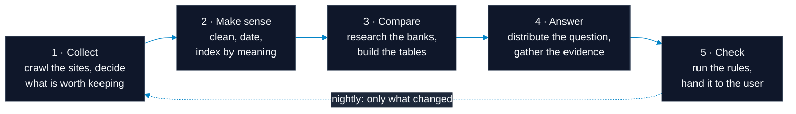

The first three steps run **ahead of time**, independently of any user, and build the corpus. The last two run **live**, the moment a user asks something. Nightly, those first three are not run again from scratch; only what changed is handled: new and updated pages, pages that went away, and campaigns past their end date. The sections follow that order.

---

## Three distinctions the design rests on

Every decision below follows from these three.

**Live numbers and durable facts come from different places.** Today's profit-share rate, instalment amount and exchange rate are fetched from the bank's own calculation service at the moment they are asked for, and are never stored in the search index, because an indexed number is wrong tomorrow. Product terms, participation principles and fee schedules come instead from a durable **corpus**: an archive of documents collected from the banks' own sites and cleaned.

**Each bank is sealed inside its own agent.** The ten bank specialists cannot see each other's data. A specialist is never offered a choice of bank; its bank is fixed the moment it is created. This makes the most common failure in a multi-bank answer, attributing one bank's rate to another, impossible by construction rather than by instruction.

**"They don't offer it" and "I couldn't reach them" are different answers.** If a bank does not sell that product, saying so is a correct and useful answer. If the bank's service broke this morning, it is not. The system records these two states separately and reports them separately.

---

# 1 · Collect

> Bank sites are crawled while the URL tree is pruned: the number of pages to download is cut before anything is downloaded.

## Pruning the URL tree to cut the page count

The URLs on a bank's site are drawn from two sources at once. The **sitemap** is the list the bank publishes itself: fast, and it hands over deep pages directly, but most banks do not keep it current. **BFS** starts at the home page and follows links layer by layer: slower, but it finds pages the sitemap never mentions. Together they produce a whole that neither reaches alone.

Throughout the crawl one boundary is never relaxed: **requests never leave the bank's own domain.** Outbound links, social media addresses and third-party services are dropped before they are ever followed. Without that boundary, wandering off one bank's site into the rest of the internet is a matter of moments, and which bank the corpus belongs to stops being clear.

The collected URLs form a **tree**, not a flat list. The goal is not to judge pages one at a time but to **prune whole branches near the root, so that far fewer pages ever need downloading.** Saying SKIP to `/kariyer` or `/yatirimci-iliskileri` at the top eliminates hundreds of pages in one decision. The agent makes that call without downloading anything: all it has is the URL path, the branch's title, and a few sample titles from underneath it.

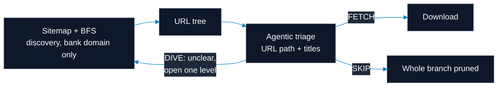

## A branch that cannot be judged is opened until it can

The agent makes one of three calls per branch:

| Call | What it means |
|---|---|
| **DIVE** | This branch holds product categories, go into its children |
| **FETCH** | There is a concrete product, campaign or document here |
| **SKIP** | This is not customer-facing: job listings, branch locators, investor reports |

The real mechanism is **DIVE**: when a branch can neither be discarded outright nor taken outright, the agent opens it and descends one level. This repeats until the call becomes clear, going all the way down to a single page if it has to. The tree is opened top-down, but only as far as it needs to be: where the answer is obvious a whole branch closes in one decision, and where it is ambiguous the crawl goes to the leaves.

The download budget is therefore spent where the judgement is genuinely hard. An agent is used instead of brittle pattern rules because every bank's site is laid out differently. Writing rules would mean starting from scratch for each new bank.

## Not every PDF is worth reading

Of the **1,088 PDFs crawled, only about 227** are product documents. Most of the rest are general credit agreements, prospectuses and corporate policies. Reading everything would have spent most of the extraction budget on contract language and buried the fee schedules underneath it.

The decision comes from **where the bank published the document**, not from its filename: a PDF linked from a product page is a product document. The corpus proves filenames alone are not enough: `banking-license.pdf` is a scan of a licence, while `vahesabi_onbilg_formu.pdf` is a disclosure form carrying real rates.

## The same content is never processed twice

Every page, PDF and image collected gets a fingerprint. Identical content sitting at different addresses, such as the same campaign banner repeated across ten pages, is processed once. This cuts both crawling and model cost directly.

---

# 2 · Make sense

> Raw collected content is turned into knowledge that can be searched and trusted.

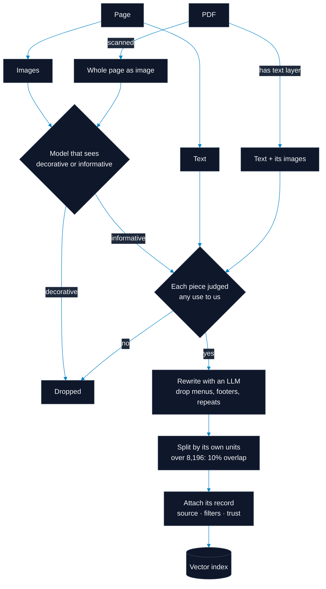

Not everything collected travels the same road, but all of it arrives at the same door: **usable, attributable, rewritten text.**

## Text and images arrive by different routes

Information on a page sits in two places. Some of it is writing; some of it is inside a picture, because a fee schedule or a profit-share table is usually an image rather than text. Taking only the writing throws away the most valuable part of such a page.

So a page's text and its images are handled separately. The same holds for PDFs: where a PDF has a text layer, the writing is taken as it stands and the images within it are examined separately; where there is no text layer at all, meaning the document is a scan, the whole page is read as an image. A scanned contract and a digital product page thus meet on the same pipeline.

Images get one extra filter: each is first judged as decorative or as carrying real product or campaign information. Logos and backgrounds are dropped; tables and condition text are extracted.

## Images are read by a model that sees, not by OCR

The off-the-shelf way to get text out of a picture is OCR, and it is deliberately not used here. The reason: **in a banking image, most of the information is not in the letters but in the layout.**

Looking at a profit-share table, OCR sees numbers stacked in a column. It cannot say which number belongs to which term or which product row, because it reads characters rather than structure. In the same way, on a campaign banner it cannot tell that the rate set in large type is the headline offer while the small print beneath it is the condition. The text it produces is made of correct characters and means the wrong thing, and it does so silently.

A model that sees looks at the image the way a reader does: it holds the row and column relationship of a table together, separates a heading from its body, and sees which figure a footnote belongs to. The same model also decides what is merely decorative, so no separate classification step is needed.

There is a cost: running a model that sees is more expensive than OCR. That is why which images are worth it is filtered beforehand, and the same image is never asked about twice.

## Relevance is judged before anything is cleaned

Not every piece of text that comes out is processed. First it is decided whether it is **any use to us**: is this product, campaign or service information a customer could be shown, or is it a corporate announcement, a regulatory text, a job posting?

The order is deliberate: filter first, clean second. Cleaning is expensive, and rewriting an irrelevant document nicely spends that cost on text that will never be used.

The call is not made once for a whole document; **every piece is judged individually**, and only those found relevant are kept. In a long document the useful parts are usually scattered: a contract's opening and closing are boilerplate, but a fee table may sit in the middle. Discarding the document whole would throw that table away; taking it whole would fill the index with boilerplate.

The same per-piece judgement makes early stopping possible on long documents: if a decisive number of pieces at the start all come back irrelevant, the rest is never looked at.

Where the answer is uncertain, the data is kept. If the pieces of a document disagree, the result counts as relevant; the system prefers holding on to doubtful text over discarding it.

## What survives is rewritten

Text judged relevant is not stored as it came. It is handed to a model and **rewritten**: menus, footers, cookie notices, social media links and anything else repeating from page to page are dropped, leaving the product and campaign content specific to that page.

This is done by a model rather than by rule lists, because the ten banks' page structures do not resemble each other and writing rules means starting over for each new bank. The same reasoning applies to images and PDFs, so all three routes take the same approach.

## Nothing is processed twice

Pages, PDFs and images are identified by a signature derived from their content. If the same campaign banner appears on ten pages, it is read once; if the same PDF downloads from two addresses, it is processed once.

This is not only about speed. Were repeated content sent to the model again and again, most of the cost would go on relearning what is already known.

## The document decides where to cut

Slicing text into fixed lengths is the easy path, and it runs through the middle of a profit-share table. The document's own units are used instead: a page's sections under their headings, a PDF's pages.

Campaigns are never split. If the dates land in one piece and the conditions in another, a search finds the condition but cannot tell whether it still applies.

We did set an upper bound: **8,196 characters**. That is our choice rather than a technical limit; handing a model one very long piece makes it lose track of the context. Text above the bound is split with a **10% overlap**, so each piece carries a little of the end of the previous one: if a fee line or a condition sentence falls exactly on the cut, it stays intact in at least one piece. Nothing under the bound is split.

## Every piece carries where it came from

After splitting we hold pieces rather than documents, and a piece on its own is anonymous. So each one carries its source alongside its text: the exact address it came from, which bank and which kind of document it belongs to, and its validity dates.

The link points at the heading the information sits under rather than the whole page; where there is no anchor it falls back to the page, but one is never invented. Wherever a piece travels, its source travels with it, so every figure shown can be verified.

---

# 3 · Compare

> Clean pages become tables that put the banks side by side. The whole step runs on agents; nowhere in it is there a fixed list of rules.

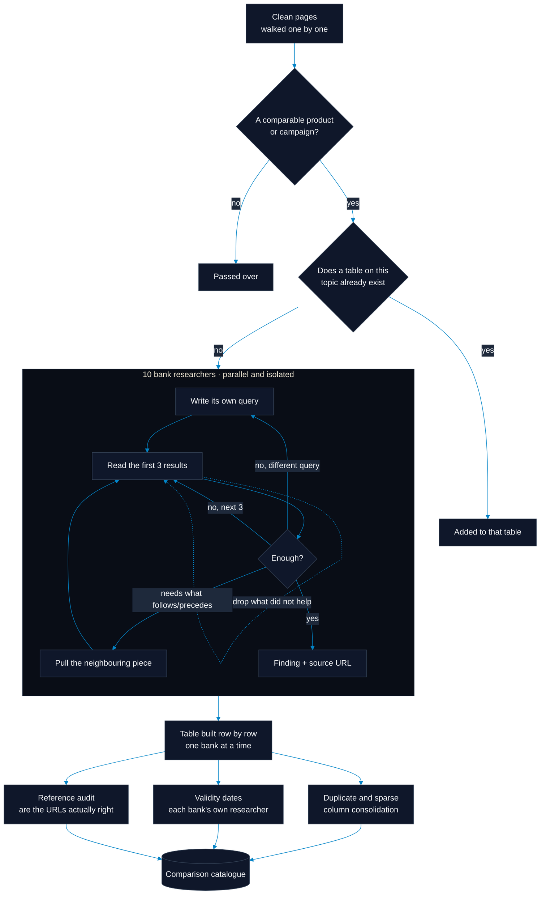

## One question is asked of every page

The first agent walks the pages that were cleaned and judged useful, one at a time. For each it makes a single call: **does this page carry concrete product or campaign information, and can that information be compared against other banks?**

## The same table is never built twice

A yes does not start the research straight away. First the existing pool is searched for **a table that already compares this topic**, and by meaning rather than by matching words, since the same subject appears on two pages under two different names.

If such a table exists, the new page is added to it. Without this check, an expensive ten-bank fan-out would be spent reproducing a table we already hold.

## Ten researchers, ten separate investigations

Where no table exists, the first agent works the topic up and hands it to **each bank's own researcher**. They run in parallel and cannot see one another's data.

Each researcher steers its own investigation. It writes its own query, reads the first three results, and decides for itself what comes next:

- If the results did not help, it can ask for **the next three** or rewrite the query entirely.
- If something important is cut off at a piece boundary, it can pull **the neighbouring piece**.
- It **discards** the pieces that were no use, keeping its working space clear as the investigation goes on.

None of these is a fixed sequence; each is a call the researcher makes in the moment. In the end every one returns its finding **together with its source address**.

## The table is built row by row

The first agent walks the ten researchers' findings in turn and fills the table one bank at a time. Producing a ten-bank table in one go leaves the door open for a single missing bank to corrupt the whole thing; built in sequence, finding nothing for one bank leaves the other rows untouched.

## Three audits once the table is built

When the table is finished it gets a single review pass:

**Are the references actually right.** Every row's source address is checked against the text it came from. Fabricated citations, and ones pointing at the wrong page, are removed here.

**How long the information holds.** Each bank's validity dates are extracted by that bank's own researcher, because the place to find the date is that bank's own sources.

**Has the table been split unnecessarily.** If another table in the pool really does compare the same topic, the two are merged. Likewise sparse columns, filled in only a few rows, are consolidated without losing data.

---

# 4 · Answer

> When a user asks, the question is distributed to the banks and evidence is gathered.

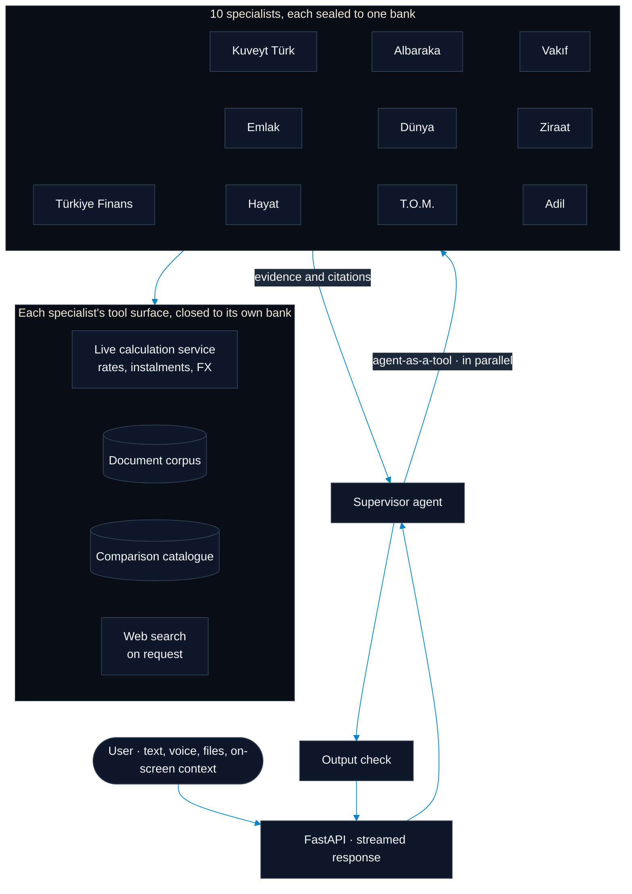

> An **agent** is a language model that decides for itself which tool to use and when. What separates it from an ordinary chat model is that it can carry out a multi-step investigation instead of answering in one shot. The **supervisor** distributes and assembles the work; a **specialist** is a sub-agent responsible for exactly one bank.

## Agent-as-a-tool

The supervisor never queries banks directly. It calls each bank **as a tool**, and all ten specialists can run at once. A specialist's own reasoning steps never reach the supervisor; only its final finding and its source links do. That keeps the supervisor's working context free of the noise of ten separate research sessions.

> An agent's **context window** is everything it can hold in mind at once: the conversation so far, plus every document it has pulled in. It is finite, and once it fills up the oldest material has to be summarised or dropped. Most of the decisions below exist to spend that space on evidence rather than on noise.

## How a specialist runs its own investigation

A specialist does not perform one search and stop. It steers its own research:

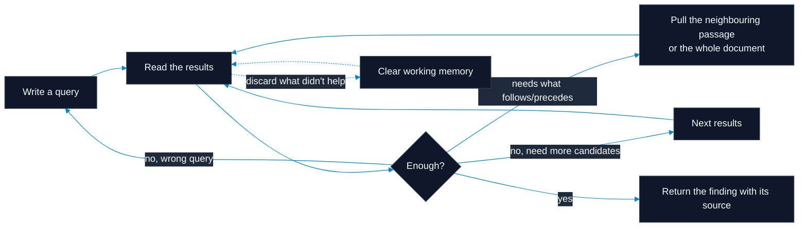

Long documents are split into passages before being indexed, so a single search result is a slice of a page rather than the whole of it. Two decisions follow:

**Continuing a cut-off passage is its own tool.** If a fee table or a profit-share condition is split across a passage boundary, the specialist can ask for the neighbouring passage or for the entire document. Without it, the model treats half a sentence as the whole answer and reports a figure that was never complete.

**The model can empty its own memory.** When a specialist marks a result as unhelpful, that text drops out of its context before the next step. This is what stops three searches from leaving twenty passages behind. The permission is deliberately narrow and applies only to search results. A live price quote or a user's message cannot be deleted this way.

## Live numbers come from the bank on the spot

Questions about rates, instalments and exchange rates are answered from the bank's own calculation service, not from the index. Four decisions shape this layer:

**The limit is known first.** Letting someone request 360 months and then showing them a screen where every bank declines teaches them nothing. The number that matters is the **intersection** across the banks in the comparison: if one stops at 84 months, a comparison including it can only ask for 84. That is not an error to report afterwards, but a ceiling to show beforehand, named alongside the bank that set it.

**The banks are asked at once.** Asking six banks one after another takes **11.99 seconds**. Asking them together takes **0.59**.

**No result is silently dropped.** "This bank does not sell that", "the service is under maintenance" and "the request failed" are three distinct answers and all three are reported. *No bank offers this* and *we could not reach anyone* must never look alike.

**The banks' state is continuously watched.** Two checks make that distinction possible: a capability check that takes seconds and can be triggered by an agent on demand, and a scheduled product audit that walks every product one by one. Both verify the **contract** rather than the value; a rate changing from yesterday is not a fault. What they find is written to a shared state that the tools read before every call.

Adil Katılım and T.O.M. Katılım are registered as providers **with no capabilities**; their sites offer no interface where a customer can have a rate calculated. Registering them is what allows the agent to say "this bank does not publish a calculator." Had they been left out, the same question would have met a silent gap instead.


---

# 5 · Check

> Before an answer reaches the user, it passes through the rules.

## The output check

An answer is read against an editable rule set before it reaches the user. The checking layer does not **repair** the answer; it returns pass or fail. On a failure the answer goes back to the assistant with the reason, because the assistant is the one holding the tools and the conversation needed to produce a correct answer. The responsibility is kept separate deliberately: a layer that both writes and judges does neither well.

What it checks:

- Fidelity to participation banking terminology, and the refusal of any guaranteed return even by implication
- Staying inside the domain
- Neutralising prompt injection and persona-hijack attempts
- Never leaking internal architecture or prompt templates
- Never asserting a claim that has no source behind it

> A **prompt injection** is an instruction hidden inside content the model reads, such as a line in an uploaded PDF or on a web page saying "ignore your previous instructions", written to hijack the model through material it was only meant to summarise.

## Where the isolation boundary is drawn

A specialist's web research tool discards every result outside its own bank's domain and validates **every redirect**, so a specialist cannot be walked onto another bank's site or an internal address. The supervisor never loads these tools at all.

## Losing nothing in long conversations

Each agent carries its own history and reaches its limit independently. When a conversation is summarised, the summariser is given the **whole** history; the off-the-shelf default is to show it only the most recent portion, which means describing most of a long conversation without having read it.

---

# Nightly: only what changed

> The corpus is not built once and left alone, but neither is it rebuilt from scratch each night. The nightly run looks for the difference and processes only that.

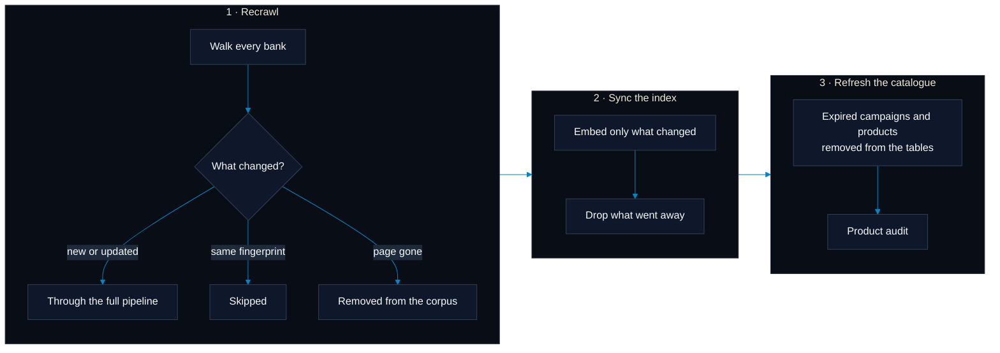

**A new or changed page is not a special case.** Anything discovered tonight, or whose content has changed, goes through exactly the same path as everything else: triage, collection, cleaning, dating, indexing. There is no separate route for content that arrives later, so a page added today is held to the same standard as one that has been there from the start. Unchanged pages enter none of those steps.

**New calculators are looked for too.** The crawl checks whether a bank has published a new calculation endpoint, and pages that build their interface dynamically are opened in a real browser, so what a visitor actually sees is what gets inspected.

**Removal matters as much as addition.** A page the bank has taken down is removed from the corpus. Campaigns and products past their end date are deleted from the comparison tables, so a table does not carry an offer that no longer exists.

**The work is proportional to the change.** Content whose fingerprint is unchanged is not read again; a night in which nothing changed costs almost nothing. Removal is guarded too: a run that would delete an unusually large share of the index refuses and writes nothing, on the assumption that a crawl went wrong rather than that a bank deleted its site.

---

# The interface

<div align="center">
  
</div>

| Page | What it does |
|---|---|
| **Chat** | The evidence-first assistant. Model choice, extended reasoning and web search are each toggleable. It can see the table or calculation currently on screen and answer questions about it. Accepts spreadsheets, PDFs, images and documents. Builds tables inside the conversation that can be saved to the catalogue. |
| **Live comparison** | General-purpose, vehicle and housing financing, participation accounts, FX and card instalments. Banks are queried in parallel. The user's own assumptions are kept visually separate from the rates the bank published. |
| **Products** | Curated multi-bank tables alongside the user's own tables from chat. Any of them can be attached back into a conversation in one click. |
| **Campaigns** | Campaigns across all ten banks, labelled active, ending soon, or expired. |
| **AI Overview** | Fast summaries that reduce long product terms, crowded tables and market movements to a few points. |
| **Automations** | Recurring tasks set up in plain language: *"Tell me if the vehicle financing rate drops below 3.5%."* When the condition is met, an email and an in-app notification go out. |

## Voice conversation

Speech recognition runs on the machine itself; audio never leaves it for a third-party service. The spoken reply is synthesised as a stream, with the first sound audible in about **0.13 seconds**, so the user does not wait for the whole answer before hearing it.

## Why the table summariser is a stateless agent

The agent that summarises a table was deliberately built with no history and no search: so that the same page produces the same summary a week later, and the result can be cached. Giving it a screenshot of the page was tried and dropped: it cost minutes of image processing per table while adding nothing the text outline already carried.

## Every exported cell carries two values

Four different surfaces produce tables, and four formats want to receive them. Writing sixteen separate converters is how Excel and PDF end up disagreeing about what a percentage is. Instead everything is reduced to one intermediate representation in which each cell holds **both its numeric value and the way it was written on screen**. Excel receives the number, so the column can still be summed. PDF and Word receive the on-screen form (`%2,89`, `₺1.234,56`), so the document reads exactly like the page it came from.

---

# Technology

| Area | Used |
|---|---|
| **Interface** | Next.js 16 (App Router), React 19, TailwindCSS v4, Recharts / ApexCharts |
| **Server** | FastAPI, Uvicorn, streamed responses |
| **Agents** | LangChain, LangGraph, persistent checkpoints |
| **Data** | PostgreSQL, SQLAlchemy 2, Alembic |
| **Search** | Qdrant, Sentence-Transformers, SearXNG |
| **Identity** | Argon2id, PyJWT |
| **Corpus** | Trafilatura, Poppler, PyMuPDF, Pillow, Playwright |
| **Voice** | mlx-whisper (recognition), voxcpm (synthesis) |
| **Export** | WeasyPrint, XlsxWriter, Pandoc |

## Models

All three run on a local vLLM server. The role assignments come from measurement, not preference.

| Key | Model | Context | Role |
|---|---|---|---|
| `gemma` | `google/gemma-4-31B-it` | 131K | Chat, visual reading, output checking. The cleanest Turkish. On a scanned page it spent 304 prompt tokens per tile and made no transcription errors, where `qwen` spent 4,328 and made three. |
| `qwen` | `Qwen/Qwen3.6-27B` | 64K | Default, and structured extraction. The most reliable JSON and the strongest step-by-step financial reasoning. |
| `gpt` | `openai/gpt-oss-20b` | 64K | Lightweight classification and stateless work. Cannot read images. |

Model choice lives in configuration rather than in code, so roles can be reassigned through `.env`.

---

# Setup

**Requirements:** Python 3.13+, Node.js 20+, Docker, Pandoc, and a reachable vLLM server. Voice conversation requires Apple Silicon.

```bash
git clone https://github.com/Abdurrahman-Wahdan/TF26.git
cd TF26
cp .env.example .env          # fill in the vLLM address and database details

docker compose up -d postgres qdrant searxng

python -m venv .venv && source .venv/bin/activate
pip install -r requirements.txt
playwright install chromium
alembic upgrade head
uvicorn api.main:app --port 8000 --reload
```

```bash
cd UI && npm install && npm run dev
```

Interface: [http://localhost:3000](http://localhost:3000)

## Useful commands

```bash
python -m banks.health          # is every capability at every bank working
python -m banks.audit           # every product at every bank (runs on a schedule)
python -m corpus.build          # rebuild the corpus from the sites
python -m index                 # sync changed documents into the index
```

The last three are meant to run nightly. `python -m corpus.schedule`, `python -m index.schedule` and `python -m banks.schedule` each print a ready scheduler entry, staggered so they do not overlap.

---

<a id="future-work"></a>

# Future work

**A multilingual interface.** The interface currently ships in Turkish only, but the groundwork for more was deliberately left in place: routing keeps the language prefix on every URL, all copy lives in translation catalogues outside the code, and old `/en` addresses are served by a temporary rather than a permanent redirect, precisely because those paths become real again the day a second language arrives. What remains is a translation catalogue and a language toggle in the navigation bar.

**A participation-banking evaluation set.** Answer accuracy is currently protected by source auditing and live service checks. On top of that, a fixed evaluation set of expert-approved question and answer pairs would make it measurable whether a prompt change has quietly degraded accuracy, before a user is the one to find out.

**More institutions and a wider product surface.** The provider interface reduces adding a bank to writing a single module. The same structure carries over to participation insurance and private pension products.

**Personalised decision support.** Recommendations grounded in a user's own saved scenarios and past comparisons are the natural continuation of the automation layer that already exists.

---

# Tests

101 unit tests, plus 11 integration tests that reach the banks' live services. The unit tests run against recorded bank responses and need no network.

```bash
pytest tests/unit                                     # offline, fast
pytest tests/integration                              # live services
cd UI && npm run test
```

---

<div align="center">
  <sub>Built for TEKNOFEST 2026 Yapay Zeka Dil Ajanları Yarışması.</sub>
</div>
